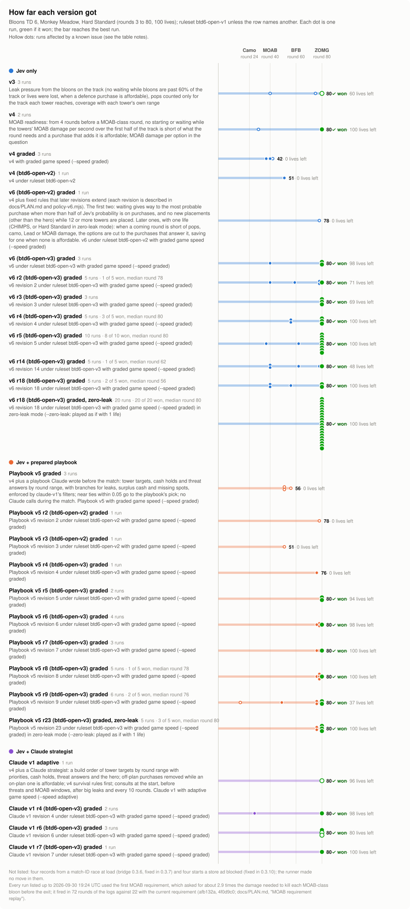
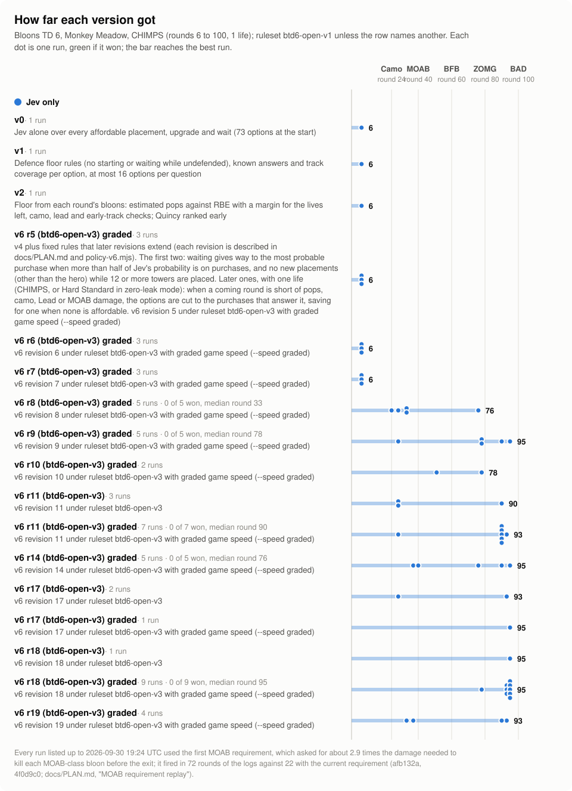

# Jev game lab

Games played by [Jev](https://docs.typesafe.ai/api), TypeSafe's decision model (`jev-1.13.0`), with Claude as a slower strategist and deterministic rules between them. The first game, Slay the Spire 2, lives in [jev-spire-strategist](https://github.com/greenlittleapple/jev-spire-strategist). This repository starts with the second, Bloons TD 6, and holds the parts every game shares.

## Results so far (2026-10-02)

**Hard Standard in zero-leak mode: 20 of 20 won, 19 with no lives lost.** In the Hard Standard chart and table below, it is the row "v6 r18 (btd6-open-v3) graded, zero-leak".
- **Who played:** Jev alone (`btd6-jev-v6` revision 18; no Claude call before or during a match) on Monkey Meadow, Hard Standard (rounds 3 to 80, 100 lives).
- **Zero-leak mode:** the version plays by its one-life (CHIMPS) rules whatever its lives, so it treats any leak as fatal.
- **The matches:** a 10-match series (07:45 to 09:55 UTC) and a 10-match confirmation (09:56, then 18:17 to 20:09). Each took 11 to 13 minutes at 3x game speed or faster.
  - The one match that lost lives won with 83: 7 leaked at round 28 and 10 at round 30, all Leads.
  - The same version and settings without zero-leak mode won 2 of 5, with lives lost even in the wins.
- **What decides:** Jev picks each purchase from the options that fixed rules in code leave and order.
  - The rules check each coming round's bloons against the defence's estimated pops, camo, Lead and MOAB damage, cap the tower count, and with one life cut the options to the answers for a shortfall.
  - They were revised between matches from these runs' logs: 18 revisions, all on Monkey Meadow.
  - How much of the result comes from Jev's choices rather than from the rules hasn't been measured.
- **Settings:** ruleset `btd6-open-v3` (every tower and upgrade; the runner aims Dartlings, Mortars and Helis), Quincy, no Monkey Knowledge, and `--zero-leak --ruleset v3 --speed graded:10 --moab-short-speed 3 --camo-margin --min-speed 3 --moab-factor 1.27 --pops-factor 1`. One map and one game build.
- **The other designs, 5 zero-leak matches each:**
  - The live Claude strategist (`btd6-claude-v1` revision 22) won 4, all with 100 lives.
  - The prepared playbook (`btd6-playbook-v5` revision 23) won 3, all with 100 lives.
  - All three of their losses came at round 76, where 60 regrowing Ceramics arrive within 2 seconds.
  - Five matches each is a first look, not a measured difference between the designs. On normal Hard Standard all three have won matches (series 5 to 7, in the tables below).

**CHIMPS (rounds 6 to 100, 1 life), the final benchmark: not cleared yet.** No match has passed round 95.
- **Revision 18** (series 1j): 93, 93, 95, 95, 95.
- **Revision 21:** reached rounds 90 to 95 in head-to-heads on 2026-10-03, and was kept because it stopped losing matches to camo before round 80. It adds a DDT damage figure that counts camo removers and Villages, a need that counts DDTs arriving together, and a camo check on arrival rates.
- **Where matches end:** DDTs and camo regrowing Ceramics at rounds 90 to 95, and sometimes Leads at round 28 or camo before round 80.
- **Details:** the work is in [docs/PLAN.md](docs/PLAN.md), and the design is in [docs/ARCHITECTURE.md](docs/ARCHITECTURE.md).

Jev-only versions are tested on Monkey Meadow, Hard Standard (rounds 3 to 80, 100 lives): a leak costs lives instead of ending the match, so the round reached measures progress. The final benchmark is CHIMPS on Monkey Meadow (the round reached out of 100, with clearing round 100 as a win); testing moved there once Jev passed about round 30 on Hard Standard. All towers and upgrades are available, as for an experienced player, and the game's rules are unchanged.

## Versions and rulesets

A **version** is the decision-maker: what chooses each purchase. A **ruleset** is the conditions every version plays under. The chart's row names combine them: "v6 (btd6-open-v3) graded" is version v6 under ruleset btd6-open-v3 at graded game speed.

| Version | What decides |
|---|---|
| `btd6-jev-v0` to `btd6-jev-v4`, `btd6-jev-v6` | Jev alone, with fixed rules in code (each version adds rules; see the table below) |
| `btd6-playbook-v5` | Jev, steered by a playbook Claude wrote before the match; no Claude calls during it |
| `btd6-claude-v1` | Jev, steered by a Claude strategist during the match |

| Ruleset | Conditions |
|---|---|
| `btd6-open-v1` | Every tower and upgrade; nothing aims the Dartling Gunner, Mortar Monkey or Heli Pilot, so they fire at the cursor or a default point |
| `btd6-open-v2` | As v1, without those three towers |
| `btd6-open-v3` | As v1; after one of those three is bought, the runner aims it at the busiest point of the track (from the track's shape, as a player's mouse would). Which towers to buy stays the version's decision. |

The numbers are separate: `btd6-jev-v3` is a version, `btd6-open-v3` a ruleset.

## Progress

Each setup is a separate series: the round reached and, on Hard Standard, the lives left.

<!-- btd6-progress:start -->

### Hard Standard (rounds 3 to 80, 100 lives)

<picture>
  <source media="(prefers-color-scheme: dark)" srcset="docs/images/btd6-progress-hard-standard-dark.svg">
  
</picture>

| Version | Final round of each run | What it added |
|---|---|---|
| v3 (`btd6-jev-v3`) | stopped at round 16 (100 lives left, speed 1)a,c, stopped at round 17 (51 lives left, speed 3)a,c, 40 (0 lives left, speed 3)c, stopped at round 10 (46 lives left, speed 3)a,c, stopped at round 51 (40 lives left, speed 3)a,c, **won (round 80) (60 lives left, speed 3)**c, 75 (0 lives left, speed 5)c | Leak pressure from the bloons on the track (no waiting while bloons are past 60% of the track or lives were lost, when a defence purchase is affordable), pops counted only for the track each tower reaches, coverage with each tower's own range |
| v4 (`btd6-jev-v4`) | 31 (0 lives left, speed 3)c, stopped at round 20 (67 lives left, speed 3)b,c, **won (round 80) (100 lives left, speed 5)** | MOAB readiness: from 4 rounds before a MOAB-class round, no starting or waiting while the towers' MOAB damage per second over the first half of the track is short of what the round needs and a purchase that adds it is affordable; MOAB damage per option in the question |
| v4 graded (`btd6-jev-v4`) | 37 (0 lives left, speed graded:10), 42 (0 lives left, speed graded:10)g, 40 (0 lives left, speed graded:10) | v4 with graded game speed (--speed graded) |
| v4 (btd6-open-v2) (`btd6-jev-v4`) | 51 (0 lives left, speed 5) | v4 under ruleset btd6-open-v2 |
| Claude v1 adaptive (`btd6-claude-v1`) | **won (round 80) (96 lives left, speed adaptive:5/1)**f | v4 plus a Claude strategist: a build order of tower targets by round range with priorities, cash holds, threat answers and the hero; off-plan purchases removed while an on-plan one is affordable; v4 survival rules first; consults at the start, before threats and MOAB windows, after big leaks and every 10 rounds. Claude v1 with adaptive game speed (--speed adaptive) |
| Claude v1 r4 (btd6-open-v3) graded (`btd6-claude-v1`) | **won (round 80) (98 lives left, speed graded:5)**, 28 (0 lives left, speed graded:5) | Claude v1 revision 4 under ruleset btd6-open-v3 with graded game speed (--speed graded) |
| Claude v1 r6 (btd6-open-v3) graded (`btd6-claude-v1`) | **won (round 80) (80 lives left, speed graded:10+moab3)**, **won (round 80) (63 lives left, speed graded:10+moab3)**i, **won (round 80) (100 lives left, speed graded:10+moab3)**i | Claude v1 revision 6 under ruleset btd6-open-v3 with graded game speed (--speed graded) |
| Claude v1 r7 (btd6-open-v3) graded (`btd6-claude-v1`) | **won (round 80) (100 lives left, speed graded:10+moab3+camo)** | Claude v1 revision 7 under ruleset btd6-open-v3 with graded game speed (--speed graded) |
| Claude v1 r22 (btd6-open-v3) graded, zero-leak (`btd6-claude-v1`) | **4 of 5 won**, median round 80 (graded:10+moab3+camo+min3, MOAB x1.27 and pops x1 pinned): **won (round 80) (100 lives left, speed graded:10+moab3+camo+min3)**, **won (round 80) (100 lives left, speed graded:10+moab3+camo+min3)**, **won (round 80) (100 lives left, speed graded:10+moab3+camo+min3)**, 76 (0 lives left, speed graded:10+moab3+camo+min3), **won (round 80) (100 lives left, speed graded:10+moab3+camo+min3)** | Claude v1 revision 22 under ruleset btd6-open-v3 with graded game speed (--speed graded) in zero-leak mode (--zero-leak: played as if with 1 life) |
| Playbook v5 graded (`btd6-playbook-v5`) | 51 (0 lives left, speed graded:10)c,d,e, 56 (0 lives left, speed graded:10)c,d, 51 (0 lives left, speed graded:10)c,d,e | v4 plus a playbook Claude wrote before the match: tower targets, cash holds and threat answers by round range, with branches for leaks, surplus cash and missing spots, enforced by claude-v1's filters; near ties within 0.05 go to the playbook's pick; no Claude calls during the match. Playbook v5 with graded game speed (--speed graded) |
| Playbook v5 r2 (btd6-open-v2) graded (`btd6-playbook-v5`) | 78 (0 lives left, speed graded:10)g | Playbook v5 revision 2 under ruleset btd6-open-v2 with graded game speed (--speed graded) |
| Playbook v5 r3 (btd6-open-v2) graded (`btd6-playbook-v5`) | 51 (0 lives left, speed graded:10)h | Playbook v5 revision 3 under ruleset btd6-open-v2 with graded game speed (--speed graded) |
| Playbook v5 r4 (btd6-open-v3) graded (`btd6-playbook-v5`) | 76 (0 lives left, speed graded:5) | Playbook v5 revision 4 under ruleset btd6-open-v3 with graded game speed (--speed graded) |
| Playbook v5 r5 (btd6-open-v3) graded (`btd6-playbook-v5`) | **won (round 80) (94 lives left, speed graded:5)**, **won (round 80) (90 lives left, speed graded:5)** | Playbook v5 revision 5 under ruleset btd6-open-v3 with graded game speed (--speed graded) |
| Playbook v5 r6 (btd6-open-v3) graded (`btd6-playbook-v5`) | **won (round 80) (98 lives left, speed graded:5)**, 78 (0 lives left, speed graded:5), 78 (0 lives left, speed graded:5), 76 (0 lives left, speed graded:5) | Playbook v5 revision 6 under ruleset btd6-open-v3 with graded game speed (--speed graded) |
| Playbook v5 r7 (btd6-open-v3) graded (`btd6-playbook-v5`) | 78 (0 lives left, speed graded:10+moab3), 76 (0 lives left, speed graded:10+moab3), **won (round 80) (100 lives left, speed graded:10+moab3)** | Playbook v5 revision 7 under ruleset btd6-open-v3 with graded game speed (--speed graded) |
| Playbook v5 r8 (btd6-open-v3) graded (`btd6-playbook-v5`) | **1 of 5 won**, median round 78 (graded:10+moab3+camo, MOAB x1.27 and pops x1 pinned): 76 (0 lives left, speed graded:10+moab3+camo), 78 (0 lives left, speed graded:10+moab3+camo), **won (round 80) (100 lives left, speed graded:10+moab3+camo)**, 78 (0 lives left, speed graded:10+moab3+camo), 78 (0 lives left, speed graded:10+moab3+camo) | Playbook v5 revision 8 under ruleset btd6-open-v3 with graded game speed (--speed graded) |
| Playbook v5 r9 (btd6-open-v3) graded (`btd6-playbook-v5`) | **2 of 5 won**, median round 76 (graded:10+moab3+camo, MOAB x1.27 and pops x1 pinned): 76 (0 lives left, speed graded:10+moab3+camo), **won (round 80) (37 lives left, speed graded:10+moab3+camo)**, 49 (0 lives left, speed graded:10+moab3+camo), **won (round 80) (100 lives left, speed graded:10+moab3+camo)**, 17 (0 lives left, speed graded:10+moab3+camo)j, 76 (0 lives left, speed graded:10+moab3+camo) | Playbook v5 revision 9 under ruleset btd6-open-v3 with graded game speed (--speed graded) |
| Playbook v5 r23 (btd6-open-v3) graded, zero-leak (`btd6-playbook-v5`) | **3 of 5 won**, median round 80 (graded:10+moab3+camo+min3, MOAB x1.27 and pops x1 pinned): **won (round 80) (100 lives left, speed graded:10+moab3+camo+min3)**, 76 (0 lives left, speed graded:10+moab3+camo+min3), **won (round 80) (100 lives left, speed graded:10+moab3+camo+min3)**, 76 (0 lives left, speed graded:10+moab3+camo+min3), **won (round 80) (100 lives left, speed graded:10+moab3+camo+min3)** | Playbook v5 revision 23 under ruleset btd6-open-v3 with graded game speed (--speed graded) in zero-leak mode (--zero-leak: played as if with 1 life) |
| v6 (btd6-open-v2) graded (`btd6-jev-v6`) | 78 (0 lives left, speed graded:10)g | v4 plus fixed rules that later revisions extend (each revision is described in docs/PLAN.md and policy-v6.mjs). The first two: waiting gives way to the most probable purchase when more than half of Jev's probability is on purchases, and no new placements (other than the hero) while 12 or more towers are placed. Later ones, with one life (CHIMPS, or Hard Standard in zero-leak mode): when a coming round is short of pops, camo, Lead or MOAB damage, the options are cut to the purchases that answer it, saving for one when none is affordable. v6 under ruleset btd6-open-v2 with graded game speed (--speed graded) |
| v6 (btd6-open-v3) graded (`btd6-jev-v6`) | **won (round 80) (98 lives left, speed graded:10)**, **won (round 80) (99 lives left, speed graded:5)**, 40 (0 lives left, speed graded:5) | v6 under ruleset btd6-open-v3 with graded game speed (--speed graded) |
| v6 r2 (btd6-open-v3) graded (`btd6-jev-v6`) | **1 of 5 won**, median round 78 (graded:5, MOAB x1.27 and pops x1 pinned): 78 (0 lives left, speed graded:5), **won (round 80) (71 lives left, speed graded:5)**, 59 (0 lives left, speed graded:5), 78 (0 lives left, speed graded:5), 40 (0 lives left, speed graded:5) | v6 revision 2 under ruleset btd6-open-v3 with graded game speed (--speed graded) |
| v6 r3 (btd6-open-v3) graded (`btd6-jev-v6`) | **won (round 80) (69 lives left, speed graded:10+moab3)**, **won (round 80) (98 lives left, speed graded:10+moab3)**, **won (round 80) (100 lives left, speed graded:10+moab3)** | v6 revision 3 under ruleset btd6-open-v3 with graded game speed (--speed graded) |
| v6 r4 (btd6-open-v3) graded (`btd6-jev-v6`) | **3 of 5 won**, median round 80 (graded:10+moab3+camo, MOAB x1.27 and pops x1 pinned): **won (round 80) (100 lives left, speed graded:10+moab3+camo)**, **won (round 80) (100 lives left, speed graded:10+moab3+camo)**, 56 (0 lives left, speed graded:10+moab3+camo), 56 (0 lives left, speed graded:10+moab3+camo), **won (round 80) (97 lives left, speed graded:10+moab3+camo)** | v6 revision 4 under ruleset btd6-open-v3 with graded game speed (--speed graded) |
| v6 r5 (btd6-open-v3) graded (`btd6-jev-v6`) | **8 of 10 won**, median round 80 (graded:10+moab3+camo, MOAB x1.27 and pops x1 pinned): **won (round 80) (100 lives left, speed graded:10+moab3+camo)**, **won (round 80) (100 lives left, speed graded:10+moab3+camo)**, **won (round 80) (54 lives left, speed graded:10+moab3+camo)**, **won (round 80) (100 lives left, speed graded:10+moab3+camo)**, **won (round 80) (100 lives left, speed graded:10+moab3+camo)**, **won (round 80) (97 lives left, speed graded:10+moab3+camo)**, 62 (0 lives left, speed graded:10+moab3+camo), **won (round 80) (97 lives left, speed graded:10+moab3+camo)**, 37 (0 lives left, speed graded:10+moab3+camo), **won (round 80) (100 lives left, speed graded:10+moab3+camo)** | v6 revision 5 under ruleset btd6-open-v3 with graded game speed (--speed graded) |
| v6 r14 (btd6-open-v3) graded (`btd6-jev-v6`) | **1 of 5 won**, median round 62 (graded:10+moab3+camo, MOAB x1.27 and pops x1 pinned): **won (round 80) (48 lives left, speed graded:10+moab3+camo)**, 78 (0 lives left, speed graded:10+moab3+camo), 40 (0 lives left, speed graded:10+moab3+camo), 62 (0 lives left, speed graded:10+moab3+camo), 40 (0 lives left, speed graded:10+moab3+camo) | v6 revision 14 under ruleset btd6-open-v3 with graded game speed (--speed graded) |
| v6 r18 (btd6-open-v3) graded (`btd6-jev-v6`) | **2 of 5 won**, median round 56 (graded:10+moab3+camo+min3, MOAB x1.27 and pops x1 pinned): 40 (0 lives left, speed graded:10+moab3+camo+min3), **won (round 80) (100 lives left, speed graded:10+moab3+camo+min3)**, 56 (0 lives left, speed graded:10+moab3+camo+min3), **won (round 80) (33 lives left, speed graded:10+moab3+camo+min3)**, 40 (0 lives left, speed graded:10+moab3+camo+min3) | v6 revision 18 under ruleset btd6-open-v3 with graded game speed (--speed graded) |
| v6 r18 (btd6-open-v3) graded, zero-leak (`btd6-jev-v6`) | **20 of 20 won**, median round 80 (graded:10+moab3+camo+min3, MOAB x1.27 and pops x1 pinned): **won (round 80) (100 lives left, speed graded:10+moab3+camo+min3)**, **won (round 80) (100 lives left, speed graded:10+moab3+camo+min3)**, **won (round 80) (100 lives left, speed graded:10+moab3+camo+min3)**, **won (round 80) (100 lives left, speed graded:10+moab3+camo+min3)**, **won (round 80) (100 lives left, speed graded:10+moab3+camo+min3)**, **won (round 80) (100 lives left, speed graded:10+moab3+camo+min3)**, **won (round 80) (100 lives left, speed graded:10+moab3+camo+min3)**, **won (round 80) (100 lives left, speed graded:10+moab3+camo+min3)**, **won (round 80) (100 lives left, speed graded:10+moab3+camo+min3)**, **won (round 80) (100 lives left, speed graded:10+moab3+camo+min3)**, **won (round 80) (100 lives left, speed graded:10+moab3+camo+min3)**, **won (round 80) (100 lives left, speed graded:10+moab3+camo+min3)**, **won (round 80) (100 lives left, speed graded:10+moab3+camo+min3)**, **won (round 80) (100 lives left, speed graded:10+moab3+camo+min3)**, **won (round 80) (83 lives left, speed graded:10+moab3+camo+min3)**, **won (round 80) (100 lives left, speed graded:10+moab3+camo+min3)**, **won (round 80) (100 lives left, speed graded:10+moab3+camo+min3)**, **won (round 80) (100 lives left, speed graded:10+moab3+camo+min3)**, **won (round 80) (100 lives left, speed graded:10+moab3+camo+min3)**, **won (round 80) (100 lives left, speed graded:10+moab3+camo+min3)** | v6 revision 18 under ruleset btd6-open-v3 with graded game speed (--speed graded) in zero-leak mode (--zero-leak: played as if with 1 life) |

- a A screen the bridge didn't handle yet paused the runner, and the run was stopped. Fixed: bridge 0.3.5 to 0.3.10 handle these screens.
- b Stopped by hand to restart the series at 5x speed.
- c Bought a Mortar or Dartling Gunner that nothing aimed, so it fired at the game's default point or the cursor. Fixed: ruleset btd6-open-v2 leaves these towers out; v3 aims them (bridge 0.3.12).
- d Playbook v5 revision 1: a cash hold for a tower that was already finished stayed in force, and Jev waited while cash piled up. Fixed: v5 revision 2 (2ae96f0).
- e Graded speed played 10x into a leak that ended the match within about 2 s. Fixed: speed caps in 1b2a510: at most 5x after danger and from round 40 without a MOAB estimate.
- f Most of the strategist's plan went unbuilt: every catalog spot was taken by round 50, and holds were dropped. Fixed: the 31-spot catalog, placement fallback and hold enforcement (7636383).
- g The Skywarden had no entry in the tower table, so every estimate counted it as 0 pops and 0 MOAB damage. Fixed: 58eea3f adds its figures; towers without data are now left out of the candidates.
- h Majority wait replaced waits with purchases while no plan target was due, and spent the savings meant for the next target. Fixed: v5 revision 4 and claude-v1 revision 3 (828b9ca): only an on-plan purchase replaces a wait.
- i Series 5: one strategist agent served every claude-v1 match of the series, so this match's plans could draw on lessons from earlier matches. v6 and v5 start every match fresh. Fixed: A new strategist agent for each claude-v1 match from series 6.
- j A request timed out about a minute into the match and paused the runner, which waits for a manual resume; the match played on without it and was lost at round 17 with $2,697 unspent. Fixed: f3519a6: a timed-out Jev request is retried once, then skipped without pausing; timed-out bridge reads are retried.

### CHIMPS (rounds 6 to 100, 1 life)

<picture>
  <source media="(prefers-color-scheme: dark)" srcset="docs/images/btd6-progress-chimps-dark.svg">
  
</picture>

| Version | Final round of each run | What it added |
|---|---|---|
| v0 (`btd6-jev-v0`) | 6 (speed 1) | Jev alone over every affordable placement, upgrade and wait (73 options at the start) |
| v1 (`btd6-jev-v1`) | 6 (speed 1) | Defence floor rules (no starting or waiting while undefended), known answers and track coverage per option, at most 16 options per question |
| v2 (`btd6-jev-v2`) | 6 (speed 1) | Floor from each round's bloons: estimated pops against RBE with a margin for the lives left, camo, lead and early-track checks; Quincy ranked early |
| v6 r5 (btd6-open-v3) graded (`btd6-jev-v6`) | 6 (speed graded:10+moab3+camo), 6 (speed graded:10+moab3+camo), 6 (speed graded:10+moab3+camo) | v4 plus fixed rules that later revisions extend (each revision is described in docs/PLAN.md and policy-v6.mjs). The first two: waiting gives way to the most probable purchase when more than half of Jev's probability is on purchases, and no new placements (other than the hero) while 12 or more towers are placed. Later ones, with one life (CHIMPS, or Hard Standard in zero-leak mode): when a coming round is short of pops, camo, Lead or MOAB damage, the options are cut to the purchases that answer it, saving for one when none is affordable. v6 revision 5 under ruleset btd6-open-v3 with graded game speed (--speed graded) |
| v6 r6 (btd6-open-v3) graded (`btd6-jev-v6`) | 6 (speed graded:10+moab3+camo), 6 (speed graded:10+moab3+camo), 6 (speed graded:10+moab3+camo) | v6 revision 6 under ruleset btd6-open-v3 with graded game speed (--speed graded) |
| v6 r7 (btd6-open-v3) graded (`btd6-jev-v6`) | 6 (speed graded:10+moab3+camo), 6 (speed graded:10+moab3+camo), 6 (speed graded:10+moab3+camo) | v6 revision 7 under ruleset btd6-open-v3 with graded game speed (--speed graded) |
| v6 r8 (btd6-open-v3) graded (`btd6-jev-v6`) | **0 of 5 won**, median round 33 (graded:10+moab3+camo, MOAB x1.27 and pops x1 pinned): 76 (speed graded:10+moab3+camo), 33 (speed graded:10+moab3+camo), 33 (speed graded:10+moab3+camo), 24 (speed graded:10+moab3+camo), 28 (speed graded:10+moab3+camo) | v6 revision 8 under ruleset btd6-open-v3 with graded game speed (--speed graded) |
| v6 r9 (btd6-open-v3) graded (`btd6-jev-v6`) | **0 of 5 won**, median round 78 (graded:10+moab3+camo, MOAB x1.27 and pops x1 pinned): 95 (speed graded:10+moab3+camo), 90 (speed graded:10+moab3+camo), 78 (speed graded:10+moab3+camo), 78 (speed graded:10+moab3+camo), 28 (speed graded:10+moab3+camo) | v6 revision 9 under ruleset btd6-open-v3 with graded game speed (--speed graded) |
| v6 r10 (btd6-open-v3) graded (`btd6-jev-v6`) | 51 (speed graded:10+moab3+camo), 78 (speed graded:10+moab3+camo) | v6 revision 10 under ruleset btd6-open-v3 with graded game speed (--speed graded) |
| v6 r11 (btd6-open-v3) (`btd6-jev-v6`) | 90 (speed 3), 28 (speed 3), 28 (speed 3) | v6 revision 11 under ruleset btd6-open-v3 |
| v6 r11 (btd6-open-v3) graded (`btd6-jev-v6`) | **0 of 7 won**, median round 90 (graded:10+moab3+camo, MOAB x1.27 and pops x1 pinned): 28 (speed graded:10+moab3+camo), 93 (speed graded:10+moab3+camo), 90 (speed graded:10+moab3+camo), 90 (speed graded:10+moab3+camo), 90 (speed graded:10+moab3+camo), 90 (speed graded:10+moab3+camo), 90 (speed graded:10+moab3+camo) | v6 revision 11 under ruleset btd6-open-v3 with graded game speed (--speed graded) |
| v6 r14 (btd6-open-v3) graded (`btd6-jev-v6`) | **0 of 5 won**, median round 76 (graded:10+moab3+camo, MOAB x1.27 and pops x1 pinned): 37 (speed graded:10+moab3+camo), 95 (speed graded:10+moab3+camo), 40 (speed graded:10+moab3+camo), 90 (speed graded:10+moab3+camo), 76 (speed graded:10+moab3+camo) | v6 revision 14 under ruleset btd6-open-v3 with graded game speed (--speed graded) |
| v6 r17 (btd6-open-v3) (`btd6-jev-v6`) | 28 (speed 3), 93 (speed 3) | v6 revision 17 under ruleset btd6-open-v3 |
| v6 r17 (btd6-open-v3) graded (`btd6-jev-v6`) | 95 (speed graded:10+moab3+camo) | v6 revision 17 under ruleset btd6-open-v3 with graded game speed (--speed graded) |
| v6 r18 (btd6-open-v3) (`btd6-jev-v6`) | 95 (speed 3) | v6 revision 18 under ruleset btd6-open-v3 |
| v6 r18 (btd6-open-v3) graded (`btd6-jev-v6`) | **0 of 14 won**, median round 93 (graded:10+moab3+camo+min3, MOAB x1.27 and pops x1 pinned): 93 (speed graded:10+moab3+camo+min3), 93 (speed graded:10+moab3+camo+min3), 95 (speed graded:10+moab3+camo+min3), 95 (speed graded:10+moab3+camo+min3), 95 (speed graded:10+moab3+camo+min3), 95 (speed graded:10+moab3+camo+min3), 93 (speed graded:10+moab3+camo+min3), 95 (speed graded:10+moab3+camo+min3), 78 (speed graded:10+moab3+camo+min3), 93 (speed graded:10+moab3+camo+min3), 28 (speed graded:10+moab3+camo+min3), 93 (speed graded:10+moab3+camo+min3), 56 (speed graded:10+moab3+camo+min3), 28 (speed graded:10+moab3+camo+min3) | v6 revision 18 under ruleset btd6-open-v3 with graded game speed (--speed graded) |
| v6 r19 (btd6-open-v3) graded (`btd6-jev-v6`) | 33 (speed graded:10+moab3+camo+min3), 93 (speed graded:10+moab3+camo+min3), 90 (speed graded:10+moab3+camo+min3), 37 (speed graded:10+moab3+camo+min3) | v6 revision 19 under ruleset btd6-open-v3 with graded game speed (--speed graded) |
| v6 r21 (btd6-open-v3) graded (`btd6-jev-v6`) | **0 of 10 won**, median round 93 (graded:10+moab3+camo+min3, MOAB x1.27 and pops x1 pinned): 94 (speed graded:10+moab3+camo+min3), 93 (speed graded:10+moab3+camo+min3), 76 (speed graded:10+moab3+camo+min3)k, 93 (speed graded:10+moab3+camo+min3), 90 (speed graded:10+moab3+camo+min3), 93 (speed graded:10+moab3+camo+min3), 95 (speed graded:10+moab3+camo+min3), 93 (speed graded:10+moab3+camo+min3), 95 (speed graded:10+moab3+camo+min3), 28 (speed graded:10+moab3+camo+min3), 93 (speed graded:10+moab3+camo+min3) | v6 revision 21 under ruleset btd6-open-v3 with graded game speed (--speed graded) |
| v6 r22 (btd6-open-v3) graded (`btd6-jev-v6`) | **0 of 5 won**, median round 93 (graded:10+moab3+camo+min3, MOAB x1.27 and pops x1 pinned): 37 (speed graded:10+moab3+camo+min3), 59 (speed graded:10+moab3+camo+min3), 93 (speed graded:10+moab3+camo+min3), 95 (speed graded:10+moab3+camo+min3), 93 (speed graded:10+moab3+camo+min3) | v6 revision 22 under ruleset btd6-open-v3 with graded game speed (--speed graded) |

- k TypeSafe answered a Jev request with HTTP 520 at round 55 and the runner paused; the match played on without it and was lost at round 76 with $40,660 unspent. Series 1l replaced it with another match. Fixed: 98111a9: a Jev request that gets HTTP 500, 502 to 504 or 520 to 524 is sent once more after 1.5 s before the runner pauses.

<!-- btd6-progress:end -->

## Layout

| Path | Contents |
|---|---|
| `core/` | Game-independent: strategist file channel, plan validation, decision loop, runner safety checks, Jev client, scorecard and chart |
| `integration/btd6/` | BTD6: bridge client, state, candidates and spots, triggers, plan schema, rules, Jev question, progress measure, command-line tools |
| `integration/btd6-bridge/` | BTD6 bridge mod (C#, MelonLoader + BTD6 Mod Helper) |
| `integration/btd6-bridge-tests/` | Tests for the bridge's protocol code, no game needed |
| `checks/` | Repository checks: no private details in committed files, and nothing in the bridge that writes the profile or changes gameplay |
| `docs/` | Architecture, live checks and their results, chart data |

## Commands

You need Node.js 26 and, for the bridge, the .NET SDK and a BTD6 install with MelonLoader and BTD6 Mod Helper that has been launched once.

| Command | What it does |
|---|---|
| `npm test` | All Node tests (no game or API key needed) |
| `npm run btd6:bridge-test` | The bridge protocol tests (.NET) |
| `dotnet build integration/btd6-bridge/JevBtd6Bridge.csproj -c Release -p:BTD6Dir="<BTD6 dir>"` | Builds the bridge mod; installing it in the game's `Mods` folder is a separate step |
| `npm run btd6:mods -- status \| off \| on [--dry-run]` | Moves the mod loader's files out of the game folder and back |
| `npm run btd6:bridge -- state` | Reads the live match through the bridge (other commands: `health`, `map`, `catalog`, `check`, `place --confirm`, `start-round --confirm`, `dismiss --confirm`, `result`) |
| `npm run btd6:spots -- --map Tutorial --confirm` | Computes the spot catalog for the open match's map, 30 spots by default (`--count`; `--dry-run` uses the simulated game) |
| `npm run btd6:run -- --setup MonkeyMeadow/Hard/CHIMPS --policy jev --confirm` | Plays one match with Jev alone, with a status page on 127.0.0.1:4318 (`--dry-run` uses the simulated game and no API key) |
| `npm run btd6:run -- --policy playbook-v5 --confirm` | Plays one match with Jev and the prepared playbook for the setup (`integration/btd6/playbooks/`), no Claude calls |
| `npm run btd6:run -- ... --speed graded:10 --moab-short-speed 3` | Graded speed up to 10x (the default is `graded:10`), with `moab_short` alone holding the speed at most at 3 instead of 1; the speed label becomes `graded:10+moab3` |
| `npm run btd6:run -- ... --speed graded:10 --moab-short-speed 3 --camo-margin` | Graded speed whose pops margin is also no more than the camo margin (camo-capable towers against the round's camo RBE), graded at 1.82 / 1.17 / 0.88 instead of 2.0 / 1.3 / 1.0; the label becomes `graded:10+moab3+camo` |
| `npm run btd6:run -- ... --moab-factor 2 --pops-factor 1.08` | Pins the MOAB damage and pops calibration factors for a series instead of the setup's stored ones, which move as runs are measured |
| `npm run btd6:rules-audit [-- --runs <text>] [--replay-threat]` | Per rule and playbook branch: rounds fired, rounds with lives lost in that round or the next, and the share without a leak, by round band and policy |
| `npm run btd6:threat-replay [-- --runs <text>] [--rounds <from>-<to>] [--detail]` | `threat_short` rebuilt on the logged decision states: decisions with a Lead or camo gap, where an answer was on offer, where the rule would save. `--burst` compares the gain-per-dollar order for burst answers with revision 3's rule and with cheapest first |
| `npm run btd6:pops-derive -- --game-data <clone> SniperMonkey:320 [...]` | How towers.json derives a tower's pops per second from the game-data export (counted projectiles, pierce cap, rate), what in the export it leaves out, and the measured pops for the same tier key with example tower-rounds; data only |
| `npm run btd6:pops-study -- --fixes`, `--verdicts`, `--thresholds [--table candidate]` | The candidate estimate (`estimate-candidate.mjs`, not used by any policy): on-damage projectiles counted, a camo margin, a Purple margin, each against the current one |
| `npm run btd6:pops-derive -- --placement WizardMonkey`, `--game-data <clone> --weapons Skywarden` | Zero-pop against popping tower-rounds of a type: position, range, reach factor, stretch of track covered, distance to the path, and whether the round's logged furthest bloon reached that stretch |
| `npm run btd6:pops-study [-- --from <round>] [--round <n>] [--json]` | Measured over estimated pops per tower type and path under three supply rules, and how each candidate pops margin (current, per-type factors fitted in-sample and leaving one run out) separates rounds that lost lives from clean rounds; data only |
| `npm run btd6:dashboard [-- --dry-run \| --runs-dir <dir> \| --no-bridge \| --port <port>]` | Read-only live dashboard on 127.0.0.1:4319: the match, speed and caps, upcoming rounds, Jev's decisions, the plan, measurements and the series' runs, from the run logs and GET reads of the bridge. It sends no commands and can run beside a series |
| `npm run btd6:strategy -- wait \| show \| answer <id> <plan.json>` | The strategist's side of the file channel |
| `npm run btd6:scorecard`, `npm run btd6:progress` | Per-run scorecard and the version chart, from the private logs |
| `npm run btd6:progress -- --add` | Adds logged runs missing from `docs/progress/btd6.json` to the version with their policy (no result: `stopped`; no move made: skipped; a policy without a version is reported), then refreshes like `--refresh` |

Copy `.env.example` to `.env` for the API key and the game folder. Logs, strategist files and backups stay in the ignored `.private/` folder.

## License and credits

MIT, see [LICENSE](LICENSE). The core modules come from jev-spire-strategist (same author, MIT); [docs/ARCHITECTURE.md](docs/ARCHITECTURE.md) lists what was copied and changed. The [TypeSafe agent skill](https://github.com/typesafe-ai/skills) (MIT) is under `.agents/skills/typesafe-ai`.

Not affiliated with Ninja Kiwi, TypeSafe or Anthropic. Bloons TD 6 belongs to Ninja Kiwi; no game files are included. Ninja Kiwi treats mods as cheating and flags accounts that use them, so modded play here uses a separate account and single-player modes only. The lab's recorded results were played on that account with every tower and upgrade available. The bridge here uses the account's own unlocks, so a tower or upgrade the account hasn't unlocked is not offered.
