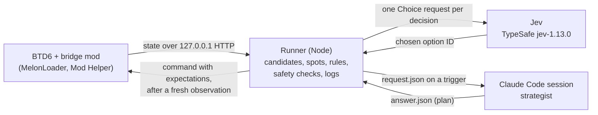

# Bloons TD 6: architecture

This is the design for the second game of the Jev + Claude strategist setup, first built for Slay the Spire 2 in [jev-spire-strategist](https://github.com/greenlittleapple/jev-spire-strategist). Jev (TypeSafe's decision model, pinned to `jev-1.13.0`) takes each in-game action from a described list of options. A Claude Code session acts as a slower strategist that writes a plan at trigger moments, and deterministic rules between the two remove the options the plan doesn't allow. The comparison that led to BTD6 is in Marcus's research note `jev-game-lab-second-game.md`, which is kept outside this repository.

What BTD6 adds over STS2:

- A clock. With auto-start on, rounds run back to back, so a strategist answer arrives while play continues.
- Placement. Candidate actions include map positions, so the runner has to produce a short list of described spots.

Status on 2026-09-29: the scaffold builds and its tests pass without the game. The first live spike ran with bridge 0.1.0: it read the match, placed towers, upgraded one and started rounds ([BTD6-VERIFICATION.md](BTD6-VERIFICATION.md)). Bridge 0.2.0 adds starting lives and screen handling; its live checks are in [BTD6-SPIKE-PLAN.md](BTD6-SPIKE-PLAN.md). Bridges 0.3.0 and 0.3.1 were checked live (startup, starting and leaving CHIMPS). The runner (`npm run btd6:run`, see "Running a match") has played three live Jev-only CHIMPS matches with bridge 0.3.2 (policies v0, v1 and v2, each lost in round 6). Bridge 0.3.3 adds the bloons on the track and the lives lost in the round. Bridge 0.3.4 adds `set_speed` (see "Game speed"); it builds and its protocol tests pass, but it has not been checked live. Bridge 0.3.5 closes the "Upgrade Your Monkeys!" tip (`tutorial_notice`); not yet checked live. Bridge 0.3.6 also closes the bloon introduction tips ("Regrow Bloons" and others) as `tutorial_notice`. Bridge 0.3.7 keeps a match's ID when the game re-initialises it at load (see "Match IDs"); it builds and its protocol tests pass, but it has not been checked live. Policy `btd6-jev-v3` then ran live on Hard Standard with bridge 0.3.7 at speed 3 (2026-09-30): the tips and rank-ups were closed as forced steps, the match kept one ID, and it was lost at round 40 to the first MOAB (see "Policy `btd6-jev-v4`"). Bridge 0.3.8 continues past the free hero and tower unlock splashes at a rank-up (`hero_unlock_notice`, `tower_unlock_notice`); it builds and its protocol tests pass, but it has not been checked live.

## Components and data flow



- **Bridge mod** (`integration/btd6-bridge`, C#): a BTD6 Mod Helper mod that serves the match state and single-player commands (tower, round, screen, and starting or leaving a match) on `http://127.0.0.1:15527`. It runs game calls on Unity's main thread and checks every command against the state the runner saw.
- **Runner** (`core/runner.mjs` with `integration/btd6/runner.mjs`): observes the bridge, builds candidates, runs the decision loop, re-checks a fresh observation, writes a dispatch record, sends the command and logs the outcome to `.private/btd6/runs/*.jsonl`. `integration/btd6/session.mjs` runs one match around it, from launch to the end screen (see "Running a match").
- **Jev** (`core/jev.mjs`, `integration/btd6/question.mjs`, `integration/btd6/policy-v1.mjs`, `integration/btd6/policy-v2.mjs`, `integration/btd6/policy-v3.mjs`, `integration/btd6/policy-v4.mjs`, `integration/btd6/policy-v6.mjs`): one TypeSafe Choice request per decision over the option IDs left after the rules; with `btd6-jev-v1` to `btd6-jev-v6` and more than 16 options, two (the action, then the spot or path). The model pin is applied after the payload, so a payload that names its own model can't override it.
- **Strategist**: a Claude Code session answering through the file channel in `.private/btd6/strategy/` with `npm run btd6:strategy -- wait | show | answer`. No Anthropic API key is used.

One decision, in order:

1. Read the state. A screen over the match (a rank-up, the tower pick, victory or defeat) that is on the allowlist is dismissed as a forced transition: no triggers, no Jev call, logged like any dispatch, not counted as a decision. Any other screen pauses the runner for the operator. Otherwise, if the game isn't ready (paused, a game action queued, the match over), skip.
2. Build candidates: wait or start the round, affordable placements at the best free spots, unlocked upgrades.
3. Decide whether a decision is due: something changed (round, towers, affordable options, lives), a strategist answer is waiting, or a wait has run out; at most one per second.
4. Adopt a waiting strategist answer, check the triggers and post a request if one fires.
5. Apply the rules. One remaining option is taken without a Jev call; otherwise Jev chooses.
6. Observe again. The structural fingerprint must be unchanged and the action must still be affordable.
7. Write the dispatch record to disk, send the command once, and record the result.

## Game-independent core

Copied from jev-spire-strategist at local commit `1f9def2957675c03a3b15ee96081d9c4797b83bc` (2026-09-29 13:31 -0700, "Strategist instructions: the late Act 1 elite limit applies only when one rest site remains before the boss"). The public repository rewrites author emails when it publishes, so its hash for that commit differs; match it by subject and date.

| Module | From | Change |
|---|---|---|
| `core/strategy-channel.mjs` | `integration/sts2/strategy-channel.mjs` | None (byte-identical) |
| `core/plan-schema.mjs` | `validatePlan` in `integration/sts2/strategy.mjs` | Takes the schema as an argument; ranges and list limits moved into the schema (`minimum`, `maximum`, `maxItems`, `maxLength`, `pattern`); adds `number` and `boolean` |
| `core/hierarchical.mjs` | `integration/sts2/hierarchical.mjs` | Game logic moved behind an adapter; consults can be non-blocking; a more urgent trigger replaces an outstanding request; answer latency and late answers are recorded; candidates can be rebuilt after a plan is adopted |
| `core/strategy-cli.mjs` | `integration/sts2/strategy-cli.mjs` | Validates against the request's own schema; game-specific answer checks passed in (the STS2 route-node check becomes BTD6's spot and tower checks) |
| `core/runner.mjs` | The runner in `vendor/jev-the-spire/spire-demo/server.mjs` | Safety checks separated from the dashboard; dispatch records synced to disk; lookup of a command by ID instead of manual reconciliation where the bridge can answer |
| `core/jev.mjs` | The TypeSafe call in the same runner | Model pin applied last; usage and limits shared with the runner |
| `core/scorecard.mjs`, `core/progress-chart.mjs` | `integration/sts2/scorecard.mjs`, `progress-chart.mjs` | The game supplies the run ID and the scorer; the chart takes a value and milestones instead of floors and boss floors |

The STS2-specific parts (combat forecasts, route facts, the encounter playbook, the dashboard) stay in the STS2 repository.

## The six per-game needs

### 1. Bridge

The mod targets .NET 6 (the runtime MelonLoader 0.7 uses for IL2CPP games) and references the game through `BTD6Dir` or the `BTD6_DIR` environment variable, so no install path is committed. The build never writes into the game folder.

| Endpoint | Purpose |
|---|---|
| `GET /`, `GET /api/v1/health` | Name, version, API version, whether the game's main thread is running frames, `unlock_all`, and the loaded Mod Helper's version and DLL SHA-256 (answered without touching the game) |
| `GET /api/v1/state` | On a menu: `main_menu`, `loading`, the current menu's name and any screen open over it. In a match: match ID, map, difficulty, mode, game type, co-op flag, round index, whether a round is running and the lives lost in it (`round.lives_lost`, 0.3.3), cash, lives, starting lives, the lives cap, paused, fast-forward and its time scale (`multiplier`, 0.3.4), auto-start, queued game actions, towers (ID, type, tiers, position, targeting, the target types the tower offers and the point its current one aims at (`target_modes`, `target_point`, 0.3.12), the pop count the upgrade panel shows and the cash the tower earned, both over its life (`pops` from `TowerToSimulation.damageDealt`, a long; `cash_earned` from `TowerToSimulation.cashEarned`, a float, rounded; 0.3.13), next upgrades with cost and unlock state), a hash of the towers, the number of sub-towers, the bloons on the track (`bloons`, 0.3.3, see "Policy `btd6-jev-v3`"), `unlock_all`, any screen open over the match (`popup`), and a `ready` flag |
| `POST /api/v1/command` | `place_tower`, `upgrade_tower`, `start_round`, `dismiss_popup`, `start_match`, `go_home`, `set_speed` (0.3.4), `set_auto_start` (0.3.11), `set_targeting` and `set_target_point` (0.3.12). Each carries a `command_id`. Tower, targeting and round commands carry `expect: {match_id, towers_hash}`; `dismiss_popup` names the screen class it expects (and the match, for a screen over one); `go_home`, `set_speed` and `set_auto_start` name the match; `start_match` has no match to expect |
| `GET /api/v1/commands/{id}` | The record of a command: queued, executed, rejected (with a reason) or failed; 404 if the bridge never saw it |
| `GET /api/v1/map` | Track paths as point lists |
| `POST /api/v1/placement-check` | Whether a tower can stand at each of up to 400 points (the game's own geometric check; changes nothing). Larger grids go in batches |
| `GET /api/v1/catalog` | Towers in the in-game shop, with the cost the game would charge now, whether the account has them unlocked, and whether the mode allows them |
| `GET /api/v1/screenshot?width=N` | A PNG of the game's own current frame (0.3.12), N pixels wide (default 960, 64 to 1920). At most one per second (429 otherwise); 503 when the main thread isn't running frames. Captures only the game, never other windows |
| `GET /api/v1/profile` | The saved profile, read from `Game.Player.Data` (`ProfileModel`), not through the game's unlock checks (0.3.2): `unlocked_towers`, `unlocked_heroes`, `acquired_upgrades`, `acquired_knowledge`, `knowledge_points` (unspent), `rank`, `xp`, `veteran_rank`, `veteran_xp`, `tower_xp` per tower, and `unlock_all`. Read only; 409 when no profile is loaded |

Tower and upgrade lookups in a match use the match's own copy of the game model (`UnityToSimulation.Model`), which has the mode's prices and rules; the base model (`Game.instance.model`) has Medium prices. Towers that other towers create (`TowerModel.isSubTower`: Engineer sentries, Comanches, phoenixes, hero summons) are left out of `towers` and the towers hash and only counted in `sub_towers`, so they never churn the hash or become command targets.

All game access runs on Unity's main thread, because the HTTP threads are not attached to IL2CPP: requests queue plain C# work that the mod's `OnUpdate` runs each frame. Work the frame loop doesn't reach within 5 s is abandoned and never runs late, and a command abandoned this way is recorded as refused. The health endpoint shows whether frames are running; an unfocused game that doesn't run in the background would stop them.

**Match IDs** (`Protocol/MatchIdentity.cs`, 0.3.7). A match gets its ID from the first of a state read that finds it running and Mod Helper's `OnMatchStart`. With 0.3.6, a read between `start_match` and `OnMatchStart` (about a second apart during a load) assigned one ID and the hook a second, so the runner logged two `run_start` records and the session ended with `match_changed`. Since 0.3.7, `OnMatchStart` keeps the current ID when it came less than 10 seconds earlier, no round has started since, and the setup agrees (the same `Simulation` object, or the same map, mode, difficulty and round index); the MelonLoader log then says "reinitialised". `OnRestart`, `OnMatchEnd` and an executed `start_match` always end the ID, so a restart or a new match gets a new one. Each assignment is logged with its source. The session's runner is also bound to the match it started: a state read with another ID pauses it before any `run_start` or decision, and the session ends with `match_changed`.

Before acting on a command, the bridge refuses it (`status: rejected`, nothing changed) when: the match ID or towers hash differs from `expect` (since 0.3.13 the hash leaves out a hero's level, which rises with XP on its own; `upgrade_tower` may carry `expect.tiers`, the tower's tiers as the runner saw them, refused with `stale_tiers` when they differ, and the runner sends it with every upgrade so a hero isn't levelled at another level and price), the match isn't a standard single-player game (co-op or another game type), the game is in a mode Mod Helper lists as a flag risk (race, public co-op, Odyssey), the game is paused, the match is over, the account hasn't unlocked the tower or upgrade (the simulation doesn't check account unlocks, the game's UI does), or the game's own checks fail (tower not in the shop, invalid position, not enough cash). A command ID that was already seen returns the first record and isn't run again. Requests with an `Origin` header, from outside the machine or to another host name are refused. The bridge never writes the player profile. A command that throws inside the game is recorded as `failed` (it may have partly run), so the runner observes again before anything else.

**Starting and leaving matches** (`MatchFlow.cs`). `start_match {map, difficulty, mode, hero?}` loads a match the way the mode screen does: a fresh `InGameData` set up with `SetupNormalGame`, the map, difficulty and mode, then `UI.LoadGame`. It is accepted only on the main menu with nothing open over it and no match loading, for these setups: Standard on Easy, Medium or Hard, Impoppable, and CHIMPS (mode ID `Clicks`). Co-op, races, boss events, Odyssey, Contested Territory and daily challenges are other game types, which it never sets up. The hero defaults to the ruleset's (Quincy) and must be the one the profile has selected; the bridge reads the selection and doesn't change it, so a different hero is refused (`hero_mismatch`) for the operator to select in the Heroes menu. The game keeps one saved game per map and a new game would overwrite it, so a saved game on the map is refused (`saved_game_exists`) unless the command sets `replace_saved` (CLI `--replace-saved`), which loads with `UI.LoadGame`'s `wasSaveOverwritten` flag as the mode screen does after its overwrite prompt. The game writes a match's save only at round checkpoints (`InGame.CreateMapSave`), so the old save stays until the new match completes a round, and a match left before its first wave leaves the old save in place (seen live with 0.3.1). Benchmark starts therefore always pass `replace_saved`. Map and mode unlocks are checked as the UI checks them. Event bonuses the mode screen can add (Golden Bloon, Monkey Teams, collection bonus) stay off. `go_home` leaves a match through `InGame.QuitToMainMenu`, or presses Home on a victory or defeat screen; any other open screen refuses it.

**Unlocks** (`Unlocks.cs`). The lab's recorded results were played on a separate single-player account with every tower and upgrade available. The public bridge uses the account's own unlocks. A locked tower, upgrade, hero, map or mode is reported as locked, and the candidates leave it out. `unlock_all` in `/api/v1/state`, `/api/v1/health` and `/api/v1/profile` says whether every tower, upgrade, hero, map and single-player mode is available regardless of the account's unlocks; with the account's own unlocks it is false. Bridge 0.3.16 moved the unlock handling into `Unlocks.cs` (optional partial methods); builds with the lab's extension behave as 0.3.15.

The bridge never writes the profile. The profile-writing methods (`AddTowerXP`, `AcquireUpgrade`, `AcquireKnowledge`, `UnlockTower`, `UnlockHero`) and the `debugUnlockAll*` flags are never used, and buying an upgrade with tower XP (`CanAcquireUpgrade`) is left alone, so the account's saved unlocks don't change. Other writes happen as in any modded game: the game itself saves XP, rewards and saved matches, and Mod Helper removes modded content IDs from the profile when it loads (its own cleanup; the bridge adds no content, so there is nothing of the bridge's to remove). The game's own rules stay in force, including the mode's tower inventory (CHIMPS locks the Banana Farm) and its tier locks (`UnityToSimulation.IsUpgradeLocked`).

**Saved-profile check.** The runner reads `/api/v1/profile` when a match starts and again when it ends (or when the session finishes with the match still open), and writes both snapshots to the run log (`profile_snapshot`) and to `.private/btd6/series.jsonl` (`profile_start` in the run's entry, then a `profile_check` line). Rank, XP, tower XP, knowledge points, medals and stats can change through normal play and are only recorded. A tower, hero or upgrade that appears in the saved unlocked or acquired lists during the run is a profile write, unless the run earned it: the run log gets a `warning`, and the scorecard's Profile column shows `WRITE (...)` with the IDs. The runner records each rank-up, tower pick and unlock splash over the match (`profile_screen`, with the unlocked ID from the splash's `<id>UnlockUI` menu or the pick). A hero is earned when its `hero_unlock_notice` was shown, or when a rank-up screen was shown and the profile rank passed his free unlock rank (`HERO_UNLOCK_RANKS`: Gwendolin 14, StrikerJones 21, ObynGreenfoot 28; profile ranks count from 1). A tower is earned by its `tower_unlock_notice` or a tower pick of it; there is no tower rank table. An acquired upgrade is always a write, since the game sells upgrades only through the menu, which the runner doesn't use. Earned unlocks go in the check's `earned` and `earned_by`, the run log gets a `note`, and the Profile column shows `earned (by rank-up: StrikerJones)`. For a check logged before this (no `earned` field), the scorecard re-reads the run's snapshots and forced `dismiss_popup` dispatches, which carry the screen kind but not the ID. This came from a won Hard Standard run on 2026-09-30 (rank 18 to 26), where Striker Jones was flagged as a write. A bridge older than 0.3.2 has no `/profile`, so those runs show `unchecked`. `npm run btd6:bridge -- profile` prints the counts and the lists (`--json` prints the whole answer). `ProfileReader.cs` is the only bridge file allowed to name these profile fields, and `checks/bridge-scope.test.mjs` fails if it adds, removes or assigns anything.

**Screens over a match or the main menu** (`Popups.cs`). The state reports an open screen as `popup: {kind, scope, class, buttons, options}`, where `scope` is `match` or `menu`. The known kinds are:

- `level_up`: `LevelUpScreen`;
- `xp_notice`: `LevelUpKnowledgeScreen` and `LevelUpMonkeyMoneyScreen`, the notices after a rank-up;
- `tower_unlock_choice`: `TowerGiftBoxScreen`, taken to be the rank-up tower pick (to confirm live); its `options` are the towers offered;
- `victory` and `defeat`: `VictoryScreen` and `DefeatScreen`;
- over the main menu, `daily_rewards` (`DailyRewardsScreen`) and `update_notice` (`UpdateAnnouncementScreen`), and `store_ad` (0.3.10, `Protocol/DialogKinds.cs`): a `PopupScreen` store ad of class `StoreLegendsPopup` (seen live: the Rogue Legends DLC ad after returning to the menu from a win), or, unverified, `StorePopup` or `RacePassStorePopup` (same `closeBtn` pattern in the interop assembly), showing exactly one button named `CloseButton`. It is the only kind with a purchase button that isn't `unknown`, and only because nothing but its Close button is ever pressed. Without a `CloseButton` it stays `unknown`;
- at startup (scope `startup`), `title_screen` (`TitleScreen`) and `modded_client_notice` (the game's Modded Client notice, `ModdingPopup`), found with `Object.FindObjectOfType` because the menus don't exist yet.
- over a match, two plain `Popup` dialogs with one `OKButton`, named from their English text (`Protocol/DialogKinds.cs`): `mode_rules_notice`, a mode's rules dialog, by the start of its body (CHIMPS: "The true test of a BTD master"), and `tutorial_notice` (0.3.5), a one-time tip, by its exact title. A new account gets each tip once, the first time its trigger happens. `TutorialNoticeTitles` lists the English values of the game's `ft_*title` text keys that can open over a match (from the btd6-game-data text table for game 56); two were seen live: "Upgrade Your Monkeys!" (round 16 of Hard Standard) and "Regrow Bloons" (round 17). Since 0.3.6 a title that is exactly a bloon or property name from `rounds.json` (with the MOAB class as "MOAB" or "M.O.A.B." and so on), optionally followed by " Bloons", is also a `tutorial_notice`. Since 0.3.9 `HintTitles` adds two gameplay hints that don't use `ft_*` keys: "Change Targeting" (seen live at round 52 of Hard Standard) and "Don't Forget!" (the Monkey XP reminder, from the text table only). 0.3.10 adds "Monkey Knowledge", the notice at the rank-30 level-up (seen live mid-match); its OK only closes it and never opens the knowledge menu or spends points. Matching is exact and case-sensitive. Both kinds are closed with OK through the button's own listeners; a single-OK dialog with any other title stays `unknown`.
- over a match, the splash after a free unlock at a rank-up (0.3.8, `Protocol/UnlockSplashKinds.cs`). `hero_unlock_notice`: `HeroPurchaseSplash` opened as menu `<heroId>UnlockUI` for a hero ID in the game model's `heroSet`, with exactly one button, named `Click`. It was seen live as `GwendolinUnlockUI` at rank 14 of a new account (Hard Standard, round 10, bridge 0.3.7), where 0.3.7 left it `unknown` and the runner paused. `LevelUpScreen.LevelUpType` lists HeroUnlock beside Knowledge, TowerUnlock and MonkeyMoney, and the game's addressables catalog has a `<heroId>UnlockUI` prefab for each hero (`StrikerJonesUnlockUI`, `ObynGreenfootUnlockUI`, ...) plus skin variants such as `ObynSkeletorUnlockUI`, which are not hero IDs and so stay `unknown`. `tower_unlock_notice`: `GiftboxUnlockSplash` opened as `<towerId>UnlockUI` for a non-hero tower in `towerSet`, with exactly one button (its `clickArea`); this one is from the assemblies and the catalog only (`DartlingGunnerUnlockUI`, `MermonkeyUnlockUI`, `BeastHandlerUnlockUI`, `DesperadoUnlockUI`) and has not been seen live. A splash with a second button (a purchase, Monkey Money or skip button), an ID the model doesn't list, or another menu name stays `unknown`. The rank-30 Monkey Knowledge unlock is expected to be `LevelUpKnowledgeScreen` (menu `LevelUpKnowledgeUnlockUI` in the catalog), already an `xp_notice` by class; not seen live. `TowerUnlockScreen` (`LevelUpTowerUnlockUI`) is a tower choice and stays `unknown`.

Every reported screen lists its buttons with their object names and visible labels; dialogs and the Modded Client notice also carry their title and body text (the body up to 400 characters from 0.3.5) (the title screen's text is left out because it shows the player ID). The state also reports the active Unity `scene`. This is for identifying unknown screens from the logs.

A dialog from `PopupScreen` (on a menu or in a match), or any other menu over a paused match, is `unknown`. `dismiss_popup` presses one allowlisted button through the screen's own handler:

- Continue on rank-up screens (`LevelUpScreen.OpenNextUnlockScreen`, or `OnClick` on the notices);
- Continue on an unlock splash, only while its one button is showing and enabled (it animates in; until then `button_unavailable`, and the runner tries again at its next step): `HeroPurchaseSplash.MenuClicked` for a hero, the `clickArea` button's own listeners for a tower (`GiftboxUnlockSplash` has no public click method). The result's `detail` names the menu and the button's persistent listeners, to confirm the handler live;
- the first tower on a tower pick (`OnPanelClicked`, then `OnSelectButton`); the pick is recorded in the result's `detail`;
- Home on the victory screen (`SummaryScreen.HomeClicked`);
- Home or Restart on the defeat screen (`HomeClicked`, `DefeatScreen.RestartClick`);
- Back on the daily rewards screen (`DailyRewardsScreen.BackClicked`), which closes it without opening the chest;
- OK on the update notice (the listeners of its `okBtn`);
- Close on a store ad: the button named `CloseButton`, only when it is the popup's own close field (`StorePopup.closeBtn`, `StoreLegendsPopup.exitButton` or `RacePassStorePopup.closeBtn`) and enabled (otherwise `button_unavailable`), through its own listeners. Try, Purchase ("Get Now") and anything else that opens the store are never pressed, and the parser accepts no other button for the kind. The result's `detail` names the button's persistent listeners, to confirm the handler live;
- Start on the title screen (`TitleScreen.OnPlayButtonClicked`) and Continue on the Modded Client notice (`ModdingPopup.Continue`), each only while its button is showing and enabled (otherwise `button_unavailable`). The notice's Close Game and Log Out buttons, and the title screen's account buttons, are never pressed.

`npm run btd6:bridge -- advance --confirm` steps from launch to the main menu through these presses and stops at any other screen; the runner treats them as forced transitions like other screens. `start_match` names the startup screen that blocks it (`startup_screen`).

It never continues or retries for Monkey Money, enters Freeplay, buys a tower or anything in the store, claims a reward, and it never dismisses an unknown screen, including consent dialogs. The bridge checks the expected class and kind on the game thread before pressing anything.

Game members the mod uses were checked against the installed game's generated assemblies (BTD6 56.3, MelonLoader 0.7.3, Mod Helper 3.6.8), and the project compiles against them: `InGame.instance.bridge` (`UnityToSimulation`) with `GetCurrentRound`, `GetRoundDisplayInfo`, `GetCash`, `GetHealth`, `CanPlaceTowerAt`, `CreateTowerAt`, `UpgradeTower`, `StartRound`, `GetTowerCost`, `RetrieveTowerDisplayOrder`, `GetAllTowers` and `actions`; `InGameData.CurrentGame` for map, mode, difficulty and game type; `TimeManager` for pause and fast-forward; `Simulation.autoPlay`; `MapModel.paths`; `TowerToSimulation.GetUpgradeCost` (the upgrade button's price); `TowerToSimulation.damageDealt` and `cashEarned` (0.3.13, the same properties exist on the simulation's `Tower`); `Game.Player.HasUpgrade`, `HasUnlockedTower`, `HasUnlockedHero`, `IsMapUnlocked` and `IsModeUnlocked`; `InGameData.CreateNewInstance`, `Editable` and `SetupNormalGame`, `UI.LoadGame` and `isLoadingGame`, `InGame.QuitToMainMenu`, `MapSet.TryGetMapDetails`, and the profile's `primaryHero` and `savedMaps` (read only); Mod Helper's `IsAccountFlagged` and `CanGetFlagged`; Mod Helper's `OnMatchStart`, `OnRestart`, `OnMatchEnd`, `OnVictory` and `OnDefeat` hooks. The first spike confirmed the rest in play (see [BTD6-VERIFICATION.md](BTD6-VERIFICATION.md)):

- placement coordinates round-trip through `simPosition`;
- placements and upgrades are queued and settled by the game's callback a frame later;
- `ObjectId.Invalid` works as the ID for a new tower;
- `autoPlay` and `FastForwardActive` follow the game's buttons;
- a standard match's mode ID is `Standard`;
- the lives cap (`GetMaxHealth`) is not the starting lives.

Still to confirm: the displayed round is `GetCurrentRound() + 1`, the game keeps running frames when unfocused, the screen classes above appear as expected, `start_match` loads the same match the mode screen does, `go_home` from play keeps the game's own saved match as the pause menu's Home does, and `TowerModel.isSubTower` covers every tower another tower makes.

**Mod Helper pin.** Mod Helper's `Plugins/UpdaterPlugin.dll` can update Mod Helper when the game starts, which would change the build the bridge was checked against. `/api/v1/health` reports the loaded Mod Helper's version and the SHA-256 of its DLL, and the runner pauses (and the CLI warns) when they differ from the pin in `integration/btd6/pins.mjs` (3.6.8).

### 2. Candidate actions

`integration/btd6/candidates.mjs` builds, for the current state:

- `wait` (keep the cash; decide again after 5 s or when something changes), offered only when a round can't be started, or `start_round` before the first round (and between rounds when auto-start is off);
- `place:<tower>@<spot>` for each affordable tower that the run's ruleset allows, the account has unlocked (all of them on the lab's account) and the mode's inventory includes, at its best free spots (four by default), plus any spot the plan names; the ruleset's hero only if none is placed;
- `upgrade:<tower id>:p<path>` for each unlocked next upgrade the crosspath rule allows and the cash covers.

Each candidate carries its cost, the cash left after it, and for placements the tower's range and a coverage fact such as "covers 22% of the track, from 10% to 45% of the way to the exit".

Spots (`integration/btd6/spots.mjs`) are computed once per match: the runner reads the track from `/api/v1/map`, lays a grid over the playfield (the spike's grid covered x -140 to 140 and y -110 to 110; the track itself runs off-screen at both ends), asks `/api/v1/placement-check` which points are valid, and keeps up to 12 points with the most track coverage at a reference range, at least a set distance apart. Their IDs (`S01` covers the most) stay fixed for the match, so plans can name them. Which spots are free is checked per tower, because placement differs by tower (water towers such as the Sub and Buccaneer, large footprints, aircraft): the runner checks each tower it could place now or that the plan names, one batched placement check per tower, and keeps the answers until the match or its towers change. The strategist's brief lists the spots free for a reference tower (the Dart Monkey). The runner also reads the shop from `/api/v1/catalog` whenever the match or its towers change, since prices depend on the mode and on discounts. Coverage for a candidate is computed at that tower's own range. The candidate list stays small (a few dozen options at most), well under the 255 options a Choice question allows. The geometry, the batched placement checks and the refresh are built and tested; the spot catalog is computed once per map with `npm run btd6:spots` and loaded at match start (see "Running a match").

Not yet offered: targeting changes, selling (CHIMPS forbids it), abilities and powers. Targeting is the next addition; the game only exposes "next target type", so it needs a small cycle-and-check command.

### 3. Triggers

`integration/btd6/triggers.mjs`, evaluated at each decision:

| Trigger | When | Priority |
|---|---|---|
| `match_start` | No plan for this match. Blocking only before the first round | 4 |
| `leak` | Lives lost in the current round; once per round | 3 |
| `low_lives` | Lives fall below the plan's `replan_below_lives_percent` | 3 |
| `threat_ahead` | A first appearance within the lead time that the plan's `threats` don't cover; once per threat. Camo, purple, lead, ceramic, MOAB, fortified, camo lead, BFB, fortified MOAB, ZOMG, DDT and BAD ask; regrow, black, white, zebra and rainbow only appear in briefs and in Jev's `threats_ahead` | 2 |
| `off_plan` | The next due step can't happen (spot taken, tower or upgrade locked, target missing) | 2 |
| `plan_done` | Every build step is done | 1 |
| `review` | The plan's `review_round` has come | 1 |

The lead time is the number of rounds the strategist's slowest recent answer (of the last five, 90 s before any) takes at the observed round length (30 s before any), plus one round to act on it. At normal speed that is about four rounds; with fast-forward, rounds are shorter and triggers fire earlier.

### 4. Plan schema

`integration/btd6/plan.mjs` (`PLAN_SCHEMA`, `STRATEGIST_INSTRUCTIONS`):

| Field | Meaning | Enforced by |
|---|---|---|
| `summary`, `priorities` (up to 5), `note` | What the plan is for | Shown to Jev and on a future dashboard |
| `build_order` | Ordered steps: `place` (tower, optional spot, optional ref) or `upgrade` (target ref or `tower:<id>`, path 1-3, tier), each with `round_from` and an optional `round_by` | `planned_step`, `save_for_step` |
| `cash_reserve` | `{from_round, to_round, amount}` | `cash_reserve` |
| `allowed_towers` | Towers Jev may buy outside the build order | `allowed_towers` |
| `threats` | Which build steps handle each coming threat, and its round | Urgent steps go first; covered threats don't trigger |
| `replan_below_lives_percent`, `review_round` | When to ask again | Triggers |

The answer CLI checks the schema, then the answer against its request: towers must be in the brief's catalog, spots in its spot list, upgrade targets must be refs of earlier place steps or towers on the map, step IDs unique, threats handled by real steps, and `review_round` after the current round.

The brief (`strategistBrief`) gives the match and setup, timing (`lead_rounds`, `seconds_per_round`, `plan_from_round`), towers, the catalog, free spots with their coverage, threats in the next 20 rounds, recent leaks, and the previous plan with each step marked done or not.

### 5. Rules

`integration/btd6/rules.mjs`, in order; each keeps at least one option:

1. `emergency`: when at least 5% of the starting lives were lost in the current round, the plan's holds are lifted and Jev chooses among everything affordable while the `leak` consult runs.
2. `planned_step`: the next due step's candidates are the only options. One placement or upgrade is taken without a Jev call; a place step without a spot leaves Jev to pick the spot.
3. `save_for_step`: when the next due step isn't affordable yet, other spending is removed (only waiting, or starting the first round, is left).
4. `cash_reserve`: purchases that would leave less than the active reserve are removed.
5. `allowed_towers`: purchases of other towers are removed.

A step that can never happen is not enforced; `off_plan` asks about it instead. With the strategist off, these rules don't apply. Policy `btd6-jev-v0` then has no rules at all; `btd6-jev-v1`, `btd6-jev-v2` and `btd6-jev-v3` have their floor rules (below).

### Policy `btd6-jev-v1`

`integration/btd6/policy-v1.mjs`, Jev alone. The first live v0 match (Monkey Meadow CHIMPS, $650, round 6) offered 73 options per question at about 7,300 input tokens each; Jev chose "Start round 6" with no towers, then "Wait" three times, and lost in round 6. v1 changes three things.

**Defence floor.** Points: 1 per tower that deals damage (Banana Farm and Monkey Village don't; towers missing from the table in `towers.mjs` count) plus 1 per upgrade tier. The floor is `ceil(round / 4)` points, at least 1: 2 at round 6, 5 at round 20, 10 at round 40, 25 at round 100. It only stops the runner from playing a round with next to nothing; it is not an estimate of what a round needs. A measure from bloon counts or RBE needs the round composition, which isn't in the repository yet.

**Floor rules**, applied before the plan's rules (core `game.rules`), each keeping at least one option:

1. `damage_first`: with no damage-dealing tower, farm and village placements and upgrades are removed.
2. `no_start_undefended`: "Start round" is removed with no damage-dealing tower, or below the floor while a defending purchase (a damage-dealing tower or an upgrade of one) is affordable.
3. `no_wait_undefended`: "Wait" (during a round, or between rounds with auto-start on) is removed below the floor while a defending purchase is affordable.

With nothing affordable, starting or waiting stays, and a single remaining option is taken without a Jev call (`decisionSource: rules`).

**Two-level questions.** Up to 16 options go to Jev as one question. Past that, Jev first picks an action: keep the cash (or start), place one tower type, or upgrade one placed tower; then, if that action has several spots or paths, a second question picks one. The action list is capped at 16: keep or start first, then towers known to handle lead or camo when that threat is due within 8 rounds and no current tower is known to handle it, then upgrades of damage-dealing towers (cheapest first), then other damage-dealing towers (most track coverage first), then the rest. The decision log records both answers (`group_answer`, `answer`) and how many options the cap left out (`narrowed`).

**Question facts.** Per option: cost, cash after, track coverage (share of the track in range, and where it lies from entrance to exit), and `answers` (lead or camo, when the tower without upgrades is known to handle them; `null` for towers not in the table). Per decision: the match, lives and cash, the towers, the current and next round with their new threats and `bloons: null` (round composition not in the repository), threats in the 7 rounds after, the defence against the floor, and recent leaks. The tower facts in `towers.mjs` cover base towers only and are marked unknown where not well established; they have not been checked against exported game data.

On the v0 match's opening state (`fixtures/v0-round6.json`), the action question is about 2,700 characters and the spot question about 950, against about 13,800 for the v0 question. At the v0 run's ratio of characters to logged input tokens, that is roughly 1,450 and 500 tokens, about 2,000 for a placement, against 7,300.

### Policy `btd6-jev-v2`

`integration/btd6/policy-v2.mjs` and `integration/btd6/estimate.mjs`, Jev alone. The first live v1 match (Monkey Meadow Hard CHIMPS, one life) placed a Dart Monkey, bought 0-0-1, started round 6, then chose "Wait and keep the cash" about 8 times with several hundred dollars unspent and lost round 6 to a leak. The v1 floor counted one Dart plus one tier as enough for round 6 (2 points); CHIMPS allows no leaks. Questions were 1,300 to 2,300 input tokens (7,300 in v0), 17,300 for the match. v2 keeps v1's structure (rules before the plan's rules, two-level questions capped at 16 options, compact facts) and replaces the floor.

**Round data.** `integration/btd6/data/rounds.json`, rounds 1 to 100 of the standard round set: bloon counts by type (the export's names, such as `GreenRegrowCamo`), how many are camo, regrow or fortified, RBE (base health plus children; fortified doubles Lead to 4 and Ceramic and MOAB-class health; rounds 81+ use the same health, so their RBE is a lower bound), when the last bloon is sent, bloon types and properties seen for the first time, how many bloons are both camo and Lead (`camo_lead`), `peak`, the most non-MOAB RBE sent within any 10 s of the round (a group's bloons spread evenly over its frames), and `camo_rbe`, the RBE of its camo bloons (graded speed's camo margin). `integration/btd6/data/towers.json`, per base tower and upgrade combination and per Quincy level (a hero's level is its first tier in the state, `[7, 0, 0]` for level 7, as the bridge sends it; `estimate.mjs` `heroLevel`): pops per second (counting projectiles created on contact, on expiry and, from 2026-10-01, on damage: `EmitOnDamageModel`, the Sniper's shrapnel and the Desperado's; one weapon per attack when a `ToggleFocusStanceModel` swaps weapons, the Skywarden's MainWeapon; children sent out in a full ring that fly further than their explosion's radius at `RING_SHARE` 0.5, the Bomb Shooter's clusters: on a straight track 2 to 4 of the 8 land over it; MOAB damage uses neither correction), lead, camo, range, MOAB damage per second and `camo_lead` (one attack sees camo and pops Lead; only the Wizard's Necromancer tiers x-0-4 and x-0-5 have camo and Lead from different attacks). Both come from the BTD6 Mod Helper game-data export at commit `f818c39` (game version 56.0), made with `node integration/btd6/data/generate.mjs <clone>`; the clone isn't committed. The first appearances match the threat table in `rounds.mjs` (a test checks this).

**Towers in the table.** 26 base towers with all 64 upgrade combinations each, the Skywarden among them, plus Quincy's 20 levels. The Skywarden was added on 2026-09-30; before that every estimate counted it as 0 (pops, MOAB damage, camo, lead, coverage). Its middle path from tier 2 fires a gust that creates a projectile along its flight (`CreateDistanceProjectileOnExhaustFractionModel`, used by no other tower), counted like the other created projectiles, once per shot. Left out for it, as for the other towers: the attack-speed ramp while it deals damage (`DamageBasedAttackSpeedModel`, up to +100%), the focus stance toggle (range x1.35, rate x1.25), the gust's pierce growing with distance, and the ice shards of its bottom path. The Sheriff has no entry: it is the Frontier Legends hero (hero tower set, cost 0 in the export, no upgrades) with 11 swappable weapons, and the export doesn't say which is equipped, so no single figure can be derived. `towers.mjs` `BASE_TOWERS` has both (the Sheriff's lead is unknown: 9 of its weapons pop Lead, 2 don't).

**Towers without data.** When the runner reads the shop for a match, `towers.mjs` `missingTowerData` lists the non-hero towers that `data/towers.json` has no entry for. They are left out of the allowed catalog, so no policy is offered them, and `run_start` records them as `no_data` (an empty list when every tower is covered), followed by one `warning` record ("No tower data ... left out of the candidates"), which the run command prints. `run_start` also records `tower_data`: the table's source and `version`, the first 12 hex digits of the SHA-256 of its parsed content (`922e6b5e918c` with on-damage projectiles, the Skywarden at one weapon and ring clusters at half; `984c4369abfb` with on-damage projectiles only; `14b45d4c4959` with `camo_lead`, `e3bf53fc7299` with the Skywarden, `b630280ed1b9` for the table before it). Runs without `tower_data` predate the field. Rulesets are unchanged by this. `btd6-jev-v4` is the frozen baseline: its sessions (and the dashboard for its runs) estimate with `data/towers-v4.json`, the table from before on-damage projectiles were counted, and read a hero's level from its name only as before (`towers.mjs` `setTowerTable`); its `run_start.tower_data` has `table: "v4"` and version `14b45d4c4959`. Every other policy uses `data/towers.json`. In a live state the hero's name also carries the level ("Quincy 7"), so live estimates of Quincy are the same either way; logged states have no name, so replays and the dashboard read the level from the tier only from this change.

**Estimate.** Pops per second per tower: for each attack's weapon, projectiles per shot x min(pierce, 10) x damage / attack interval, plus projectiles created on contact or expiry (a bomb's explosion). Abilities, buffs from other towers, bonus damage to MOAB-class bloons and slowing are left out; Banana Farm, Monkey Village and Glue Gunner count 0. What the defence can pop in a round (`can_pop`) is the towers' total x (the round's sending time + 8 seconds) x 0.8. The round needs its RBE x a margin: 1.5 with one life, 1.3 with up to 10, 1.15 above. With one life, rounds up to 10 (`EARLY_ROUND_LAST`) need 3.0 (`EARLY_ONE_LIFE_MARGIN`) in `btd6-jev-v6` revision 6, `btd6-playbook-v5` revision 10 and `btd6-claude-v1` revision 9; the session turns it on for those policies only (`setEarlyMargin`), so `btd6-jev-v4` and the earlier policies keep 1.5, as v4 keeps `towers-v4.json`. Every check that reads the margin takes the round (`roundCheck`, `camoCheck`, burst, `neededPps`, `moabCheck`), so graded speed and the rules that read `roundCheck`'s verdict (`no_start_short`, `no_wait_behind`, `threat_short` and the rest) use it too. Basis: CHIMPS series 1 lost both matches at round 6 with one 0-0-0 Bomb Shooter at an estimate of about 2.5x the round's RBE (ratio 1.66 at 1.5), and in the current-era Hard Standard logs rounds 3 to 10 leaked at estimates up to about 2.2x RBE. A round is covered when `can_pop` reaches that, some tower pops camo if the round has camo, some tower pops lead if it has Lead bloons (from the tier data, so Enhanced Eyesight counts for camo; a Monkey Village's camo doesn't), and some damage-dealing tower's range reaches the first half of the track (from the spot catalog's track; skipped without one). The numbers are rough and not calibrated against live play.

With one life:

| Round | Bloons | RBE | Needs | Pops per second that meets it |
|---|---|---|---|---|
| 6 | 4 Green, 15 Red, 15 Blue | 57 | 86 | 4.0 (two base Dart Monkeys: 4.2) |
| 10 | 102 Blue | 204 | 306 | 6.8 |
| 20 | 6 Black | 66 | 99 | 9.4 |
| 28 | 6 Lead | 138 | 207 | 19.9, and a tower that pops lead |
| 40 | 1 MOAB | 616 | 924 | 128.3 |

**Rules**, each keeping at least one option:

1. `damage_first`: as in v1, with no damage-dealing tower, purchases of towers that pop nothing are removed.
2. `no_start_short`: "Start round" is removed while that round isn't covered and an affordable purchase improves it (more `can_pop`, or the missing camo, lead or early range), or while it is covered, the round after isn't, and one affordable purchase would cover the round after.
3. `no_wait_short`: "Wait" (a round running, or between rounds with auto-start on) is removed while the current or next round isn't covered and an affordable purchase improves it.

Waiting stays when both rounds are covered; when both have 1.5 times what they need the defence is reported as `ahead`, which is when saving for later rounds makes sense.

**Hero.** Placing Quincy ranks right after start or wait in the capped action list up to round 30, when the current and next round stay covered with him at one of his offered spots (at the opening he costs most of the $650, and alone gives 3.2 pops per second against the 4.0 round 6 needs, so there he ranks with the other purchases). After that, purchases rank by pops per second added per dollar, after towers that handle a threat due within 8 rounds that no current tower handles.

**Question facts.** v1's facts, with: `rounds` (the current and next round's bloon counts and RBE, and new threats), `defence` (the towers' pops per second, the margin, `short`, `enough` or `ahead`, and per round `can_pop`, `needs` and what is missing), and `pops` per option (pops per second it adds). On the v1 match's round 6 state, the action question is about 3,300 characters against 2,700 for v1, and the spot question about 1,050: roughly 1.2 times v1's size.

### Policy `btd6-jev-v3`

`integration/btd6/policy-v3.mjs`, Jev alone. The first live v2 match (Monkey Meadow Hard CHIMPS) placed a Tack Shooter at S03 ($280); v2's estimate counted it as covering round 6, so "Start round 6" stayed. Jev then chose "Wait and keep the cash" nine times with $370 or more while bloons leaked, and lost round 6 (about 19,000 input tokens). v2 had no view of the bloons on the track, and its estimate counted all eight of the Tack's tacks although it fires in fixed directions and, at its range of 23, reaches 8% of the track.

**Bloons on the track** (bridge 0.3.3, `GameReader.ReadBloons`, `Protocol/BloonSummary.cs`). `/api/v1/state` in a match carries `bloons`: `count`, `by_type` (count per variant ID such as `GreenRegrowCamo`, at most 8, the rest in `other_types`), `camo`, `regrow`, `fortified`, `moab_class`, `furthest` (the furthest bloon's progress along its path, 0 at the entrance and 1 at the exit) and the progress quantiles `progress_p50`, `progress_p75` and `progress_p90`. No per-bloon list is sent, except `moabs` (0.3.11): the MOAB-class bloons, furthest first and at most 20, each with `type`, `progress`, `health` (health left, `Bloon.health`) and `max_health` (`BloonModel.maxHealth`), for graded speed's `moab_outrun` check, and `nearest_exit` (0.3.15): the 5 bloons furthest along, any type, furthest first, each with `type`, `camo`, `regrow`, `fortified` and `progress`. The bloons come from `simulation.factory.GetUncast<Bloon>()`, which skips destroyed pooled bloons (`IsDestroyed` is checked again); properties come from `bloon.bloonModel` (`id`, `isCamo`, `isGrow`, `isFortified`, `isMoab`) and progress from `Bloon.PercThroughMap()`. `round.lives_lost` is the lives at the round's start (Mod Helper's `OnRoundStart` hook, or the bridge's first read of the round) minus the lives now; lives gained during a round offset it. The members were checked by compiling against the game's interop assemblies. What `PercThroughMap()` returns in play, and whether it follows the same path as `/api/v1/map`, is not yet checked live.

**Bloons in the run log** (`runner.mjs` `describeState`, `bloonLog`). Each logged state (decisions and `run_end`) keeps `bloons: {count, furthest, nearest_exit}`, with `nearest_exit` as the bridge sends it (`[]` before bridge 0.3.15); the type counts, quantiles and MOAB list are left out to keep each record small. States from a bridge without a bloon summary have no `bloons` field. Before this, logged states had no bloons at all, so the bloons near the exit when lives were lost could not be read back (r78-data.mjs).

**Reach.** Each option's coverage is computed at decision time from the map path, with the tower's own range after the purchase (`data/towers.json` for its tiers, so an upgrade that adds range counts; the shop's range for towers missing there). Besides the share of the track and where it lies, it gives `late`: the share of the last 40% of the track (past 0.6, the same scale as bloon progress) in range. Towers whose attacks aren't limited to their range circle (Sniper, Ace, Heli, Mortar, Dartling; `towers.mjs` `AIM`) count as reaching the whole track. From v6 revision 3, v5 revision 7 and claude-v1 revision 6 (a shared estimate change, so v3 and v4 replays change too) the Monkey Ace counts at 0.1 of its table rate (`towers.mjs` `GLOBAL_SHARE`): it flies a fixed pattern and fires at what lies under it, and in the logs of bridge 0.3.13 and later its measured pops were a median 0.04 of `est_reach` over 637 tower-rounds that cleared and 0.05 over 12 that lost lives (90th percentile 0.11 and 0.12). The Sniper, also global, measured a median 2.1 and stays at 1.

**Estimate.** As in v2, but each tower's pops per second count only for the track it reaches (`estimate.mjs` `reachFactor`). A tower that aims at bloons gets min(1, track length in range / (2 x range)), which is 1 when the track crosses its whole circle. The Tack Shooter fires in fixed directions, so it also gets the share of directions that point at track in range, times 0.5 for the chance that a tack meets a bloon on its line (a rough guess, not calibrated). A tower that reaches no track counts for nothing, including camo and lead. Round 6 on Monkey Meadow (`can_pop` / needs):

| Defence | CHIMPS (1 life), v2 | CHIMPS, v3 | Hard Standard (100 lives), v3 |
|---|---|---|---|
| One base Tack at S03 (reach factor 0.36) | 152 / 86, enough | 55 / 86, short | 55 / 66, short |
| One base Dart at S01 | 45 / 86, short | 45 / 86, short | 45 / 66, short |
| Two base Darts at S01 and S02 | 90 / 86, enough | 90 / 86, enough | 90 / 66, enough |

**Rules**, each keeping at least one option:

1. `damage_first` and `no_start_short`: as in v2, with the v3 estimate.
2. `leak_pressure`: while the furthest bloon is past 0.6 of the track or lives were lost this round, "Wait" is removed when a defence purchase (one that adds pops on this track) is affordable. Purchases that reach the late track move to the front of the options and rank first in the capped action list. The pressure (`pressureTracker`, kept by the runner across observations) lasts until a round ends with no new leaks; a round that ends with leaks carries it into the next round. A change in pressure also triggers a new decision.
3. `no_wait_behind`: otherwise "Wait" is removed when a defence purchase is affordable, unless the defence is `ahead` for this round and the next and no lives were lost this round or the last.

**Question facts.** v2's facts with the v3 estimate, plus `on_track` (bloon count, the furthest bloon's progress, the median, the four most common types, lives lost this round, and the pressure reason), and per option `pops` on this track, `track` with the tower's own range, and `late`.

### Policy `btd6-jev-v4`

`integration/btd6/policy-v4.mjs` and `integration/btd6/moab.mjs`, Jev alone. The best v3 run (Hard Standard at speed 3, bridge 0.3.7, 2026-09-30) reached round 40 with 32 lives and lost them all to the first MOAB, in 6.6 minutes and about 274,000 input tokens. Its towers were two Mortar Monkeys 0-3-2, two Dart Monkeys 2-3-0, a Dart Monkey 3-2-0, a Bomb Shooter 0-2-3, a Sniper Monkey 2-2-0, a Ninja Monkey 0-1-0 and a Wizard Monkey 1-0-0. v3's estimate called round 40 covered: it counts pops, and pierce and splash say little about one bloon with a 200-health shell.

**MOAB damage per tower** (`data/towers.json`, fifth field `moab_dps`, from `data/generate.mjs`): against one MOAB, for each attack's weapon, projectiles per shot x the damage one projectile deals to a MOAB / attack interval. Pierce doesn't multiply it, since a projectile hits a given bloon once. The damage includes `DamageModifierForTagModel` bonuses for the `Moabs` or `Moab` tag. A projectile created on contact or expiry counts one hit (an explosion hits the MOAB once; shrapnel and frags fly off), and a shot spread over half a turn or more (the Tack Shooter's ring) counts one projectile. Projectiles or attacks filtered away from MOABs count 0, and damage over time added to the bloon (Burny Stuff) adds its rate once per tower. Abilities, buffs, and bonuses for the BFB, ZOMG, DDT and BAD tags are left out. Examples: Mortar 0-3-2 6.9 (3 per shell every 0.81 s plus the burn's 4 every 1.25 s), Bomb Shooter 0-3-0 (MOAB Mauler) 19.4, Sniper 2-2-0 4.4 and 3-2-0 12.6, Dart 2-3-0 6.3, base Tack 0.9, base Ice and Glue 0.

**What a MOAB-class round needs.** Each MOAB-class bloon, with the MOAB-class bloons inside it, has to die before the exit (`KILL_BY`, 1). A tower's damage counts for the share of the first half of the track it reaches (`POP_BY`, 0.5; the whole of it for the towers in `towers.mjs` `AIM` that reach the whole track); the calibration factor is measured against that figure, so it stays at the first half. Needed damage per second is the toughest bloon's MOAB-class health over the time it takes to cross the whole track at its speed, times the margin for the lives left (1.15 above 10 lives). There is no term for the round's total MOAB-class health: the damage figure is for one bloon, while splash and several towers hit the group, and such a term (the total over the round's sending time plus the shortest crossing) fired in rounds cleared with nothing lost. The bloons inside count at the outer bloon's speed: counting them at their own speed, killed one after another, asks 333 for the round-80 ZOMG, which the first claude-v1 match cleared at about 150 calibrated. Health is the base health of the shell plus the MOAB-class bloons inside it (a BFB 1,500, a ZOMG 10,000, the BAD 41,200); Fortified doubles the shell. Hard has no health multiplier in the game data (`Mods/Hard.json` changes cash, lives, costs, speed and the round range); rounds 81 and later make MOAB-class bloons tougher, which isn't modelled. A MOAB moves about 80 map units per second on Hard (`MOAB_SPEED`), from one live reading: the round-40 MOAB went from 0.616 to 0.832 of Monkey Meadow's 1,276-unit track in 1.15 s at speed 3, so it crosses the whole track in about 16 s. Other MOAB-class bloons move at their speed relative to a MOAB (BFB 0.25, ZOMG 0.18, DDT 2.64, BAD 0.18). On Monkey Meadow with more than 10 lives a MOAB round needs 14.4 MOAB damage per second (16.3 with up to 10 lives, 18.8 with one life), a BFB round 27 and the ZOMG round 130. A round with many MOAB-class bloons needs what its toughest one needs: round 64 (6 MOAB, 3 Fortified MOAB) 28.8, round 75 (7 BFB, 3 Fortified MOAB) 28.8, since a Fortified MOAB (400 over 16 s) needs more than a BFB (1,500 over 64 s); round 99's Fortified DDT 152.

Until 2026-09-30 the shell had to break in the first half of the track and the result was also divided by 0.8 (estimate.mjs `EFFICIENCY`): about 2.9 times the rate to kill before the exit, and the division counted the damage side's error a second time next to the measured calibration. Rounds 40 to 77 of the v6 run lost nothing at a sixth to a half of that figure. The total term was dropped the same day, after the replay below. `npm run btd6:moab-replay` (`moab-replay.mjs`) recomputes the check before and after the change for every logged decision state: `--factor <x>` sets the calibration (default: each run's stored setup factor), `--runs <text>[,<text>]` and `--rounds <from>-<to>` narrow it, `--json` prints the rows. Per round it shows the target round, the calibrated damage, both requirements, whether the logged decisions had `moab_short`, the due rounds some state was short for before and after, and the lives lost. Results are in docs/PLAN.md, "MOAB requirement replay".

The round-40 build had 38.3 MOAB damage per second in the table and 21.2 over the first half of the track (the Mortars and the Sniper reach all of it, the Darts and the Ninja about a fifth, the Wizard and the Bomb Shooter none): v4 called it short, 21.2 against 36. (With the aim model and the kill-before-exit requirement, the test fixture counts 8.4 against 14.4.) Artillery Battery on both Mortars and Deadly Precision on the Sniper would give 47.4.

**MOAB damage calibration** (`moab-calibration.mjs`). The first claude-v1 match (2026-09-30, Hard Standard, won with 96 lives) cleared round 40 at an estimated 17.4 MOAB damage per second against 36 needed and the round-80 ZOMG at 112 against 324, with no lives lost: the estimate is too low. Likely parts: the requirement to break a shell in the first half of the track halves the time; towers.json's MOAB damage leaves out high-tier effects (Sticky Bomb's burst, Cripple MOAB and crits, Archmage's extra attacks) and abilities; Quincy isn't counted. Every MOAB damage estimate (`moabDps`: v4's `moab_short`, graded speed's margin and `moab_outrun`, the briefs) is multiplied by a factor per setup, set once per session. Until live runs measure it, the factor is 2.0 from `data/moab-calibration.json`, a hypothesis below both lower bounds from that match (2.07 and 2.9). With bridge 0.3.11 the session follows the lead MOAB-class bloon (`bloons.moabs`; until the fix of 2026-09-30, `state.mjs` normalizing dropped this list, so no live run logged a `moab_measure` and graded speed's `moab_outrun` never fired) and logs a `moab_measure` record per round: damage and game seconds (wall time times the game speed), measured damage per second, the uncalibrated estimate (`estimated_dps`, over the first half of the track), the table figure without reach (`table_dps`) and their ratio. A bloon gone between reads without lives lost counts as popped, with its remaining health over the whole interval (so the measure errs low); a leak drops its interval. After a live run with at least 3 measured rounds, the run's factor (the 25th percentile of its round ratios) is stored in `.private/btd6/calibration/moab-<map>-<difficulty>-<mode>.json`, and the setup's factor becomes the median of its last 5 runs, kept within 0.5 to 5. `session_start` and `run_start` record the factor and its source (`calibration.moab`); the scorecard's MOAB measured column shows the median ratio.

**Pops calibration** (`pops-calibration.mjs`), the counterpart for the pops estimate: a factor on `can_pop` in `roundCheck` with reach (v3 and later: the verdict short / enough / ahead, `no_start_short`, graded speed's pops margin), for rounds from the setup's `from_round` on. v2's estimate without reach, the per-option pops rates and the `pops_round` estimates stay uncalibrated. Two kinds of evidence:
- *Outcome bounds*, from the decision states of any run log (`outcomeBounds`). A round cleared with no lives lost popped its whole RBE, so the estimate was low by at least `rbe / can_pop`; `can_pop` is computed with the current estimate and the fixture track for the largest tower set seen in the round, so the bound is the smallest the round supports. The lives margin is left out, since clearing shows the RBE was popped, not the margin. A round that lost lives with camo, lead and early reach covered gives an upper bound the same way, weaker because a leak can come from towers idle out of reach. Rounds with a tower missing from towers.json (the Skywarden) are left out, since its 0 pops would inflate the bound. The decision records before this change hold only the verdict (`no_wait_behind` logged `verdict` and `leaks`; `no_start_short` logged `can_pop` and `needs` for one round; `speed_set` `margins` the ratio at speed changes), so the bounds are recomputed from the states. `no_wait_behind` now also logs `rounds` (`rbe`, `can_pop`, `needs` for this round and the next).
- *Measurement*, from bridge 0.3.13's `pops_round` records (`runFactor`). Measured pops can't exceed the RBE on the track, so in a cleared round `pops / est_reach` only reaches `rbe / est_reach`: a lower bound, no better than the outcome bound. Only a round that lost lives had bloons left over for the towers, so there the measured pops are the defence's capacity and `pops / est_reach` measures the factor. `pops_round` now carries `lives_lost` (drops between reads while the round was current); for 0.3.13 logs without it, `lostByRound` reads it from the decision states. A run's factor is the median over rounds from `from_round` with lives lost and measured pops at least half the RBE (at least 3 such rounds), raised to the 25th percentile of its cleared rounds' lower bounds when that is higher. The setup's factor is the median of its last 5 runs, kept within 1 to 3, in `.private/btd6/calibration/pops-<map>-<difficulty>-<mode>.json`.
- *Interim*: `data/pops-calibration.json`. Hard Standard on Monkey Meadow: 1.08 from round 60, the 25th percentile of the 22 lower bounds above 1 in the 24 logged runs (`interimFactor`; range 1.01 to 4.5, median 1.29, the highest in rounds 75, 76, 79 and 80). Every lower bound above 1 is from round 60 or later. Before round 60 the estimate was above the RBE in every cleared round (`rbe / can_pop` at most 0.87) and in every round that leaked (at most 0.7), so those leaks came from something other than the pop count and nothing supports a factor there. Other setups: 1 (no evidence). `session_start` and `run_start` record the factor, its first round, source and basis (`calibration.pops`).

Both count pops over the whole round, however long it ran, so the factor corrects the rate and the estimate's time window (`roundSeconds`) together.

**Pinned factors** (`--moab-factor <x>`, `--pops-factor <x>` on `btd6:run`). Without them a run applies the setup's stored factor, which moves as each measured run is added, so runs within a series would play on different estimates. A pinned factor is applied as given, recorded with source `pinned` and the stored factor beside it (`stored`); the stored run count still decides graded speed's composition cap. The run still logs its own measures, adds its run factor to the setup's file, and appends a `calibration_recorded` record (run factor, new setup factor, factor applied).

**Pops derivation** (`npm run btd6:pops-derive -- --game-data <clone> <Tower:tiers> ...`, `pops-derive.mjs`). Data only. For each tier key: the `towers.json` row, the derivation recomputed from the export (`generate.mjs` `towerValue`: per weapon, emission count x pops per shot / rate; pops per shot = min(pierce, 10) x damage, plus projectiles created by `CreateProjectileOn...` behaviours and `EmitOnDamageModel`), every projectile with its pierce, damage and immunity bits, and what the derivation doesn't count (other projectile-creating behaviours such as `AlternateProjectileModel`, damage modifiers by tag or bloon state, abilities and other tower behaviours). Next to it, the measured over `est_reach` for that key from `pops-study.mjs` and example tower-rounds (from the rounds that lost most lives, and clean rounds 50 to 70).

**Candidate pops estimate** (`estimate-candidate.mjs`; evaluation only, no policy or the runner uses it). `node integration/btd6/data/generate.mjs <clone> --candidate` writes `data/towers-candidate.json` (as `towers.json`, with a 7th field: some damaging projectile isn't immune to Purple) and `data/rounds-candidate.json` (per round: `camo_rbe`; `camo_peak`, the most of it in 10 s, MOAB-class left out; `purple`, one layer per Purple bloon; `purple_peak`). `candidateCheck` gives the whole-round and burst margins on the active tower table (`towers-v4.json` for the table before on-damage projectiles) with `camo` (camo-capable towers' pops against `camo_rbe` and `camo_peak`) and `purple` (Purple-capable towers against the Purple layers), each margin the smallest of those enabled. `npm run btd6:pops-study -- --fixes` evaluates the variants.

**Pops study** (`npm run btd6:pops-study`, `pops-study.mjs`). Data only; it changes no decision. From the `pops_round` records (merged per round, since a round number that flickers at a round's end writes two records): measured over `est_reach` per tower type and per path (top path, tier 3+ or below) under three supply rules. `leak`: rounds that lost lives with pops at least 0.5 of the RBE, median per tower. `tight`: rounds whose factor-adjusted estimate is at most 1.5x the RBE or that lost lives, summed, refitted 4 times. `rel`: every round, each tower's pops against its estimate times the round's measured / estimated pops, so supply cancels within a round. Each fit gives a candidate margin at each round's first decision state (whole round, burst window, their minimum, and the whole-round margin against `moabCheck`), fitted on every run and leaving one run out. For each it reports the rounds that lost lives (and more than 5) below 2.0, 1.3 and 1.0 and the clean rounds at or above them, the same at the thresholds that keep 70, 90 and 95% of clean rounds at or above, the within-round AUC (same-round pairs of a leak and a clean run), and every run's margins at the start of round 78 (`--round`). `--from <round>` drops earlier rounds; `--json` prints everything.

**Rule audit** (`npm run btd6:rules-audit`, `rules-audit.mjs`). For each floor or plan rule and each playbook branch (`branch:<id>`): the rounds it fired in, how many of them lost lives in that round or the next, and the share without a leak, by round band (before 40, 40 to 59, 60+) and per policy. `--runs <text>[,<text>]` keeps logs whose file names contain one of the texts; `--dir` reads another folder; `--json` prints the totals; `--replay-threat` adds `threat_short (replay)` from `threat-replay.mjs`. A rule that fires mostly in rounds that lose nothing points at an estimate that needs calibrating: in the 24 runs up to 2026-09-30 09:30, `moab_short` fired in 46 rounds, 83% without a leak, and `no_wait_behind` in 104, 83% without a leak, 29 of them from round 60.

**Towers that need a point** (`aim.mjs`, bridge 0.3.12). Three towers attack where the player points: the Dartling Gunner fires toward the mouse cursor by default (target type `Normal`; `Locked` fires at a set point), the Heli Pilot follows the cursor (`FollowTouch`; also `LockInPlace` and `PatrolPoints` with points, and `Pursuit` from tier 2 on the top path), and the Mortar hits only around its reticle (`TargetSelectedPoint`, its only type; the model's `startWithClosestTrackPoint` is off). The runner never moves the mouse, so live Dartlings fired at wherever the cursor sat ("pointing down"). The Monkey Ace's default circle and the Spike Factory's default track placement need no point, and every other tower in the ruleset has First, Last, Close and Strong (types from the game data's `TowerModel.targetTypes`).
- **Rulesets.** `btd6-open-v2`, the default, leaves the three out of the shop the runner offers. `btd6-open-v3` keeps them and has the runner aim them (it needs bridge 0.3.12; the run pauses on an older one). Runs record the ruleset with the excluded towers (`run_start`, `series.jsonl`), and runs under another ruleset than v1 are their own series in the chart (`progress.mjs` `speedSeries`). v3 becomes the default once aiming is checked live.
- **Aiming** (`runner.mjs` `aimCandidate`, a forced step like a screen dismissal: no Jev call, not counted as a decision). After a placement or upgrade, the first tower that needs it gets `set_targeting` (Dartling `Locked`; Heli `Pursuit` when offered, otherwise `LockInPlace`) and then `set_target_point` at the densest track point: sampled every 4 units along the track inside the playfield, the one with the most track within the tower's aim radius (12 for the Mortar's blast and the Dartling, 22 for the Heli's range), ties to the point nearest the tower. On Monkey Meadow that is about (-51, 15) for a radius of 12, where the track bends back on itself. Each executed command is an `aim` record; a command refused twice for the same tower and target is not sent again in the match. The state's `targeting` and `target_point` per tower go into the decision log.
- **Estimates.** A point tower with a targeting field in the state that is on the cursor or has no point counts for nothing (pops, reach, early track and MOAB damage). Aimed at a point, it counts like an aimed tower whose range circle is its aim radius around that point; a Heli on Pursuit reaches the whole track. A tower the estimate only imagines (a purchase being weighed, or a fixture without targeting) counts as aimed at the densest point. This replaces `RETICLE_SHARE`, the flat quarter the Mortar used to count.
- **Measured pops** (`pops.mjs`, bridge 0.3.13; logging only, no decision uses them). The logged state keeps each tower's `pops`. At each round's end (the speed clock's boundary: the next round number first seen, or the match result) the session writes a `pops_round` record: each tower's pops in the round (the count then minus the count when the round's number was first seen; 0 at the start for a tower placed during the round), the estimate for that tower and round (towers.json's rate x the round's seconds x `EFFICIENCY`; `est` without and `est_reach` with the reach factor; an unaimed point tower 0), the totals and the round's RBE. After each `aim` record it writes an `aim_check`: the tower's pops at aiming and after 10 s of game time while a round runs (`complete: false` when the match ends first or the tower is gone). The scorecard's Pops column shows the median of measured over estimated pops per round and how many aim checks saw the tower's pops rise. Sub-towers aren't listed; those with the game's `CreditPopsToParentTower` behavior presumably add to the parent's count.
- **Bridge** (`Targeting.cs`). `set_targeting` (0.3.14) sets the mode directly with the simulation's `Tower.SetTargetType(TargetType)`, passing the type from the tower's own `TowerModel.targetTypes`, and reads the simulation tower back in the same frame: `executed` when it shows the mode, otherwise refused with `mode_not_reached` and the mode it shows (also `mode_not_offered`, `targeting_locked`). 0.3.12 and 0.3.13 stepped with `UnityToSimulation.SetNextTowerTargetType`, the targeting arrows' call, which applies on a later frame; live on 0.3.13 it answered `not_applied` while the step still landed. The state's `targeting` reads the simulation tower's `TargetType` too. `set_target_point` calls `ApplyTargetTypeData` with the current type and the point in map coordinates (`SMath.Vector2`), the call a player's tap makes, and reads the point back from `TargetSelectedPoint.targetPoint` or `LockInPlaceSetting.lockedPosition` on the tower's attacks. `set_target_point` works live (0.3.13); the 0.3.14 `set_targeting` compiles against the game's assemblies and has not run live.

**Rules.** v3's rules, then `moab_short`: from 4 rounds before a MOAB-class round (`MOAB_LEAD_ROUNDS`; round 36 for round 40), while the towers' MOAB damage is short of what a MOAB-class round within those rounds needs, "Start round" and "Wait" are removed when a purchase that adds MOAB damage is affordable, and those purchases move to the front, most added per dollar first. This treats MOAB damage as the missing piece, as v2 and v3 treat camo and lead. In the capped action list, groups that add MOAB damage rank first while it is short. From v6 revision 16, v5 revision 20 and claude-v1 revision 19 it binds with one life (`moab_short` binding with one life, under v6).

**threat_short** (`threat.mjs`; off in v4 itself, on in `btd6-jev-v6` revision 2, `btd6-playbook-v5` revision 6 and `btd6-claude-v1` revision 5 through `floorRulesV4`'s `threatShort` option). After `moab_short`, from 3 rounds before a round the towers can't handle for Lead or camo (`THREAT_LEAD_ROUNDS`; round 25 for round 28's Leads, round 21 for round 24's camo). The facts are the ones behind the question's `missing`: `roundCheck` with reach says `lead: false` or `camo: false` for that round.
- A purchase that makes that check pass is an answer; it is tagged `details.threat` with the properties it adds.
- While an answer is on offer (so affordable), "Wait" and "Start round" are removed and the answers go first: those adding the most missing properties, then the cheapest, then the most pops per dollar. Cheapest first because the property is all or nothing for the round, and the cheaper answer leaves the most cash for pops. Other purchases stay. In the capped action list, groups with an answer rank first.
- While no answer is affordable, the rule saves: every purchase is removed and "Wait" (or "Start round" between rounds) is kept or put back (`restored`), until the cheapest answer is affordable. The cheapest comes from the options built with no cash limit on the floor's catalog, free spots and paths (`answerPool`). There is no saving under leak pressure, which needs pops at once.
- Record: `{kind: 'threat_short', round, missing, rounds: {lead: 28}, adders, first, removed}`, or with `saving` (the answer's cost), `for` (its ID) and `cash` when saving.

Evidence: claude-v1 revision 4 (`...2026-09-30T20-45-16-989Z-btd6-claude-v1.jsonl`) lost at round 28, the first Lead round (6 Leads in 5 s). Its Darts 0-2-2, Wizards 1-0-0 and Ninja 0-1-0 popped no Lead. The question showed `missing: lead` and `no_start_short` removed "Start round", which auto-start never offers, so nothing required a Lead popper. Without the saving part the rule would not have fired there: no answer was affordable at any of the 24 decisions of rounds 25 to 28. Cash was $27 to $280; the cheapest answer, a Wizard's 1-1-0, cost $325. Each time cash reached $200 to $280 it went on another purchase. `npm run btd6:threat-replay` (`threat-replay.mjs`) rebuilds the rule on logged decision states: the logged options are the candidates before the rules, and only affordable options are built, so an option in the log was affordable. Spot positions and costs come from the chosen actions in the logs. The saving pool is each tower's next tiers and each offered tower at each known free spot, at costs the logs show. `cash if saved` adds back what the purchases chosen at earlier saving decisions cost. Flags: `--runs`, `--rounds <from>-<to>`, `--detail` (one line per decision), `--json`. `npm run btd6:rules-audit -- --replay-threat` adds the replayed rule to the audit as `threat_short (replay)`. Results are in docs/PLAN.md, step 0.

**threat_short kinds from v6 revision 3, v5 revision 7 and claude-v1 revision 6** (`THREAT_KINDS_V2`, through `floorRulesV4`'s `threatKinds`; earlier revisions use `THREAT_KINDS`, Lead and camo). Two more gaps, with the same lead time:
- `camo_lead`: the round has camo Lead bloons and no tower has `camo_lead` in `towers.json`. A Monkey Ace (measured share below 1) doesn't count. `roundCheck`'s `camo_lead` is part of `enough` and of the question's `missing` ("one tower that sees camo and pops Lead"). Answers and saving work as for Lead and camo. Evidence: v6 revision 2 (`...2026-09-30T22-11-44-353Z-btd6-jev-v6.jsonl`) lost 116 of 100 lives at round 59 (50 camo Leads, 20 Ceramics, 10 regrow Ceramics) with $10,639 in hand. Lead came from a Bomb Shooter 0-2-4 and Wizards, camo from Darts, a Ninja and Skywardens; the only tower doing both was a Monkey Ace 4-2-0, through its Pineapple drops. The 13 current-era runs that cleared round 59 each had a Sniper, Mortar or Wizard that does both. The leak screenshot shows a line of camo Leads passing the Wizards.
- `burst`: `roundCheck`'s `burst` is false, that is, the pops over the round's densest 10 s plus the 8 s dwell, times `BURST_FACTOR` (0.8), fall short of `peak` x the margin for the lives. Not part of `enough`. One purchase rarely closes it, so a purchase adds `burst` when it raises that window's estimate, and those purchases go most pops per dollar first (in the grouped question too). There is no saving part for it, and while `moab_short` put MOAB damage first a burst gap alone leaves the options as they are. Round 78 of Hard is the case: 8,870 of its 26,382 RBE in 10 s near its end (72 camo Ceramics in 1.2 s with Purples and Rainbows), 1.83 times its average rate, while the whole-round check averages it over 98 s. `BURST_FACTOR`: in the current-era losses there with pops measured, the towers popped 0.89 to 0.96 of the RBE against a window estimate (no margin) of 1.12 to 1.68, a real share of 0.53 to 0.82 (0.71, 0.82 and 0.80 in three of them); 0.8 flags those three and not the six clean wins (1.43 to 1.66). Results are in docs/PLAN.md, "Findings: round 78 and round 59".

`npm run btd6:threat-replay -- --kinds v2 --current-era` replays the rule with these kinds on the current-era runs.

**threat_short burst answer order from v6 revision 4, v5 revision 8 and claude-v1 revision 7** (`THREAT_BURST_AHEAD` through `floorRulesV4`'s `threatOptions`; earlier revisions pass none). The rest of the rule is as above, and burst is still checked 3 rounds ahead (`THREAT_BURST_ROUNDS`, equal to `THREAT_LEAD_ROUNDS`):
- A purchase that adds only `burst` records `details.burst_gain`: the due round's burst `can_pop` after the purchase minus before, over that window's `needs` (the burst ratio it adds). Those purchases go highest `burst_gain` per dollar first, in the rule and in the grouped question (`rankV4`). Answers that add Lead, camo or camo Lead keep the cheapest-first order. Saving is unchanged: it targets the cheapest Lead, camo or camo Lead answer, and a burst gap alone never saves.
- Record: as above, plus `first_gain` and `first_cost` of the first answer when it adds only `burst`.

**What revisions v6 4, v5 8 and claude-v1 7 change.** Decisions: the tower table (`data/towers.json` `922e6b5e918c`: on-damage projectiles, the Skywarden at one weapon, the Bomb Shooter's ring clusters at half; 83 of 1,684 pops-per-second rows differ from the table series 5 played with), which moves every estimate behind verdicts, `threat_short`, the speed margin and Jev's pop facts; and the burst answer order above, which gives the same order as the earlier pops per dollar in effect. Logging and speed only: the bloon summary in each logged state (bridge 0.3.15) and the `--camo-margin` speed option (label `+camo`). `btd6-jev-v4` is unchanged: it keeps `data/towers-v4.json` and runs no `threat_short`.
- An 8-round burst window (`burstLead`) was replayed on the logs and dropped: against a round 8 ahead the defence nearly always looks short, so the rule fired all game (docs/PLAN.md). `threatShort` and `applyThreatShort` keep the `burstLead` option; it defaults to the Lead window.

`npm run btd6:threat-replay -- --burst [--min-round 68] [--rounds <from>-<to>] [--detail] [--out <file>]` (`burstReplay`) rebuilds revision 3's rule and `THREAT_BURST_AHEAD` on every logged decision of the runs that reached `--min-round`: per run, the rounds burst is due, the round each was first flagged and the ratio there; the decisions the new version changes (waits removed, answers forced with no wait on offer, saving, a different first answer); and per decision with burst-only answers, the first by gain per dollar against the cheapest, with costs, gains and their sums. Both versions see the same rebuilt options (purchases without a cost in the logs left out), `moabFirst` and logged leak pressure; the v3 rules before them and v6's tower cap are not rebuilt. Results are in docs/PLAN.md.

**threat_short camo capacity from v6 revision 5, v5 revision 9 and claude-v1 revision 8** (`THREAT_KINDS_V3`: Lead, camo, camo Lead, `camo_capacity`, burst; through `floorRulesV4`'s `threatKinds`, with `THREAT_BURST_AHEAD` as before). In series 6, v6 lost twice at round 56 (camo Rainbows) with a camo margin below 1.0; no rule read camo capacity, and the purchases it made in rounds 50 to 56 added none (`npm run btd6:camo-replay`).
- Trigger: a round within `THREAT_LEAD_ROUNDS` (3) that has camo bloons (`rounds.json` `camo_rbe` > 0) and whose camo margin is below `CAMO_CAPACITY_AT` (1.0). The camo margin is `estimate.mjs` `camoCheck`, the one graded speed's `--camo-margin` reads: the camo-capable towers' pops with reach and Quincy's level, against the camo RBE times the margin for the lives left.
- Answers: affordable placements and upgrades (from the binding revisions, of measured types only: at least 30 tower-rounds in `data/early-ratios.json`, so not Mermonkey, the Ace or others without enough data) that raise that round's camo `can_pop`. Each records `details.camo_gain` (the camo margin it adds), and they go highest `camo_gain` per dollar first, in the rule and in the grouped question (`rankV4`).
- Effect: the same as burst answers. While an answer is affordable, "Wait" and "Start round" are removed and the answers go first; other purchases stay after them. It is a rate kind: a `camo_capacity` gap alone never saves (purchases are never removed to wait for an answer), and while `moab_short` has put MOAB damage first a gap of rate kinds alone leaves the options as they are.
- Order of kinds: a purchase that adds Lead, camo or camo Lead first (the existing order: most of those added, then cheapest), then purchases that add `camo_capacity`, then those that add only burst. The first kind with a gap and an affordable answer decides.
- Plan policies: it is part of `threat_short`, so `survival_first` sets the plan filters aside, and the tower cap lets an answering placement through only when no kept upgrade answers (`applyTowerCap`).
- Record: as above, plus `camo_capacity: {round, camo_margin, at}`, and `first_camo_gain` and `first_cost` when the first answer adds camo capacity and no Lead, camo or camo Lead.

`npm run btd6:threat-replay -- --camo-capacity [--current-era] [--runs <parts>] [--rounds <from>-<to>] [--detail] [--out <file>]` (`camoCapacityReplay`, data only) rebuilds `THREAT_KINDS_V3` against `THREAT_KINDS_V2` (both with `THREAT_BURST_AHEAD`) on every logged decision: per run and per policy, the decisions where `camo_capacity` is due, those set aside by `moabFirst`, the decisions where it decides (its first answer adds camo capacity and no check kind) and the waits it removes; with `--detail`, each such decision's first answer, its cost and camo gain, and the first camo answer left after v6's tower cap. Like the burst replay it rebuilds only `threat_short`, not the other floor rules.

**camo_capacity on the camo rate from v6 revision 21, v5 revision 25 and claude-v1 revision 24** (`threat.mjs` `camoRate`, on in `THREAT_OPTIONS_R21`, the default `threatOptions` of `floorRulesV6` and the v5 and claude-v1 floors; `threatOptions: THREAT_BURST_AHEAD` gives the revisions before; the dashboard follows the run's `policy_revision` through `camoRateFor`).
- Trigger: `camo_capacity` is due when the rate ratio is below `CAMO_CAPACITY_AT` (1.0): the camo-capable towers' pops per second (camoCheck's `can_pop` over `roundSeconds`) against the camo RBE per second (camoCheck's `needs`, with the lives margin, over the camo spawn stretch from `data/camo-timing.json` plus 8 seconds). This is `camo.mjs` Model B, and equals the camo margin times `camoRateScale(round)`. Look-ahead, order and the one-life binding are unchanged.
- Answers: `camo_gain` is the rate ratio a purchase adds. Within one round this keeps the margin's order; the answers change where the rate makes an earlier round due.
- Record: `camo_capacity: {round, camo_rate, camo_margin, at}`. Graded speed's `+camo` keeps the camo margin.
- Nearer capacity round (`policy-v4.mjs` `capacityNearer`, on in `floorRulesV6` and the v5 and claude-v1 floors; `threat.mjs` `capacityBefore`): with one life, while `moab_short` has MOAB adders, a `camo_capacity` or `lead_capacity` round before `moab_short`'s short round is evaluated instead of set aside. When it binds, its binding stands (with revision 11's choice under the cap) and `moab_short` neither binds nor saves at that decision. The rule records `before_moab`. A MOAB round as near or nearer keeps the earlier behaviour.
- Gap guard (`threat.mjs` `camoBindShare`, `CAMO_BIND_GAP_SHARE` 0.05, in `THREAT_OPTIONS_R21`; `camoBindShare: 0` turns it off): with one life `camo_capacity` binds only when its best affordable answer (a known cost within the cash) raises the rate by at least 5% of the gap to 1.0 (`camoBindWeak`). Otherwise it only orders its answers first and records `camo_bind_held: {gain, need}`, and under the nearer-round rule it stays set aside for `moab_short` at that decision. `lead_capacity` is unchanged.
- Replay: `npm run btd6:threat-replay -- --camo-rate` (`camoRateReplay`, revision 20 against 21, counts by round band and the camo answers before given loss rounds).

**threat_short Lead capacity from v6 revision 12, v5 revision 16 and claude-v1 revision 15** (`THREAT_KINDS_V4`: Lead, camo, camo Lead, `camo_capacity`, `lead_capacity`, burst; `threatKinds: THREAT_KINDS_V3` gives the earlier revisions). The Lead check is yes-or-no: one tower that pops Lead passes it, however little of the round's Leads it can handle. CHIMPS series 1g match 1 (v6 revision 11) lost at round 28 to its 6 Leads: `threat_short` found Lead missing at round 25, the binding bought the Wizard's 1-1-0, and from then on the check passed. The whole-round margin for round 28 was 2.46, but only 96 of 138 RBE were popped. `lead_capacity` is `camo_capacity` for Lead:
- Trigger: a round within `THREAT_LEAD_ROUNDS` (3) that has Lead bloons and whose Lead margin is below `LEAD_CAPACITY_AT` (1.0; 0.5 only in v6 revision 17, v5 revision 21 and claude-v1 revision 20, which `threatOptions.leadAt: LEAD_CAPACITY_AT_R17` reproduces; v6 revision 18, v5 revision 22 and claude-v1 revision 21 went back to 1.0 after revision 17's first CHIMPS match lost at round 28 to Leads with a Lead margin of 0.62 that 0.5 didn't flag; the record's `lead_capacity.at` shows the threshold used). Lead bloons are any Lead variant (camo, fortified, regrow) that isn't MOAB-class; `estimate.mjs` `leadRbe` sums their full RBE with children, from the bloon names in `rounds.json` (`data/generate.mjs` `bloonRbe`). The Lead margin is `estimate.mjs` `leadCheck`, computed as `camoCheck` is: the pops with reach of the towers that pop Lead (`towers.json`), against that RBE times the margin for the lives left. It doesn't ask for camo detection; for camo Leads the `camo_lead` check does.
- Answers: affordable placements and upgrades that raise that round's Lead `can_pop`. Each records `details.lead_gain` (the Lead margin it adds), and they go highest `lead_gain` per dollar first, in the rule and in the grouped question (`rankV4`, after camo capacity answers).
- Saving: with lives 1 or fewer it saves as the check kinds do (`threat.mjs` `savesFor`, `saveFor`): while none of its answers is affordable, only the pass options stay while the cheapest Lead-capacity answer in the pool is out of reach, recorded with `saving` and `for`; leak pressure stops it, as for the check kinds. While `moab_short` has put MOAB damage first (`moabFirst`) it is set aside as `camo_capacity` is, with any number of lives: its answers aren't put first and it doesn't save (a check kind missing at the same time still acts and saves for its own answers). With 2 or more lives it doesn't save. `camo_capacity` and burst still never save.
- Effect, binding and the tower cap: as `camo_capacity`. With one life, once an answer is affordable, it binds (`binding_kind: 'lead_capacity'`) and keeps the answers within `THREAT_KEEP` of the best Lead gain per dollar, including revision 11's choice under the cap (`cap_binding.kind: 'lead_capacity'`). With 2 or more lives it orders the answers only. Its placements are not in `ONE_LIFE_PASS`.
- Order of kinds: Lead, camo and camo Lead answers first (the yes-or-no checks are unchanged), then `camo_capacity`, then `lead_capacity`, then burst only.
- Record: plus `lead_capacity: {round, lead_margin, at}`, and `first_lead_gain` and `first_cost` when the first answer adds Lead capacity and no check kind or camo capacity.
- Fixture `fixtures/lead-capacity-r28.json` (`lead-capacity.test.mjs`): the 17 decisions of that match in rounds 25 to 27, with the logged options and the cheapest Lead-capacity answers of the saving pool the logs show (`threat-replay.mjs` `poolFor`). Revision 12 flags `lead_capacity` for round 28 at each, with a Lead margin of 0 before the Wizard's 1-1-0 and 0.39 (80 of 207) after it; revision 11 doesn't, and reproduces the logged rules. Through round 25's upgrade the Lead check decides, as before. At the 13 decisions after it no logged option raises the Lead margin, and revision 12 saves for the cheapest answer, another Wizard's 0-1-0 ($325), leaving only "Wait"; that blocks the four logged purchases: a Glue Gunner ($245), a Wizard 0-0-0 ($270), a Skywarden ($220) and the Skywarden's 0-0-1 ($160).
- No DDTs from v6 revision 15, v5 revision 19 and claude-v1 revision 18 (`leadRbe`/`leadCheck` option `ddt`, `threatShort`/`applyThreatShort` option `leadDdt`, `threatOptions.leadDdt: true` in `floorRulesV4`/`floorRulesV6`; true gives v6 revisions 12 to 14, v5 16 to 18 and claude-v1 15 to 17). Revisions 12 to 14 counted DDTs as Lead bloons. A DDT is MOAB-class and Black: a Bomb Shooter pops Lead but can't damage it, and the MOAB check's DDT-capable figure (revision 13) already covers it. A BAD's DDTs were never counted here. The dashboard follows the run's revision (`threat.mjs` `leadDdtFor`, `LEAD_NO_DDT_FROM`).
- Fixture `fixtures/lead-capacity-r95.json` (`lead-capacity.test.mjs`, compact form: towers, tower sets and options listed once): the 129 rule decisions of CHIMPS series 1h match 2 (revision 14) in round 90 and rounds 92 to 95. With the DDTs, round 95's Lead RBE is 30,980 (24,480 of it from its 30 camo DDTs) and its Lead margin 0.85; revision 14 is due at all 125 decisions of rounds 92 to 95 and reproduces the logged margins and the 71 decisions that saved $405 for a Bomb Shooter. Without them the RBE is 6,500 and the margin 4.04, and revision 15 neither flags nor saves. Round 90 (50 camo regrow fortified Leads, 3 camo DDTs): 3,748 and 2.35 with the DDTs, 1,300 and 6.77 without; neither revision flags it.

`npm run btd6:camo-replay -- --lead [--since 2026-09-30T10-00] [--json]` (`leadStudy`, counts only) takes the current-era Hard Standard and CHIMPS logs. At the first decision state of each round with Lead bloons, it reports the Lead margin and whether lives were lost in that round, bucketed (<0.5, 0.5-1, 1-1.5, 1.5-2, >=2), with run and leak counts. For each CHIMPS `btd6-jev-v6` log it counts the decisions where `lead_capacity` is due, how many of those have an affordable logged option that raises the Lead margin, the decisions where revision 12's floor saves and revision 11's doesn't (each on its logged state, leak pressure from the logged rules), and the longest run of those in a row. The replays' upgrade costs are now keyed by tower, path and the tier reached (`threat-replay.mjs` `harvest`), with the tiers-after key as the fallback; the tiers-after key alone gave the Wizard's 1-0-0 to 1-1-0 the $190 of 0-1-0 to 1-1-0. The live saving pool (`threat.mjs` `answerPool`) never had this problem: it prices each upgrade from the tower's `next_upgrades`, which the bridge reads per path and tier reached (`GameReader.cs` `ReadUpgrades`, `GetUpgradeCost`).

`npm run btd6:threat-replay -- --lead-ddt [--since 2026-10-01T23-47] [--mode Clicks] [--no-track] [--rounds 92-95]` (`leadDdtReplay`, counts only) runs v6's floor rules with revision 14's Lead RBE and revision 15's on each rebuilt decision of the CHIMPS `btd6-jev-v6` logs from `--since`, with the run's MOAB and pops calibration, the DDT check on and `poolFor`'s saving pool. Per log it counts the decisions where `lead_capacity` is due and the saving decisions (all, and those whose gap includes `lead_capacity`), with their rounds. It uses the map's track unless `--no-track`, and skips decisions the runner didn't put through the rules.

**DDT-capable MOAB damage from v6 revision 13, v5 revision 17 and claude-v1 revision 16** (`moab.mjs` `setDdtCheck`, `hitsDdt`; the session turns it on for those policies, `ddtCheckFor`, and the dashboard by the run's `policy_revision`; off, the default, gives the earlier revisions; v4 never uses it). A DDT is Camo, Lead and Black (the export's `Bloons/Ddt`: `bloonProperties` 3, the round set's DDTs all Camo), so only some towers hurt it.
- Capability: `data/towers-ddt.json` (`generate.mjs`, written with `towers.json`, or alone with `--ddt`), one field per tower and tiers: 1 when one attack sees camo (the same test as `towers.json`'s camo field) and has a projectile, or one it creates on contact or expiry, that hits MOAB-class bloons with a `DamageModel` immune to neither Lead (`immuneBloonProperties` bit 1) nor Black (bit 2). Every `DamageModel` in the export carries the field, so it is known for every tower in the table; a tower or tiers without a row count as unable, and they have no MOAB damage in `towers.json` either. Monkey Village camo isn't included, as for the camo field. A capable tower counts its whole MOAB figure.
- Check: `moabCheck` takes the DDT-capable figure (`moabDps(towers, paths, {ddt: true})`, the same share and calibration factor) for a DDT and for the 1,200 health of the three DDTs inside a BAD (`innerDdtHealth`); the rest of a bloon counts at every tower's figure, blended by time to kill (`blendedDps`). The toughest bloon is the one with the highest need for its own figure (ties: the higher need), and `dps` is that figure, so `moab_short`, graded speed's MOAB margin and the `moab` fact use it. In a round with DDTs the record adds `ddt_dps` and `all_dps`. Rounds without DDTs give the same record as before.
- `moab_outrun` (`speed.mjs`): a DDT's health and a BAD's inner DDTs count at the DDT-capable figure (`ddt_dps` in the record).
- Gains (`policy-v4.mjs` `withMoab`): `details.moab` is the gain in `moabCheck`'s figure for the round in focus (`moabFocus`: `moab_short`'s round, else the next MOAB-class round within `MOAB_FACTS_ROUNDS`), so a tower that can't hit a DDT adds nothing for a DDT round and isn't a `moab_short` answer there.
- Evidence: CHIMPS series 1g match 2 (revision 11) measured 116 MOAB damage per second on round 90's DDTs against an estimate of 110 that counted every tower (the check rated the round 1.4), and 172 to 246 on rounds 88, 89, 91 and 92; it lost at round 93 to camo DDTs.

**Support-effects figure and deadline-based need from v6 revision 20, v5 revision 24 and claude-v1 revision 23** (`moab.mjs` `setDdtSupport`/`ddtSupportFor` and `setDdtNeed`/`ddtNeedFor`; the session turns both on for those revisions, and the dashboard by the run's `policy_revision`).
- Figure: the DDT-capable figure counts towers under a Village MIB or Radar Scanner and towers behind a camo remover upstream (`ddtSupport`, `data/towers-ddt-support.json`).
- Need: in a round with DDTs (`hasDdtRound`) that has `moab_groups` in `rounds.json` (`generate.mjs`; each group's bloon, count, start and end seconds), each MOAB-class bloon spawns evenly within its group (`moabSpawns`) and must die within its kill window. For every interval from one spawn to another's deadline (spawn plus window), the demand is the health of the spawns that start and fall due inside it, as a DDT part and the rest; the need is demand over length, the figure `blendedDps` of the two parts, and the toughest interval has the highest need for its figure, times the lives margin. Intervals another as short with at least as much of both parts dominates are dropped, and the rest cached per round and track length (`moabDeadlines`). One bloon gives the per-bloon need. The record adds `count`, `hp_window` and the interval's `seconds`. Other rounds keep the per-bloon need.
- Nearest round (`policy-v4.mjs` `moabNearest`, `moabNearestShort`; on in `floorRulesV6` and the v5 and claude-v1 floors): with lives 1 or fewer, `moab_short`'s binding and DDT saving target the nearest due round whose ratio is below `MOAB_BIND_RATIO` (0.5) instead of the weakest. `withMoab`'s gains (option `focus`) and the saving's gap and quarter-gap target are for that round; the record names it in `round` and the weakest in `weakest` when they differ. Without such a round the weakest stands. `moabNearest: false` and `ddtSaveBest: false` with the figure and need off give revision 18.
- Saving target (`policy-v4.mjs` `ddtSaveBest`, on in the same floors): the DDT saving targets the pool purchase with the most gain per dollar for its round (`withMoab`'s `details.moab`; ties: the cheaper) instead of the cheapest that adds any. The binding is unchanged. `ddtSaveBest: false` gives the cheapest adder.
- Revision 19's `moabCapacity` and `ddtGapShare` are off again from these revisions (series 1k kept revision 18 over 19); they stay switchable, and with them and `moabNearest: false` the floor is revision 19's.
- Replay: `npm run btd6:threat-replay -- --ddt-need` (revision 18 against 20, and 20 without `moabNearest`).

`npm run btd6:moab-replay -- --ddt [--since 2026-09-30T10-00]` (`ddtReplay`, counts only) takes the Hard Standard and CHIMPS logs from `--since`. For each `moab_measure` record whose types include a DDT it lists the measured damage per second, the logged estimate (uncalibrated, as the meter logs it) and that times the record's factor, the old estimate recomputed from the round's first decision state, the DDT-capable estimate from that state (uncalibrated and times the same factor) and the lives lost that round. For CHIMPS logs it lists the rounds where some decision state has a due round short with the DDT check and not without it, at the run's factor, and whether those states were already short without it.

**early_short from v6 revision 7, v5 revision 11 and claude-v1 revision 10; binding from v6 revision 8, v5 revision 12 and claude-v1 revision 11** (`early.mjs`, through `floorRulesV4`'s `earlyShort` and `earlyBinding` options; off in v4). CHIMPS series 1 lost four matches at round 6: Jev placed a Bomb Shooter ($405), put the rest into its 0-0-1 upgrade ($215) and started with $30. The uncorrected estimate rates the Bomb highest, but in the current-era Hard Standard logs a Bomb Shooter popped about 0.2 of its `est_reach` in rounds 3 to 10 and a Dart Monkey about 0.5.
- Data: `data/early-ratios.json`, written by `npm run btd6:early-ratios -- --write` (`early-ratios.mjs`): Hard Standard, current era (`hard-rounds.mjs` `currentEra`), rounds 3 to 10, per base tower type the summed measured pops over the summed `est_reach` (`pops_round` records merged per round as in `pops-study.mjs`; tower-rounds with no estimate or 0 are left out). A type with fewer than 30 tower-rounds, and a type never seen, uses the ratio over all types; from the binding revisions that ratio only counts unmeasured towers already placed, and such types are never answers. The file records the log span, the counts per type and the source commit.
- Trigger: one life or fewer, the early one-life margin in force (3.0, `EARLY_ONE_LIFE_MARGIN`), and the current round, or else the next, both up to `EARLY_ROUND_LAST` (10), short by `roundCheck` with reach: the verdict `no_start_short` reads.
- Answers: affordable placements and upgrades that raise that round's corrected capacity: each tower's effective pops per second times its type's early ratio, over the round as `roundCheck` counts it (round seconds plus dwell, efficiency, pops calibration). An upgrade's gain is the corrected capacity after minus before. Each answer records `details.early` (gain per dollar), and they go highest first, in the rule and in the grouped question (`rankV4`).
- Effect (binding revisions): while an answer is affordable, the options are reduced to the answers whose gain per dollar is at least `EARLY_KEEP` (0.8) times the best answer's, plus `threat_short`'s Lead, camo and camo Lead answers, which stay first. "Wait", "Start round" and every other purchase are removed. It never saves: with nothing affordable it does nothing, so the last option ("Start round" or "Wait") is never removed. With the CHIMPS round-6 opening at $650 and today's ratios (Dart 0.476, Sniper 0.754, Bomb 0.218) only the Dart Monkey placements stay.
- Effect (v6 revision 7, v5 revision 11, claude-v1 revision 10): order only. "Wait" and "Start round" were removed and the answers went first, with other purchases after them, and unmeasured types were ranked by the all-types ratio. In CHIMPS series 1c Jev ignored the order (Mermonkey and Dart answers first; it chose a Sniper, then the Sniper's 0-1-0 upgrade, and started round 6 with $0).
- With `threat_short`: it runs after it, and its order replaces `threat_short`'s for burst and camo capacity (in a CHIMPS round 6 both fire, and burst-ratio gain per dollar, from the uncorrected estimate, puts the Bomb first). Answers that add Lead, camo or camo Lead stay first.
- Plan policies: a survival rule (`rules-v1.mjs` `SURVIVAL_RULES`), so `survival_first` sets the plan filters aside. Tower cap: an answering placement passes only when no upgrade answers (`applyTowerCap`, `tower_cap_exception` with `survival: ['early_short']`).
- Jev's facts are unchanged; only the filtering and order of options change. Record: `early_short` with `removed`, (binding) `binding`, `keep`, `best_gain_per_dollar`, `kept` (the kept option ids) and `kept_threat`, `round`, `can_pop` and `needs` (uncorrected), `corrected_can_pop`, `corrected_ratio`, `answers`, `first`, `first_tower`, `first_cost`, `first_gain_per_dollar` and `first_type_ratio`.
**threat_short binding with one life from v6 revision 9, v5 revision 13 and claude-v1 revision 12** (`threat.mjs` `bindAnswers`, through `floorRulesV4`'s `threatBinding` option, on by default; v4 runs no `threat_short`). In CHIMPS series 1d (v6 revision 8) four of five matches died at the first threat rounds (24, 28, 33 and 33). In the round-24 loss (log T20-01) `threat_short` reported a camo gap from round 21 with an affordable answer (a Dart x-x-2 at $215), only removed waiting, and Jev bought two Wizard placements, a Wizard upgrade and a Dart placement with $234 to $342 in hand.
- When: lives 1 or fewer, and `threat_short` has a gap with an affordable answer. With more lives (Hard Standard) the rule is unchanged.
- Effect: the options are reduced to the deciding gap's answers. The deciding gap is the first answer's in the existing order (`threatOrder`). Lead, camo and camo Lead: every affordable answer that adds one of them stays, in the existing order (most added, then cheapest). `camo_capacity`: the answers within `THREAT_KEEP` (0.8) of the best camo gain per dollar; `lead_capacity` (from v6 revision 12) the same with the Lead gain per dollar. Burst: the answers within 0.8 of the best burst-ratio gain per dollar. The first answer always stays, so the last option is never removed.
- Saving is unchanged: with no answer affordable, the check kinds save as before and the rate kinds do nothing.
- Tower cap: an answering placement passes only when no kept upgrade answers (`applyTowerCap`); from v6 revision 10, v5 revision 14 and claude-v1 revision 13, with one life, only Lead, camo and camo Lead answers pass; from v6 revision 11, v5 revision 15 and claude-v1 revision 14 a one-life `camo_capacity`, `burst` or `early_short` binding chooses among the answers the cap allows (see One-life cap under `btd6-jev-v6`).
- With `early_short` (rounds up to 10): when `early_short` also acts, it runs on `threat_short`'s unbound order and its set applies, with `threat_short`'s Lead, camo and camo Lead answers first as before; `threat_short`'s record then shows `binding: false` and `deferred_to: 'early_short'`.
- Record: `threat_short` adds `binding: true`, `binding_kind` (`check`, `camo_capacity`, `lead_capacity` or `burst`), `binding_removed` (options removed by binding), `keep` (rate kinds) and `kept` (the kept option ids); `removed` counts all options removed.
- Replay (data only, rounds 20 to 34 of the five series 1d runs, 138 decisions): the rule would have bound at 17 decisions, and Jev's logged choice was outside the kept set at 13. In the round-24 loss it binds at 4 decisions in rounds 21 to 24, each with the $215 Dart x-x-2 first. In the round-28 loss it binds once (round 26, a Lead gap, first a Wizard x-1-x), and Jev's Bomb Shooter placement was among the kept answers.

**Question facts.** v3's facts, plus `moab` from 8 rounds before the next MOAB-class round: the round, how many rounds away, its MOAB-class bloons and their health, the towers' MOAB damage per second over the first half of the track (`dps`), what the round needs (`needs_dps`), `short` or `enough`, and the round from which the rule applies; per option `moab_dps`, the MOAB damage it adds.

### Majority wait

`core/hierarchical.mjs` `majorityWait`, turned on by a game's `majorityWait` setting (`game.mjs` `MAJORITY_WAIT`: threshold 0.5, a waiting option is one of kind `wait`). It is a rule for reading Jev's answer, used by `btd6-jev-v6`, `btd6-playbook-v5` from revision 3 and `btd6-claude-v1` from revision 2, so the next comparison runs all three on one set of answer rules. v0 to v4 are unchanged. From v5 revision 4 and claude-v1 revision 3 the plan policies use a plan-aware version (below).

In the group question and the flat question (used when 16 options or fewer are left), a pick of "Wait" stands unless more than half of Jev's probability is on purchases. Then the most probable purchase is taken; starting the next round counts as a pass, not a purchase, so it never replaces a wait (in between-rounds mode it is offered at every decision); for a group, its move question (spot or path) follows as usual. It applies to the options left after the rules and the plan filters, and after v5's near-tie break, so a tie-break can't hand the choice back to waiting. The hold filters still decide which purchases are offered: a purchase that would take cash below a hold is removed before Jev is asked, so forcing a purchase among the rest keeps the hold. Each override is a `tie_break` entry on the decision: `{stage, kind: 'majority_wait', p_wait, chosen_group, p_chosen}` (`chosen` in the flat question). The logged `group_answer` or `answer` keeps Jev's own pick. The scorecard counts overrides in the Rules column as `majority_wait`, not as playbook tie-breaks.

**Plan-aware majority wait** (`game.mjs` `planMajorityWait`, `btd6-playbook-v5` revision 4 and `btd6-claude-v1` revision 3). Only on-plan purchases count: those that advance a target due now, by the test the plan filters use (`plan-v1.mjs` `onPlanPurchases`). A "Wait" is replaced only when the on-plan purchases hold more than half of Jev's probability, and then by the most probable on-plan purchase. With no on-plan purchase on offer, or no plan, the wait stands: in a plan policy, waiting while nothing is due is saving for the next target. In the group question a group counts as on-plan when any of its members is. The core takes this as the `eligible(state, options, plan, {stage})` hook of the `majorityWait` setting, which returns the option IDs that count; the record gains `on_plan: true`. `btd6-jev-v6` keeps the original rule (any purchase, with its tower cap).

Evidence for the plan-aware version: v5 revision 3 at graded:10 (ruleset btd6-open-v2, `...2026-09-30T10-00-33-227Z-btd6-playbook-v5.jsonl`) lost at round 51; revision 2 had reached round 78. In rounds 48 to 50 nothing was due (`plan.due` empty; the Sticky Bomb Ninja was due from 51), so no plan filter applied. Jev picked "Wait" at 0.26 to 0.42, and majority wait replaced it 13 times with the Bomb Shooter placement group (0.16 to 0.26), leaving 17 Bomb Shooters at 0-0-0 and no cash for the Ninja. Round 51 took the match from 99 lives in two decisions.

Evidence for the original rule: a v4 run at fixed 5x on the 31-spot catalog (ruleset btd6-open-v2, 2026-09-30 09:26 UTC) lost at round 51. From round 43 it chose "Wait" at 14 of its 15 decisions while cash rose from $2,656 to $20,593, with about 122 options on offer. Over the run, 31 of its 58 waits in the group question had less than 0.5 of Jev's probability (for example 0.45 for waiting against 0.19 for a Monkey Ace and 0.07 for a Bomb Shooter, the rest spread over 13 more groups), and 1 of its 16 waits in the flat question.

### Policy `btd6-jev-v6`

`integration/btd6/policy-v6.mjs`, Jev alone: v4 plus majority wait and a tower cap. Revision 2 (`V6_REVISION`, recorded as `policy_revision` in `run_start`) adds `threat_short` (under v4 above); revision 1, unrecorded, played series 3. Revision 3 adds the `camo_lead` and `burst` kinds and counts the Monkey Ace at its measured share (under v4). Revision 4 checks `burst` 8 rounds ahead and orders burst answers by burst-ratio gain per dollar (`THREAT_BURST_AHEAD`, under v4). v4's grouping and question are unchanged. The same v4 run spread its cash over many towers with few upgrades: 14 towers with 10 upgrade tiers in all at round 35, and 24 towers at the end, most at 0-0-0. v4's graded losses built 13 or 14 towers with 10 to 16 tiers by round 35; v4's one win (fixed 5x, the old 12-spot catalog) had 7 towers and 18 tiers. Revision 5 adds `threat_short`'s `camo_capacity` kind (`THREAT_KINDS_V3`, above). Revision 6 sets the one-life margin for rounds up to 10 at 3.0 (`estimate.mjs` `EARLY_ONE_LIFE_MARGIN`, under the estimate above). Revision 7 adds `early_short` (under v4). Revision 8 makes it binding (under v4). Revision 9 makes `threat_short` binding with one life (under v4). Revision 10 narrows the tower cap's exception with one life (One-life cap, below). Revision 11 lets a one-life rate-kind or `early_short` binding choose among the answers the cap allows (One-life cap, below). Revision 12 adds `threat_short`'s `lead_capacity` kind (`THREAT_KINDS_V4`, under v4). Revision 13 counts only DDT-capable MOAB damage against DDTs (DDT-capable MOAB damage, under v4). Revision 14 makes a one-life `burst` binding with no answer the cap allows step aside instead of passing its placements (Burst stand-aside under the cap, below). Revision 15 leaves DDTs out of `lead_capacity`'s Lead RBE (threat_short Lead capacity, under v4). Revision 16 makes `moab_short` binding with one life (`moab_short` binding with one life, below).

**Tower cap** (`floorRulesV6`, after v4's rules). While 12 or more towers other than the hero are placed (`TOWER_CAP`), placements other than the hero are removed (rule `tower_cap`, with the tower count). Upgrades, the hero, "Wait" and "Start round" stay. Exception (rule `tower_cap_exception`): when `leak_pressure`, `moab_short` or `no_start_short` fired and "Wait" was removed, and no upgrade is affordable, placements stay for that decision. `threat_short` is narrower: when it fired and no upgrade on offer is an answer, only the placements that are answers stay (`survival: ['threat_short']`, with the number of placements removed); other placements are capped. When v3's `no_wait_behind` removed "Wait" and the cap would leave no purchase, "Wait" is offered again (`wait_restored`). The cap is a constant with no command-line option. The logic is `applyTowerCap`, which `floorRulesV6` calls after v4's rules and `btd6-playbook-v5` (revision 5) and `btd6-claude-v1` (revision 4) call after their plan filters, so all three arms in the comparison share it (see `tower_cap` under claude-v1's enforcement).

**One-life cap** (v6 revision 10, `btd6-playbook-v5` revision 14, `btd6-claude-v1` revision 13; `applyTowerCap`'s `oneLife` option, on by default, `false` gives the earlier revisions). With lives 1 or fewer and 12 or more towers placed, the `threat_short` exception passes only placements that add a check kind: a missing Lead, camo or camo Lead (`ONE_LIFE_PASS`). Placements that answer only `camo_capacity`, `burst` or `early_short` are capped, so those gaps are answered by upgrades. When no upgrade answer is affordable, the cap leaves what the rule would otherwise leave: the other upgrades, or "Wait" put back if a rule removed it (`wait_restored`); with no option left the cap does not apply, so the last option is never removed. Below 12 towers and with 2 or more lives nothing changes. The `tower_cap` and `tower_cap_exception` records add `one_life_removed`: the answering placements the earlier exception would have passed. Evidence: in CHIMPS series 1e (v6 revision 9) the round-78 losses had 27 and 36 towers at round 75, with 10 Bomb Shooters and 9 Ninjas at 0-0-0, placed through the exception for `burst` and `camo_capacity`; the round-95 match had 14 towers. Replay (data only, the logged choices): in rounds 40 to 80 the rule would have removed 0, 19, 17, 16 and 0 chosen placements in the five matches, all `burst` or `camo_capacity` answers; of those, 0, 0, 10 and 9 were at 0-0-0 at round 75 (0, 0, 4 and 1 at the last logged state).

**One-life binding under the cap** (v6 revision 11, `btd6-playbook-v5` revision 15, `btd6-claude-v1` revision 14; `applyTowerCap`'s `bindUnderCap` option, on by default, `false` gives revision 10, v5 revision 14 and claude-v1 revision 13). Revision 10 ran the binding first and the cap second, so the binding could keep only placements and the cap then remove them all. Now, with lives 1 or fewer and the cap in force, a `threat_short` binding on a rate kind (`camo_capacity`, `lead_capacity` from v6 revision 12, `burst`) and `early_short`'s binding choose again among the answers the cap allows: affordable upgrade answers, hero placements, and the placements the plan arms exempt (on-plan placements, `rules-v1.mjs`). Those within the binding's keep factor (`THREAT_KEEP` or `EARLY_KEEP`, 0.8) of the best of them stay, by the same gain per dollar the binding uses; `early_short`'s Lead, camo and camo Lead answers stay first, as before. The binding rules carry their answers before the keep cut as a non-enumerable `answers` property (`threat.mjs` `withBindAnswers`), which the run log leaves out. The `tower_cap` record adds `cap_binding` (`rule`, `kind`, `allowed`, `keep`, `best`, `kept`), and `one_life_removed` still counts the answering placements revision 9's exception would have passed. When none of the answers is allowed, the binding's placement answers pass the cap as in revision 9: a `tower_cap_exception` record with `placement_pass: true` and no `one_life_removed`. So with one life the cap never leaves "Wait" alone while a binding has an answer among the options. Check-kind bindings (Lead, camo, camo Lead), 2 or more lives and fewer than 12 towers are unchanged. Evidence: CHIMPS series 1f match 1 (revision 10), from round 48: the binding kept four Ninja placements for `camo_capacity` (camo margin 0.83 for round 51), the cap removed them, and the rules chose "Wait" at 27 decisions in a row while cash rose from $482 to $11,090; the match was lost at round 51. The round-48 state is the fixture `fixtures/one-life-bind-r48.json` (`one-life-bind.test.mjs`): revision 10 leaves "Wait", revision 11 the Sniper's camo upgrade ($270).

**Burst stand-aside under the cap** (v6 revision 14, `btd6-playbook-v5` revision 18, `btd6-claude-v1` revision 17; `applyTowerCap`'s `burstStandAside` option, on by default, `false` gives v6 revision 13, v5 revision 17 and claude-v1 revision 16). With lives 1 or fewer and the cap in force, a `burst` binding whose answers hold none the cap allows (no affordable upgrade answer, no exempt or hero placement answer) no longer passes its placement answers. It steps aside for that decision: the options are `threat_short`'s order-only result (`withBindAnswers`'s non-enumerable `unbound`), and the cap applies to them as without a binding: placements are removed, affordable upgrades stay, and "Wait" comes back if a rule removed it and no purchase is left. The `tower_cap` record (or `tower_cap_exception`, when a survival rule's exception applies) adds `burst_stand_aside: true`. If the cap would leave no option at all, revision 11's placement pass applies. A `burst` binding with an allowed answer still chooses among them (revision 11). `camo_capacity`, `lead_capacity` and `early_short` keep the placement pass, since a camo or Lead capacity gap can need a new camo or Lead tower, while a burst gap asks for more damage in a window, which upgrades give at less cost per tower. Check kinds, 2 or more lives and fewer than 12 towers are unchanged. Evidence: CHIMPS series 1g match 3 (revision 11, log 2026-10-01T22-33-39) lost at round 90 with 38 towers; 15 of its 17 placement passes were `burst` gaps (rounds 60 to 62 for round 63, 73 to 75 for round 76), each a $200 to $400 tower that raised the burst ratio by about 0.01. Fixture `fixtures/burst-stand-aside-r73.json` (`one-life-bind.test.mjs`) holds that match's 10 placement-pass decisions in rounds 73 to 75 (states and logged option IDs, rebuilt with `threat-replay.mjs` `rebuild`, no track): revision 13 passes a burst placement at each, revision 14 leaves only affordable upgrades (2 to 17 per decision). `npm run btd6:threat-replay -- --one-life-bind --stand-aside` (`standAsideReplay`, counts only) reports, per CHIMPS v6 log, the placement passes by binding kind, the burst stand-asides and the decisions left with only "Wait" under revisions 13 and 14.

**`moab_short` binding with one life** (v6 revision 16, `btd6-playbook-v5` revision 20, `btd6-claude-v1` revision 19; `floorRulesV4`'s `moabBinding` option, on in `floorRulesV6` and in the v5 and claude-v1 floors, `false` gives v6 revision 15, v5 revision 19 and claude-v1 revision 18; v4 runs without it). Before it `moab_short` only removed "Wait" and "Start round", while `early_short`, `threat_short` and `lead_capacity` all bound with one life.
- When: lives 1 or fewer and `moab_short` fires: a MOAB-class round within `MOAB_LEAD_ROUNDS` is short and an affordable purchase adds MOAB damage for it. The gain is revision 13's per-round `details.moab`, so in a DDT round only DDT-capable damage counts.
- Effect: the options are reduced to `threat_short`'s Lead, camo and camo Lead answers, which stay first, then the MOAB adders within `THREAT_KEEP` (0.8) of the best MOAB gain per dollar (`policy-v4.mjs` `applyMoabBinding`). It runs after `threat_short`, on its order-only options when `threat_short` bound, whose record then shows `binding: false, deferred_to: 'moab_short'`; the rate kinds stay set aside while `moab_short` fires, as before. A `threat_short` saving for a check kind stands. With no affordable MOAB adder `moab_short` doesn't fire, so nothing changes and it never saves.
- Record: the `moab_short` record adds `binding: true`, `keep`, `best` (MOAB damage per second per dollar), `adders` (the affordable MOAB adders), `kept`, `kept_threat` (when check answers stayed) and `binding_removed`, and is written whenever it binds, also when "Wait" wasn't on offer. Its answers go on the non-enumerable `answers` property, as for the other bindings.
- Under the cap: revision 11's choice (`capBinding`, kind `moab_short`): affordable upgrade answers (and exempt or hero placements) within 0.8 of the best of them, recorded as `cap_binding` on `tower_cap`; when there are none, the placement answers pass (`tower_cap_exception`, `survival: ['moab_short']`, `placement_pass: true`). An upgrade answer goes first even when a placement adds more per dollar.
- Unchanged: 2 or more lives, the survival exceptions, v4.
- Fixture `fixtures/moab-bind-r40.json` (`moab-bind.test.mjs`, compact form): the 30 rule decisions of CHIMPS series 1h match 3 (revision 14, log 2026-10-02T00-22-58) in rounds 36 to 39, with the run's MOAB calibration (1.27), the DDT check and the track. Revision 15 reproduces the 30 logged rule lists and keeps every logged choice. Revision 16 binds at 21 of them and removes the logged choice at 18: upgrades with no MOAB gain for round 40, and two weaker placements. What stays (MOAB damage per second per $1,000): a Skywarden placement at S10 (3.18, 10 decisions; 2.27 to 2.73 at 6 more, with a second spot), four Sniper placements (4.47), a Dart Monkey placement (1.40), and three upgrades kept under the cap: the new Dart Monkey's 0-0-1 (2.11) and 0-0-2 (0.47) and a Bomb Shooter's 0-2-2 (0.47).

`npm run btd6:threat-replay -- --moab-bind [--since 2026-10-01T20-19] [--mode Clicks] [--no-track] [--rounds 36-40]` (`moabBindReplay`, counts only) runs v6's floor rules as revision 15 and revision 16 on each rebuilt decision of the CHIMPS `btd6-jev-v6` logs from `--since`, with the run's MOAB and pops calibration and the DDT check on. Per log: the decisions where `moab_short` fires, those where it binds, the logged choices revision 15 kept and revision 16 removes (and how many of them added no MOAB damage), and their rounds. Track and skipping as `--lead-ddt`; decisions with no short MOAB-class round within the lead are counted but not run. Over the 17 logs from 20:19 it took about 25 minutes. It runs revisions 15 and 16 through their options (`R15_OPTIONS`, `R16_OPTIONS`).

**Revision 17 of `moab_short` and `lead_capacity`** (v6 revision 17, `btd6-playbook-v5` revision 21, `btd6-claude-v1` revision 20; v4 unchanged). Revision 16 bound at 29% of the rebuilt decisions of the CHIMPS v6 logs, under the pinned MOAB factor 1.27, which runs low for CHIMPS (ordinary MOAB rounds measured 1.6 to 2.2 times the estimate). The losses it was meant for were far below 1: round 40 of series 1h match 3 at 0.18 to 0.24, the round-90 DDT losses at 0.14 to 0.31 (no track).
- Severe-shortfall cutoff: the binding (and its `cap_binding` under the cap) applies only while the short round's ratio (`moabCheck`'s `ratio`) is below `MOAB_BIND_RATIO` (0.5; `floorRulesV4`'s `moabBindBelow`). From 0.5 to 1 `moab_short` does what v4 does: it removes "Wait" and "Start round" and puts the MOAB adders first, and the cap treats it as a survival rule only.
- DDT rounds: `moabDue` looks `MOAB_DDT_LEAD_ROUNDS` (10) ahead for rounds with DDTs, including a BAD's (`hasDdtRound`), and `MOAB_LEAD_ROUNDS` (4) for the other MOAB-class rounds. The DDT lead is set per session like the DDT check (`setMoabDdtLead`, `moabDdtLeadFor`, `MOAB_DDT_LEAD_FROM`; `session.mjs`, `dashboard.mjs`), so `moab_short`, the MOAB gains (`withMoab`'s focus round), the grouping and the `moab` fact's `required_from_round` read it. The graded speed's `moab_short` signal keeps 4 (`moabShort(state, paths, {ddtLead: MOAB_LEAD_ROUNDS})` in `session.mjs` and the dashboard), since a DDT shortfall under the 1.27 factor would otherwise hold the speed at the `--moab-short-speed` level for the 10 rounds before each DDT round.
- DDT saving (`moabSaving`, `saveForDdt`): with lives 1 or fewer, while the short round has DDTs (with the DDT check on), its ratio is below 0.5 and no affordable purchase adds DDT-capable damage for it, `moab_short` saves for the cheapest purchase in the pool that does (`answerPool`, or `context.pool`): only the pass options ("Wait", "Start round") stay, after `threat_short`'s affordable Lead, camo and camo Lead answers, while it is out of reach. The `moab_short` record adds `ratio`, `saving`, `for` and `cash` (and `restored` when a pass option was put back). Leak pressure stops it, as it stops the other savings; a `threat_short` saving stands; a `threat_short` binding defers to it (`deferred_to: 'moab_short'`). Once a DDT-capable purchase is affordable the binding takes over. With 2 or more lives it never saves.
- `lead_capacity` threshold 0.5 (above).
- Earlier revisions: `moabBindBelow: Infinity`, `moabSaving: false`, `threatOptions.leadAt: LEAD_CAPACITY_AT_R12` and `setMoabDdtLead(MOAB_LEAD_ROUNDS)` give v6 revision 16, v5 revision 20 and claude-v1 revision 19.
- Tests: `moab-ddt.test.mjs`.

`npm run btd6:threat-replay -- --moab-cutoff [--since 2026-10-01T20-19] [--runs a,b] [--out file.json]` (`moabCutoffReplay`, counts only) runs revisions 15, 16 and 17 on each rebuilt one-life decision of the CHIMPS v6 logs, with `poolFor`'s saving pool: per revision and per bucket of the short round's ratio (`MOAB_CUTOFF_BUCKETS`: below 0.25, 0.25 to 0.5, 0.5 to 0.75, 0.75 to 1), the decisions where `moab_short` binds or saves and the logged choices removed against revision 15; and the decisions where the 10-round DDT lead finds a short DDT round the 4-round lead doesn't.

### Policy `btd6-claude-v1`

`integration/btd6/plan-v1.mjs`, `triggers-v1.mjs` and `rules-v1.mjs`, with the game adapter `claudeGameV1` in `game.mjs`: `btd6-jev-v4` plus a Claude strategist. The Jev-only failures are long-horizon preparation (camo at 24, lead at 28, the MOAB at 40), which a slow planner can see coming. The answering session's brief is [BTD6-STRATEGIST.md](BTD6-STRATEGIST.md). The v0 strategist sections above (triggers, plan schema, rules) describe `btd6-strategist-v0`, which is kept but not wired to `btd6:run`.

**Revisions** (`CLAUDE_V1_REVISION`, recorded as `policy_revision` in `run_start` and `revision` in each decision's plan record). Revision 1 (unrecorded) played the first match. Revision 2 lets holds whose targets are complete lapse (from the v5 revision 2 change) and adds majority wait (see "Majority wait"), after the plan filters. Revision 3 makes majority wait plan-aware: it replaces "Wait" only with a purchase that advances a due target. Revision 4 adds v6's tower cap after the plan filters (`tower_cap` above); series 3 ran it. Revision 5 runs the floor with `threat_short` (under v4) and makes it a survival rule, and its instructions ask for a threat's `by_round` at least 2 rounds before the threat's round and for one answer target with the property in `tower_facts`, with a `cash_hold` if it isn't affordable yet. Revision 6 adds `threat_short`'s `camo_lead` and `burst` kinds and the Monkey Ace's measured share (under v4). Revision 7 checks `burst` 8 rounds ahead and orders burst answers by burst-ratio gain per dollar (under v4); `btd6-playbook-v5` revision 8 is the same change. Revision 8 adds `threat_short`'s `camo_capacity` kind (`THREAT_KINDS_V3`); `btd6-playbook-v5` revision 9 adds it too, with playbook 1.1.0. Revision 9 sets the one-life margin for rounds up to 10 at 3.0 (`estimate.mjs` `EARLY_ONE_LIFE_MARGIN`); `btd6-playbook-v5` revision 10 is the same change. Revision 10 adds `early_short` (under v4) to the floor as a survival rule; `btd6-playbook-v5` revision 11 is the same change. Revision 11 makes it binding (under v4); `btd6-playbook-v5` revision 12 is the same change. Revision 12 makes `threat_short` binding with one life (under v4); `btd6-playbook-v5` revision 13 is the same change. Revision 13 narrows the tower cap's exception with one life (One-life cap, under v6); `btd6-playbook-v5` revision 14 is the same change. Revision 14 makes a one-life binding choose among the answers the cap allows, on-plan placements included (One-life cap, under v6); `btd6-playbook-v5` revision 15 is the same change. Revision 15 adds `threat_short`'s `lead_capacity` kind (`THREAT_KINDS_V4`, under v4); `btd6-playbook-v5` revision 16 is the same change. Revision 16 counts only DDT-capable MOAB damage against DDTs (DDT-capable MOAB damage, under v4); `btd6-playbook-v5` revision 17 is the same change. Revision 17 makes a one-life `burst` binding with no answer the cap allows step aside (Burst stand-aside under the cap, under v6); `btd6-playbook-v5` revision 18 is the same change. Revision 18 leaves DDTs out of `lead_capacity`'s Lead RBE (threat_short Lead capacity, under v4); `btd6-playbook-v5` revision 19 is the same change. Revision 19 makes `moab_short` binding with one life (under v6); `btd6-playbook-v5` revision 20 is the same change.

**Plan.** A build order of targets by round range (`{id, tower, tiers "a-b-c", count, spot?, round_from, round_by, priority 1-3}`), cash holds (`{from_round, to_round, amount, for: [target ids]}`), threat answers (`{threat, by_round, answer: target id}`), the hero (`{tower, round_from}`, or `"none"`), an optional `review_round`, a one-sentence summary and a note. Strings are short and IDs must come from the brief; the answer CLI runs the schema check (core `validatePlan`) and `checkAnswerV1`. Towers on the map count toward targets: each tower toward the first target in the list it can still reach, preferring towers that already meet it. The ruleset allows only Quincy, so the hero choice is Quincy or none, and when; choosing another hero before the match starts would need a consult before `start_match` and a ruleset that allows it (not built).

**Triggers**, a few dozen per match at most (`MAX_CONSULTS` 36):

| Trigger | When | Priority |
|---|---|---|
| `match_start` | No plan for this match. Blocking only before the first round, and only for `--opening-timeout` (300 s by default); after that the request stays posted and play goes on under v4 alone | 4 |
| `big_leak` | More than 5% of the starting lives lost in the current round; once per round | 3 |
| `threat_ahead` | Consult threats within the lead time plus 2 rounds whose plan answer isn't met, one request for all of them; MOAB-class threats inside an asked MOAB window don't ask again | 2 |
| `moab_window` | A window of MOAB-class rounds (a new window after a gap of more than 2 rounds or 10 rounds in; on Hard Standard 40, 50-58, 60-68, 70-79, 80) starts within the lead time plus 4 rounds; once per window | 2 |
| `review` | The plan's `review_round`, or 10 rounds after the request it answered | 1 |

**Enforcement** (`constrainV1`), after v4's floor rules; each filter removes purchases only, keeps at least one option, and is recorded in the decision's `constraint.rules` with the IDs it removed (up to 8):

1. `survival_first`: while the floor applied `leak_pressure`, `moab_short`, (from claude-v1 revision 5 and v5 revision 6) `threat_short` or (from claude-v1 revision 10 and v5 revision 11) `early_short`, no plan filter applies (`rules-v1.mjs` `SURVIVAL_RULES`). `threat_short` also lists its answers first, and when it saves only "Wait" is left. The strategist can't delay a Lead or camo answer past what the round data needs: in the revision 4 loss the last review moved the plan's Lead answer from round 27 to round 30.
2. `no_hero`: hero `"none"` removes hero placements.
3. `off_plan`: while a purchase that advances a due target is affordable (from its `round_from`, or when a threat it answers is within the lead time), other purchases are removed. Waiting stays.
4. `plan_priority`: of those, only the best priority; a threat answer within the lead time counts as 0.
5. `cash_hold`: purchases that would leave less than the active hold are removed unless they advance a target it is for (those may be bought before their `round_from`). Lifted (`cash_hold_lifted`, with a `reason`) while the floor applied `no_start_short`. When every option left spends below the hold because the floor removed waiting (`no_wait_behind`), waiting is put back if the floor's verdict for the round isn't `short` and nothing leaked (`cash_hold` with `restored: "wait"`); otherwise the hold is lifted (`reason` `no_wait_behind:short`, or `no_option_left`). Before this, such a hold was dropped without a record, since a filter never removes the last option: in the first claude-v1 match the holds for the second Ninja and the ZOMG towers were lost this way from round 53 on. `survival_first` records the active hold's amount (`hold`).
6. `tower_cap` (revision 4; v5 from revision 5): `btd6-jev-v6`'s tower cap (`policy-v6.mjs` `applyTowerCap`) on what the filters left, also while `survival_first` set them aside, with v6's exception (`tower_cap_exception`: a survival rule removed "Wait" and no upgrade is affordable). A placement that advances a due target needing a new tower (`onPlanPurchases`) is exempt, so the plan still decides how many towers it wants. The records are v6's, and so is the one-life cap (claude-v1 revision 13, v5 revision 14). Evidence: v5 revision 4 at graded:5 (ruleset v3, `...2026-09-30T19-42-45-561Z-btd6-playbook-v5.jsonl`) lost at round 76. In rounds 56 and 57, with $6,481 at round 56, `leak_pressure` and `survival_first` let Jev choose `place:BombShooter` 20 times (19 placed; $6,000+ of 0-0-0 Bomb Shooters) while 20 lives leaked; it ended with 48 towers, 27 of them 0-0-0 Bomb Shooters. v6 won in the same series with 99 lives and 24 towers. With no plan in force (before claude-v1's first plan) the filters and the cap don't run.

Jev's question is v4's with a `plan` fact: the summary, up to three due targets and the cash hold.

**Asynchrony and records.** Requests go through the core file channel and carry `policy`, so the CLI applies the right checks. Each decision records the plan in force (`plan: {request_id, reason, round_at, adopted_at}`, or null before the first plan). `strategy_request`, `strategy_adopted` (with `latency_ms` and `late`) and `strategy_timeout` go to the run log; the scorecard counts requests, answers, late answers and the median latency. The series entry has `policy` and `label` `btd6-claude-v1` and `mode` `strategist`. Speed defaults to 3, the same as the v4 baseline.

**Size.** In dry runs to round 80 (Hard Standard) and 100 (CHIMPS) with a scripted strategist: 16 and 21 requests. What `show` prints is about 7,500 characters at the opening and about 8,000 to 10,000 later (instructions 2,200, schema 2,000, the rest the brief), roughly 2,000 to 2,500 tokens.

### Policy `btd6-playbook-v5`

`integration/btd6/playbook-v5.mjs`, the game adapter `playbookGameV5` in `game.mjs`, and one playbook per setup in `integration/btd6/playbooks/` (the first is `monkey-meadow-hard-standard.json`). The middle ground between Jev alone (v4) and the live strategist (claude-v1): strategist-quality plans are written ahead of time for round ranges and for a few situations, and code applies them at each decision. No Claude call is made during a match, so it plays as fast as v4.

**Playbook file.** Validated against `PLAYBOOK_SCHEMA` (core `validatePlan`) and `validatePlaybook` when the runner starts:

- `playbook_version` (`major.minor.patch`), `id`, `setup` (`map`, `difficulty`, `mode`, `start_round`, `end_round`), `summary`, `note`, `hero` (claude-v1's `{tower, round_from}`).
- `phases`: the build order by round range. Each phase is `{id, from_round, to_round, summary, build, cash_hold, threats}`, with `build`, `cash_hold` and `threats` in claude-v1's plan format (targets `{id, tower, tiers, count, round_from, round_by, priority}`; no `spot`, since spot IDs change when the catalog is rebuilt). Phases follow each other without gaps from the setup's first round to its last. A phase is a whole plan, like one strategist answer: keep met targets listed so towers stay assigned to them, and give a target the same ID across phases to take the same tower further.
- Threat answers for at least camo, lead, purple, fortified, MOAB, BFB, ZOMG and DDT across the phases. Each answer's target is checked against `data/towers.json` at its tiers: camo answers detect camo, lead and fortified answers pop lead, MOAB-class answers deal MOAB damage, a DDT answer does all three. Purple has no check in the table.
- `branches`: `{id, when, override, note}`.

**Conditions** (`when`; every listed condition must hold; `CONDITIONS` in `playbook-v5.mjs`):

| Condition | Holds when |
|---|---|
| `rounds: [from, to]` | The current round is in the range |
| `moab_short: {within: n}` | The next MOAB-class round within n rounds needs more MOAB damage per second than the towers have (v4's `moabCheck`) |
| `lives_lost: {rounds: n, at_least: l}` | At least l lives were lost in the last n rounds, this one included (the runner's leak record) |
| `no_free_spot: true` | The next due target that needs a new tower has no free valid spot for that tower (catalog or fallback) |
| `cash_above: {margin: m}` | Cash is at least m above the cheapest purchase that advances a due target; above 0 when nothing is due; never while a due target is unaffordable |

**Overrides**, applied in this order: `build` (a target with an existing ID replaces it, a new one is added at the end), `threats` (replace by threat), `cash_hold` (added), `lift_holds` (no holds), `bring_forward` (every `round_from` n rounds earlier), `focus` (those targets are due now at priority 0), `defer_unplaceable` (due targets that need a new tower with no free spot are dropped with their holds and threat answers).

**Entry selection** (`resolvePlaybook`), at every decision: the phase whose rounds contain the current round; every branch's conditions are evaluated against that phase's plan before any override, so branches don't depend on each other; the branches that hold are applied in file order. Threat answers go first in the 3 rounds before their `by_round` (`THREAT_LEAD`; the runner's lead is a strategist's answer time, which doesn't apply here).

**Enforcement.** v4's floor rules first, then the resolved plan through claude-v1's `constrainV1` (`survival_first`, `no_hero`, `off_plan`, `plan_priority`, `cash_hold`), with no strategist channel. Revision 2 (`V5_REVISION`, recorded as `revision` in each decision's plan record and `policy_revision` in `run_start`) changes two things after the first two graded runs were lost at rounds 51 and 56: a hold whose targets are all complete no longer applies (`activeHolds`; the bfb hold of $3,500 for the Bomb Shooter stayed in force after it reached 0-4-2), and `idle_cash` removes waiting while a purchase that advances a due target is affordable and leaves at least $200 (`IDLE_MARGIN`) above every hold for other targets (Jev chose waiting at 0.58 to 0.63 at every decision while cash rose to $9,851 and $11,550, and round 49 then leaked 66 and 56 lives). The stale-hold fix applies to claude-v1 too; `idle_cash` is v5 only. Revision 3 adds majority wait (see "Majority wait"), after the plan filters and the near-tie break. Revision 4 makes it plan-aware: only a purchase that advances a due target can replace "Wait". Revision 5 adds v6's tower cap after the plan filters, with on-plan placements exempt (claude-v1's `tower_cap`). Revision 6 runs the floor with `threat_short` (under v4), a survival rule as in claude-v1 revision 5. Revision 7 adds its `camo_lead` and `burst` kinds and the Monkey Ace's measured share. Revisions 8 to 10 follow claude-v1 revisions 7 to 9; revision 11 adds `early_short` (under v4), a survival rule as in claude-v1 revision 10; revisions 12 and 13 follow claude-v1 revisions 11 and 12 (`early_short` binding, then `threat_short` binding with one life). The core loop takes it through `game.plan` (a game's own plan when no strategist is used). Jev's question is v4's with the same `plan` fact as claude-v1.

**Near-tie break.** When Jev's top two options are within 0.05 (`--tie-margin`, 0 turns it off), the one the playbook ranks higher is taken (core `game.tieBreak`). The rank of a purchase is the priority of a due target it advances (0 for a threat answer within the lead or a focus target), else 4 plus the priority of a later target it advances, else none; a group ranks as its best member. When neither is ranked, or both rank the same, Jev's choice stays. Each near tie with a ranked option is logged in the decision's `tie_break` (`margin`, `top`, `ranks`, `jev`, `chosen`, `switched`).

**Adherence** (claude-v1 and v5; `progress.mjs` `planAdherence`, the scorecard's Plan column). The runner logs a `plan_target` record for each target whose `round_by` has just passed (`{id, tower, tiers, count, round_by, met, done}`, once per target and round), under the plan in force. The column shows targets met on time out of those reported, holds kept (`cash_hold`) against holds lifted by reason (`cash_hold_lifted`, `survival_first` with an active hold), and decisions where `survival_first` skipped the plan filters.

**Records.** Each decision's `plan` is the playbook in force: `{playbook, version, phase, branches: [{id, facts}], due (up to 6 target IDs), hold, deferred?}`. `session_start`, `run_start` and the series entry carry `playbook: {id, version}` and `tie_margin`; the series entry's `mode` is `playbook`. The scorecard's Policy column shows the playbook version.

**The first playbook** (Monkey Meadow Hard Standard, rounds 3 to 80, version 1.0.0) follows the btd6-claude-v1 match of 2026-09-30: two Dart Monkeys 0-2-2 by 14 for camo, one Bomb Shooter for lead that becomes MOAB Mauler 0-3-2 by 36 and MOAB Assassin 0-4-2 by 50, two Snipers 1-1-0 for camo lead, a Sticky Bomb Ninja 2-0-4 by 59 for the BFB, a second by 70 and both Snipers to 4-2-0 by 78 for the ZOMG. Two fixes from that match: the Bomb Shooter is one target, so it isn't taken down path 3 before it has its MOAB tiers, and the second Ninja is due by round 70, with 30 catalog spots and the fallback to place it. Branches: MOAB damage short before 40, 60 or 80 puts that phase's MOAB target first; 5 lives lost in 3 rounds lifts the holds and adds a Sniper 2-1-0; no free spot defers the placement; cash 3,000 above the next purchase brings targets 8 rounds forward. The costs behind the holds are estimates, not game data.

**Playbook 1.1.0** (from v5 revision 9). Phase `zomg` (rounds 60 to 80) adds target `jugg`, two Dart Monkeys 4-0-2 (Juggernauts that see camo) from round 62, due by 74, priority 1, directly after `darts`; both holds in that phase (rounds 61 to 69 and 71 to 78) are also for `jugg`. In series 6, v5 lost at rounds 76 and 78 with Snipers and Bomb Shooters about 7 to 10% short of the Ceramic bursts, while the late game held cash for MOAB damage only. Tower assignment (`planTargets`, each tower counts toward the first target it can still reach) keeps the two 0-3-2 Darts with `darts` (they can't reach 4-0-2), so new Darts and their path-1 upgrades count toward `jugg`.

Running it: `npm run btd6:run -- --policy playbook-v5 --confirm` (the playbook for the setup is found in `integration/btd6/playbooks/`; `--playbook <file>` names another). `--dry-run` plays the simulated game.

### 6. Progress measure

`integration/btd6/progress.mjs`: the round reached on the fixed setup (the final round for a win), lives left, and the result. Clearing the setup's final round is a win. The scorecard and chart are described under the evaluation protocol.

## When the game doesn't wait

In STS2 every consult blocks: the game waits for input, so the runner waits for Claude. BTD6 only waits before the first round. The design:

- **One blocking consult per match.** Before the first round the runner waits for the `match_start` plan, places the opening steps, then starts the round.
- **Every later consult is non-blocking.** The request is posted and play continues under the current plan. The answer is adopted at the first decision after it arrives, and the candidates are rebuilt in case the new plan names a spot that wasn't offered.
- **Plans are written for later rounds.** The brief says how many rounds pass during a typical answer (`timing.lead_rounds`) and asks for a plan from `plan_from_round` on; steps carry `round_from`. Threat triggers fire that many rounds ahead.
- **Late answers are counted.** Each request records `needed_by_round`. An answer adopted after that round is logged as late, and the scorecard reports late answers and the median answer time.
- **One request at a time.** A more urgent trigger (a leak) replaces an outstanding lower-priority request, and the CLI refuses answers to the replaced one. A less urgent trigger waits and fires again later if it still applies.
- **Jev covers the gap.** A fast leak lifts the plan's holds so Jev can spend at once; Jev answers in well under a second.
- **Time pressure is a setting.** Auto-start on and fast-forward off for the first series; later series turn fast-forward on. Runs use graded speed by default (see "Game speed"). The runner never pauses the game to wait for the strategist in an evaluation run. The runner's pause stops commands for the operator; it doesn't pause the game.

## Running a match

`npm run btd6:run -- --policy jev-v4 --confirm` plays one match with a Jev-only policy on Monkey Meadow, Hard Standard, the default setup (`--setup MonkeyMeadow/Hard/CHIMPS` plays CHIMPS): `--policy jev-v6` is `btd6-jev-v6` (v4 with majority wait and the tower cap), `--policy jev-v4` is `btd6-jev-v4` (v3 with MOAB readiness), `--policy jev-v3` is `btd6-jev-v3` (leak pressure and reach), `--policy jev-v2` is `btd6-jev-v2` (floor from the round's bloons), `--policy jev-v1` is `btd6-jev-v1` (floor rules and two-level questions), `--policy jev` or `jev-v0` is the `btd6-jev-v0` baseline (no strategist, no rules), and `--policy playbook-v5` is `btd6-playbook-v5` (v4 with a prepared playbook). The policy is recorded in `session_start`, `run_start`, every decision and the run's `series.jsonl` entry (`policy` and `label`). `integration/btd6/session.mjs`, in order:

1. Refuses to start without `TYPESAFE_API_KEY`, `MAX_DECISIONS` and `MAX_INPUT_TOKENS` in `.env` (the key is never printed), or while another runner holds the lock for the same bridge port (`.private/btd6/runner.lock` for 15527, `runner-<port>.lock` for any other; see "Two game copies").
2. Reads `/api/v1/health`: stops when the loaded Mod Helper isn't the pinned build, or when `BTD6_REQUIRE_ALL_UNLOCKS=1` is set and `unlock_all` isn't true.
3. Steps from launch to the main menu as `advance` does (`lifecycle.mjs`). A match that is already open stops it.
4. Sends `start_match` with `replace_saved` (benchmark starts always replace the saved game), waits for the match and checks that it is the requested setup. Then sends `set_speed` for `--speed` (see "Game speed").
5. Loads the spot catalog for the map from `.private/btd6/spots/<map>.json` and checks it against the live track.
6. Runs the decision loop (`runner.mjs`). The CHIMPS rules dialog, rank-ups, the end screens and aiming a tower are forced steps; after a win or a loss the runner presses Home. If no end screen shows within 30 s of the result, it sends `go_home`.
7. Stops when the game is back on the main menu, or when a cap is reached (the match is left open, and `npm run btd6:bridge -- home --confirm` leaves it).

**Two game copies** (`integration/btd6/ports.mjs`). Two copies of the game on one PC can each play a match at the same time, each with its own runner. Each copy has its own `UserData` folder, and so its own `MelonPreferences.cfg`. The bridge reads its port from that file once at game start (`BridgeSettings.Load`), so the second copy's file sets another port:

```
[JevBtd6Bridge]
port = 15528
```

The first copy keeps the default, 15527. The runner and the tools pick a copy with `BTD6_BRIDGE_PORT`. Everything a run writes keeps its old name on 15527, so existing scripts work unchanged; on any other port:

| What | 15527 | Another port |
|---|---|---|
| Operator lock | `.private/btd6/runner.lock` | `.private/btd6/runner-<port>.lock` |
| Run log | `runs/<time>-<policy>.jsonl` | `runs/<time>-<policy>-port<port>.jsonl` |
| Screenshots | `shots/<match>/` | `shots/port<port>/<match>/` |
| Calibration entry (`run` key) | `<match>` | `<match>-port<port>` |

Live match IDs are the bridge's start time to the second plus a per-process counter, so two copies can produce the same ID; the suffixes keep their files and calibration entries apart. `bridge_port` is recorded in `session_start`, `run_start` and the run's `series.jsonl` entry. Both copies append to the same `series.jsonl`, so a series counts the runs of both. Log and series writes are single appends of one line (`core/runner.mjs` `runLog`). The calibration files are read, changed and replaced: each update holds `<file>.lock` (`withFileLock`: retried every 50 ms for up to 10 s; a lock older than 30 s is taken as left by a process that died) and writes its own temp file before the rename.

Each copy also needs its own strategist channel and status page. Set `STRATEGY_DIR` to a directory for that copy (a strategist policy on a port other than 15527 refuses to start without it) and `BTD6_STATUS_PORT` (or `--status-port`) to a port other than the first copy's 4318. The strategist session for that copy runs `npm run btd6:strategy` with the same `STRATEGY_DIR`. For example, for the second copy:

```
BTD6_BRIDGE_PORT=15528 STRATEGY_DIR=.private/btd6/strategy-15528 BTD6_STATUS_PORT=4322 npm run btd6:run -- --policy claude-v1 --confirm
```

The dashboard follows one copy: `--bridge-port` (or `BTD6_BRIDGE_PORT`) sets both the bridge it reads and the run it follows, the newest run log whose `session_start.bridge_port` matches (logs without the field count as 15527). The second copy's dashboard is `npm run btd6:dashboard -- --bridge-port 15528 --port 4321`. The run history and the series list keep every run from both copies, with each run's port.

**Screenshots** (`shots.mjs`, bridge 0.3.12; off with `--no-shots`). The session saves the game's own frame to `.private/btd6/shots/<run>/<round>-<reason>.png` at the start of every 10th round (`round_<n>`), once in a round where lives are lost (`leak`), on the victory or defeat screen, and after the runner finishes aiming a tower (`aim_<tower id>`), each with a `screenshot` record (path relative to the repository). They are side actions with no Jev call; a shot the bridge refuses is tried again at the next read, at most 3 times. The operator command is `npm run btd6:bridge -- screenshot [file]`.

**Game speed** (bridge 0.3.4, `GameSpeed.cs`, `integration/btd6/speed.mjs`). `set_speed {fast_forward, multiplier?, expect: {match_id}}` goes through the normal command path (dispatch record, ledger, main thread) and is refused while the game is paused, like the tower commands. It toggles fast-forward the way the in-game button does (`UnityToSimulation.SetFastForward`) and sets the fast-forward time scale through Mod Helper's `TimeHelper.OverrideFastForwardTimeScale`, which Mod Helper returns in place of `TimeManager.FastForwardTimeScale`. The multiplier may be 1 to 10; without one, the time scale goes back to the game's default, `Constants.fastForwardTimeScaleMultiplier` (3), which is also Mod Helper 3.6.8's initial value for the override. The override is static, so it lasts across matches until the next `set_speed` or a game restart. `/api/v1/state` reports `fast_forward` and `multiplier` (`TimeManager.FastForwardTimeScale`). The members were checked against the game's interop assemblies and the Mod Helper 3.6.8 DLL, and the project compiles against them.

The runner's `--speed` is a fixed speed, graded (the default) or adaptive. A fixed speed is one number, `--speed <1-10>`: 1 is normal speed (fast-forward off), 3 is fast-forward at the game's rate, and other values are fast-forward with that multiplier. The session sends `set_speed` once the match has loaded (`speed_set` records in the run log). At each round start, and for 3 s after it, a speed that differs from the one the runner set is taken as the game's reset and set again, once per round. A target the game hasn't taken yet (a change or reapply refused with `game_paused` behind a screen, or failed) stays pending: once no screen is open and the game isn't paused, it is sent again (`speed_set` reason `resend`), at most every 0.5 s, until a `set_speed` for it executes or the target changes, and the speed not matching a pending target is never taken as a person's change. (Run 2026-09-30 08-39-43: 10 to 5 was refused at round 49 behind a Level Up screen and never resent; the round played at 10x and lives went from 98 to 32.) A change at any other time that the runner didn't make is taken as a person's: it is logged as a `warning`, and the runner leaves the speed alone for the rest of the match. The operator command is `npm run btd6:bridge -- speed <1-10> --confirm`.

**Graded speed** (`--speed graded[:<max>]`, the default `graded:10` for every policy; `speed.mjs` `gradedSpeed`). Adaptive speed slows by category: every round with a MOAB-class bloon started at 1, so late games ran mostly at 1 even when the defence was far ahead (v4 won a game with all 100 lives). Graded speed picks the speed from how far ahead the defence is, from the levels max, 5, 3 and 1 (10, 5, 3, 1 by default; max may be 3 to 10). It uses only `set_speed`, never pauses, and is independent of the decision policy.

- **Predictive level**, at each round start and during the round, for the round being played or about to start (`defenceMargins`). Two margins: pops, v3's estimate against the round's RBE times the margin for the lives left (`estimate.mjs` `roundCheck` with reach; a round with Camo or Lead that no tower can pop counts as 0), and, in a round with MOAB-class bloons, v4's MOAB damage per second against what the round needs (`moab.mjs` `moabCheck`). The smaller decides, so a MOAB round is judged by its MOAB margin. At least 2.0 plays at max, 1.3 or more at 5, 1.0 or more at 3, below 1.0 at 1 (`GRADE_AT`). An unknown margin plays at 3.
- **Danger signals** (`dangerSignals`), each forcing 1: `lives_lost` (this round), `bloons_past_<p>` (the furthest bloon past p of the path, where p depends on the speed being played: 0.5 at 10, 0.6 at 5 to 9, 0.7 at 3 and below; `dangerProgress`), `moab_outrun`, `leak_pressure` (v3), `moab_short` (v4), and `consult:<reason>` for claude-v1 as in adaptive mode. `moab_outrun` (`moabOutrun`) uses the MOAB-class bloons in the bloon summary (`bloons.moabs`, bridge 0.3.11): taking the bloons furthest first, a bloon's time to kill is the health left in it and in every bloon ahead of it, with the MOAB-class bloons inside each (a BFB's four MOABs), over the towers' MOAB damage per second (`moabDps`, over the first half of the track); its time to exit is its remaining track at its speed (`MOAB_SPEED`, `RELATIVE_SPEED`). The signal holds when time to kill × 1.5 (`KILL_MARGIN`) exceeds time to exit. The damage figure is the one v4 plans with; towers covering only the late track are undercounted and towers covering only the early track overcounted for a bloon already past half. With a bridge before 0.3.11 there is no MOAB list and no `moab_outrun`.
- **`moab_short` alone** (`--moab-short-speed <1|3|5>` on `btd6:run`, `gradedSpeed` option `moabShortSpeed`). By default `moab_short` forces 1 like the other signals. With 3 or 5, while `moab_short` is the only danger signal the level is at most that value instead (and the caps still apply); any other signal still forces 1, and the level returns to that value once only `moab_short` is left. It still counts as a danger drop for the cooldown. The value must be at most the graded maximum; at `graded:3` a value of 3 means `moab_short` alone doesn't lower the speed. A value above 1 is part of the speed label (`graded:10+moab3`, before any `+between-rounds`).
- **Speed floor** (`--min-speed <1|3>` on `btd6:run`, graded speed only, label `+min3` after `+camo`; `gradedSpeed` option `minSpeed`). The default 1 is no floor. With 3, every level the controller sets is at least 3: a margin grade below 3, each danger signal that otherwise forces 1 (including consult slowdowns and `moab_short` at `--moab-short-speed 1`) and the level at the start of the match. Levels above 3, the step-up timing and the caps work as without it; a danger signal still blocks steps up and counts for the cooldown. The runner's `speed_set`, round-start reapply and resend send the controller's target, so they keep the floor. `gradedLevels(max, minSpeed)` leaves out levels below it, and the dashboard reads the mark from the label. `npm run btd6:speed-replay -- --floor 3 [--since <time>] [--mode <mode>]` estimates each logged match's minutes with the floor (`floorEstimate`: time below the floor played at the floor, game time unchanged).
- **Composition cap** (`compositionCap`). While the setup's MOAB calibration is the interim hypothesis (no measured run), a round with MOAB-class bloons, or whose RBE is more than 1.5 times the largest of the 3 rounds before it, plays at most at 5 (on Hard Standard, rounds 4, 10, 18, 27, 31, 34, 40, 45, 49 and most from 50). The reason ends with `cap 5: moab_class` or `cap 5: rbe_spike`. A measured calibration lifts it.
- **Cooldown** (`speedCaps`). After a danger drop, the rest of that round and the next 3 play at most at 5 (`cooldown`).
- **Hard rounds** (`hard_round`, `hard_round_next`; `hard-rounds.mjs`, `data/hard-rounds.json`). A round on the setup's hard-round list plays at most at 3, and the round before it at most at 5, so a hard round never starts at 10. The pops and MOAB estimates miss these rounds: in the third graded v5 run the speed rose to 10 in round 51 on a pops margin of 4.05 and the match went from 99 lives to a loss in about 2 s, and a replay of the MOAB requirement predicted round 78 (150 Rainbows, 147 Ceramics, 80 Purples; 68 and 97 lives lost) at 10x. The list has two sources. From the round data (MOAB-class bloons left out, since `moabCheck` covers them): `rbe_record` (the round's RBE at least 1.5 times the largest of any earlier round), `burst` (its RBE per second of sending time at least 2 times the highest of any earlier round, with at least 500 RBE), `camo_layered` (at least 15 camo Ceramics and Rainbows), and `first:<type>` (the first Camo, Lead, Fortified, MOAB, BFB, ZOMG or DDT round). From the run logs: every round in which some run of the setup lost lives (`lost:<runs>/<most lives one run lost>`). On Hard Standard the round data flags rounds 2, 4, 10, 24, 27, 28, 40, 43, 45, 49, 51, 56, 60, 62, 63, 74, 76, 78 and 80. Comparing a round's RBE with only the 3 rounds before it flagged most rounds after a MOAB-only round (54, 59, 69, 70, 74), so the rules compare with every earlier round. `npm run btd6:hard-rounds -- --write` rebuilds the file from `data/rounds.json` and `.private/btd6/runs`, with the source commit, thresholds and log span; a setup without an entry uses the round-data flags alone.
- **Last rounds** (`end_rounds`). The last 6 rounds of the match (75 to 80 on Hard) play at most at 3.
- **Buying** (`buying`). While the last decision, less than 3 s ago, was a purchase that went to the game, at most 5 (`buyingNow`). After a purchase the next decision comes about 1.4 s later at any speed: in the logs the median gap after a purchase was 1.2 game seconds at 1x, 3.5 at 3x, 6.7 at 5x and 13.7 at 10x, and 98 of the 195 rounds played wholly at 10x ended with a purchase as the last decision, against 88 of 341 at 5x. Decisions per round were 15.1 at 1x, 4.6 at 3x, 3.0 at 5x and 1.6 at 10x. The cap keeps a run of purchases within 7 game seconds per purchase; in the replay it cost about 1% of the time.
- **`no_moab_estimate`** (from round 40, at most 5 in a round without MOAB-class bloons) was the earlier answer to round 51. The hard-round list replaces it; the replay found no difference in losses with it and it is kept only as a replay option (`noMoabCap`).
- **Camo margin** (`--camo-margin` on `btd6:run`, label `+camo` after `+moab<n>`; `defenceMargins` option `camo`, `gradedSpeed` option `gradeAt`). The pops margin becomes the smaller of the round's margin and its camo margin (`estimate.mjs` `camoCheck`: the camo-capable towers' pops over the round, with the same rate, reach, time, efficiency and factor as `roundCheck`, against `camo_rbe` times the lives margin; none in a round without camo bloons). The MOAB part is unchanged. On this lower scale the levels use `GRADE_AT_CAMO`, 1.82 / 1.17 / 0.88 for max / 5 / 3 (derived on table `922e6b5e918c`), which keep the shares of clean rounds at or above each level that 2.0 / 1.3 / 1.0 give without it (`npm run btd6:pops-study -- --thresholds`, docs/PLAN.md). Verdicts, rules and `threat_short` don't use it. The dashboard reads the mark from the label.
- **Replay** (`npm run btd6:speed-replay`, `speed-replay.mjs`). Runs `gradedSpeed` over each logged run: its decision states plus a state at each round start (the `speed_round` record, with the last decision's towers and lives), each run at the calibration factors it was played with. Danger signals from the logs are `lives_lost` and `moab_short`; bloon positions aren't in the decision states, so `bloons_past` and `moab_outrun` are left out. Game time between two states is the real time times the logged speed; the replayed time is that game time over the replayed level. A lost round's level is the highest in force from its first state to the first lives lost (the controller drops at the first read of a round, 250 ms, so the level it entered at is reported separately). The hard list is built leave-one-out: a run is replayed without its own lost rounds. `--variant` picks variants (current, proposed, no lead, lead at 3, hard at 5, end caps, list sources, current-era log rounds, `moab_short` at 3). One option exists only for the replay so far: the log part of the list from current-era runs only (`currentEra`: ruleset btd6-open-v2 or later and bridge 0.3.13 or later; `npm run btd6:hard-rounds -- --current-era`). The `moab_short` at 3 variant uses `moabShortSpeed`, which live runs set with `--moab-short-speed` (above).
  - `--fine` replays on a finer clock: a state at each executed `speed_set` the controller made, whose `danger` list is added to the replayed signals until the next one (so leak pressure, `bloons_past` and `moab_outrun` count where the live controller saw them), and an observation every 250 ms of replayed time between states, with the step-up delay and the buying window measured on that clock. Bloon positions are still not logged, so a danger the live run didn't see at its own speed (for example bloons between 0.5 and 0.6 of the track while a variant plays 10x) is missed, and decisions keep their logged game times whatever the replayed speed. The climb and buying variants (`hold 1 s`, `hold 2 s`, `hold 4 s`, `step 2 s`, `buying 0 s`, `buying 1.5 s`) use the replay-only `gradedSpeed` options `jumpHoldMs` (straight to the allowed level once no danger forcing 1 has shown, and the speed hasn't changed, for that long) and `stepUpMs`; no speed label sets them.
  - `--causes` reports, per graded run and per speed label, the wall time lost against the maximum level, from the executed `speed_set` records: the climb back after a drop, dt(1 - s/L) at speed s under the allowed level L, and L's cause, dt(s/L)(1 - L/max): the danger signal of a drop, the caps, or the margin below 2.0, 1.3 or 1.0. It also counts the danger drops by signal and the speed before, against the lives the round then lost. `--current-era` limits either mode to current-era runs.
- **Reads while a decision waits** (`session.mjs` `stepWatching`). A Jev call takes one to three seconds, and the loop used to read the state only between steps, so at 10x a leak could run for several game seconds before the speed dropped. While a step waits, the session now reads the state every 250 ms of real time (`watchMs`) for the speed control, the MOAB measure and screenshots.
- **Changes.** A lower target is set at once. Speeding up goes one level at a time, at most once every 4 s of real time since the last change (`STEP_UP_MS`), and only while no danger signal is active. Since v3's leak pressure starts when a bloon reaches 0.6 of the path and lasts through the next round after a round with leaks, a leak keeps the speed at 1 until a round ends clean.

Each change is a `speed_set` record with `reason` `match_start: start: ...`, `drop: ...` or `up: ...` (the danger signals, or the margin), and the `margins` and `danger` it used. The caps that lowered the level are listed in `cap` (for example `["hard_round"]`) and at the end of the reason (`cap 3: hard_round`). A speed change the runner didn't make, during a round, wins as in the other modes: a `warning`, and graded speed stops for the rest of the match.

**Zero-leak mode** (`--zero-leak` on `btd6:run`, off by default; `btd6-jev-v6`, `btd6-playbook-v5` and `btd6-claude-v1` only; `zero-leak.mjs`). The goal is a Hard Standard game with no lives lost. With it the policy and graded speed treat the match as if it had one life, whatever its real lives, so the CHIMPS branches run on Hard Standard: the early one-life margin, `early_short`, `threat_short`'s binding, `lead_capacity` saving, the one-life tower cap and its bindings, `moab_short`'s binding with the DDT lead and saving, and the one-life margins in `estimate.mjs` and `moab.mjs`.

- The seam is a state view, `zeroLeakView(state)`: the state with `lives` set to 1. `zeroLeakGame` wraps the game adapter (`game.mjs`) so its policy hooks (`rules`, `constrain`, `group`, `plan`, `tieBreak`, `majorityWait.eligible`) read the view; no rule or estimate is edited. The runner applies it when `createBtd6Runner` gets `zeroLeak`.
- Graded speed's margins (`defenceMargins`) and its `moab_short` signal read the view too (`session.mjs`).
- Real lives everywhere else: the run log and decision states, the match tracker (leaks, leak pressure, `lives_lost`), the strategist's triggers, brief and stamp, and the `lives` in Jev's question. The question's estimates and verdicts (margin, defence, MOAB facts) come from the view.
- Hard Standard on Monkey Meadow starts at round 3 with $650. With one life the early margin is 3.0 through round 10, so `early_short` and `no_start_short` keep purchases first; the start is offered once no purchase that raises the ratio is affordable (about $50 left after three Dart Monkeys). Rounds 1 and 2, which this setup doesn't play, behave the same (`zero-leak.test.mjs`).
- Recording: `session_start`, `run_start` and the series entry carry `zero_leak: true`; the policy revision is unchanged. In the progress data zero-leak runs are Hard Standard runs with `zero_leak: true` (`progress.mjs` `refreshRun` sets it from `run_start`), and `speedSeries` puts them in their own rows, named "<series>, zero-leak" and placed after the same version and revision's normal rows, so `npm run btd6:progress -- --add` never mixes them with normal runs and their win rates stay separate.

**Between-rounds mode** (`--between-rounds`, off by default; bridge 0.3.11). At match start the runner sends `set_auto_start {enabled: false}` (an `auto_start_set` record with the previous value); a refusal stops the run. With auto-start off the game waits after each round: the runner makes its purchases then, and the policy's "Start round" option (offered only when no round runs and auto-start is off, `candidates.mjs`) starts the next round, at the speed graded mode has set for it. While a round runs the runner offers nothing unless an emergency is active (`EMERGENCIES`: lives lost this round, a bloon past the danger progress for the speed, `moab_outrun` or leak pressure); screens are still handled. When the match ends (or the run stops with the match open) the runner sets auto-start back on if it was on before. If auto-start turns on again during the match after the runner saw it off, that is a person's change: a `warning`, and the runner plays on without the between-rounds limits. The mode is part of the speed label (`graded:10+between-rounds`, or `5+between-rounds` with a fixed speed) and `session_start` has `between_rounds: true`. `set_auto_start` calls `UnityToSimulation.SetAutoPlay`, the method behind the in-game toggle, from `GameSpeed.cs`; it is accepted after the match result and while a screen pauses the game, so the setting can be restored. Whether the game also saves this setting to the profile, and whether the call takes effect after the result, is not yet checked live. The operator command is `npm run btd6:bridge -- auto-start on|off --confirm`.

**Adaptive speed** (`--speed adaptive[:<cruise>/<pressure>]`, the default before graded speed). The runner plays at the cruise speed (3 to 10) and drops to the pressure speed (1, fast-forward off, or 3) while something needs resolving. It uses only `set_speed` and never pauses. It is independent of the decision policy. Any of these slows it down (`speedTriggers`):

- `lives_lost`: lives lost this round;
- `bloons_past_half`: the furthest bloon is past 0.5 of the path (the bloon summary, bridge 0.3.3);
- `moab_present`: a MOAB-class bloon is on the track;
- `threat_round:<ids>`: the round is a threat round from `data/rounds.json`, meaning the first Camo (24), Purple (25), Lead (28) or Fortified (45) round, or any round with a MOAB-class bloon (from 40);
- `leak_pressure`: v3's leak pressure is active (`pressureTracker`, which counts a round that ended with leaks);
- `moab_short`: v4's `moab_short` holds (a MOAB-class round within 4 rounds that the towers are short for);
- `consult:<reason>`: for claude-v1, an unanswered strategist request for `threat_ahead`, `big_leak` or `moab_window`.

The runner computes all of them for every policy. Once it slows down, it stays slow at least until the round ends. It returns to cruise when a round ends with no lives lost and no trigger active. It changes speed at most once per round in each direction, except that lives being lost always slow it down. A round ends when it stops running or when the round number moves on. Each change is a `speed_set` record whose `reason` starts with `slow:` (the triggers) or `cruise:`. A speed change the runner didn't make, during a round, still wins: the runner logs a `warning` and stops adapting for the rest of the match.

**Recording.** `session_start`, `run_start` and the series entry record the mode as `speed`: a number for a fixed speed, `"graded:10"` for graded (`"graded:10+moab3"` with `--moab-short-speed 3`, `"graded:10+moab3+camo"` with `--camo-margin` too, `"graded:10+moab3+camo+min3"` with `--min-speed 3` as well), `"adaptive:5/1"` for adaptive, with `+between-rounds` in between-rounds mode. A `speed_round` record gives each round's seconds at each observed speed (`seconds`, keyed by speed) and, in adaptive and graded mode, `slow_s`, the seconds at the pressure speed (graded: at 1). `run_end.speed_time` has the totals (`total_s`, `seconds`, `slow_s`) and, in adaptive and graded mode, the number of `changes` and whether the runner was still `adapting`. The scorecard's Speed column shows the mode, and its Minutes column shows the wall-clock minutes with the minutes at the slow speed. Runs from before `speed_time` are timed from their first to their last logged event. The `speed` of each run in `docs/progress/btd6.json` is the mode the run was set to. Runs from before `--speed` show what they reported (fast-forward off: 1). The chart and the README table show a version's adaptive, graded and between-rounds runs as their own series ("<version> adaptive", "<version> graded", "<version> graded between rounds", `progress.mjs` `speedVariant`), separate from its fixed-speed runs. The graded maximum and the `+moab<n>` mark don't split a series: `graded:5` and `graded:10+moab3` runs of the same version, revision and ruleset share its graded row.

Every lifecycle command, decision and dispatch goes to `.private/btd6/runs/<time>-<policy>.jsonl`, with `session_start` and `session_end` records around them. The `run_start` record and the run's entry in `.private/btd6/series.jsonl` carry the setup, the ruleset, `unlock_all`, the speed the run was set to (`speed`), auto-start, fast-forward and its multiplier as the game reported them (`conditions`), the loaded Mod Helper and the pin. They also carry the code the run used (`provenance.mjs`): `lab_commit`, the short hash of HEAD in the checkout the runner runs from; `code_commit`, the short hash of the last commit that touched `core/`, `integration/` or `package.json`, so doc-only commits don't split runs; and `code_dirty`, true when tracked files under those paths differ from HEAD. Git runs from the repository root of the running code; if it fails, all three are null and the run continues. These fields are for logging only, and no decision, speed or rule code reads them. The runner never pauses the game; Ctrl+C stops it after the current step and leaves the match open.

`--dry-run` runs the same code against a simulated game behind the bridge API (`fake-bridge.mjs`) with a stand-in for Jev: no game, no key, no TypeSafe call. It writes under `.private/btd6/dry-run/`, so the scorecard doesn't count it (`BTD6_LOG_DIR=.private/btd6/dry-run/runs npm run btd6:scorecard` scores it).

**Spot catalog** (`npm run btd6:spots -- --map Tutorial --confirm`, `spot-catalog.mjs`). With a fresh match open on the map and no towers placed, it reads the track, lays a 6-unit grid over x -140 to 140 and y -110 to 110 (`--step`, `--bounds` change it), and runs the placement check over the grid for each tower the ruleset allows and the mode's inventory includes, 400 points per request. It keeps 30 of the Dart Monkey's valid points (`--count`, 4 to 60), at least 12 units apart and spread along the track: the track is cut into 10 equal parts by where each point's covered stretch is centred, and picking goes round the parts, best coverage first in each, so the spots don't cluster where the track bends back. It then adds up to 4 spots for each tower that has fewer than 4 valid spots among them (up to the count plus 10 in all). IDs follow coverage at the Dart Monkey's range. The file records the map, a hash of the track, the grid, the count and spread (`selection`), and which spots are valid for each tower. The placement check changes nothing in the game. The first catalogs had 12 spots; in the claude-v1 match of 2026-09-30 all 12 were taken by round 50, and no tower was placed after that.

**Places beside the track** (`runner.mjs` `fallbackSpots`). When every catalog spot is taken for a tower, the runner lays an 8-unit grid over a band 8 to 28 units from the track (`spots.mjs` `nearTrackPoints`), runs the live placement check on it for the Dart Monkey, and offers the best 8 by coverage, spread along the track, as `F01` to `F08`; another tower gets those of them its own check accepts. The Dart Monkey's accepted points are kept for the match, and only they are checked again when the towers change. Each computation is a `spot_fallback` record: `tower` is the tower whose spots ran out, and `checked` and `valid` count points for `counts_for` (the Dart Monkey). Towers the spot catalog found no valid point for anywhere on the map (`valid_points` 0, such as the Monkey Sub and Buccaneer on Monkey Meadow) get no fallback search; before this, 308 of the records were for the Monkey Sub.

**Status page.** While `btd6:run` runs, `http://127.0.0.1:4318/` (`--status-port` or `BTD6_STATUS_PORT`; 4317 is the STS2 dashboard's) shows bridge health, the match, the runner, decisions and Jev tokens against the caps, and the latest decisions, dispatches and events, with pause, resume and reconcile. It listens on 127.0.0.1 only, refuses other host names, and its buttons need a token embedded in the page. Pausing stops commands, not the game. `--no-status` turns it off. When the runner pauses for an unhandled screen over the match, it resumes by itself once a fresh state read shows the same match with no screen open (for example, after the operator presses OK), and logs `runner_resumed` ("resumed after screen closed"). Every other pause (the Pause button, limits, a TypeSafe error other than a timeout, a command with an unknown result) needs Resume. Request timeouts that can't change the game don't pause: a Jev timeout is logged as `jev_timeout` and a bridge read timeout as `bridge_read_timeout`, and both show among the page's warnings. Each `error` and `runner_paused` record names its `source` (`jev`, `bridge_read`, `bridge_command`; `runner`, `operator` or `limit` for pauses that aren't a request), the `endpoint` (URL or bridge path) and the `timeout_ms`.

**Dashboard.** `npm run btd6:dashboard` (`dashboard-server.mjs`, model in `dashboard.mjs`, page in `dashboard.html`) is a separate, read-only page on 127.0.0.1:4319 (`--port` or `BTD6_DASHBOARD_PORT`), in the style of the STS2 page. It takes no lock, writes nothing and sends no command, so it can run beside a series. Its sources:

- The newest file in `.private/btd6/runs/` (`--runs-dir`; `--dry-run` reads `.private/btd6/dry-run/runs` with bridge reads off), tailed each second and followed to the next file when a new run starts, and `series.jsonl` beside it (`--series`). The current series is the run of start entries with the same speed label, ruleset, bridge version, setup and pinned factors; the history joins each entry to its log's `run_end` and `session_end`.
- The bridge (`--bridge-port`, `BTD6_BRIDGE_PORT`, or `--no-bridge`): GET `/api/v1/state` about once a second, `/health` every 10 s, and `/map` once per match for the track paths. When it doesn't answer, the page uses the state of the last logged decision and says so.
- The repo's code, on the latest state with the calibration factors the run recorded: `defenceMargins`, `gradeFor`, `speedCaps` (the hard-round list, end rounds, cooldown from the logged danger drops, buying from the last logged purchase), `dangerSignals` and `moabOutrun`, `roundCheck`, `moabCheck`, `threatShort` and the per-tower estimates. Lives lost in the round and leak pressure come from the dashboard's own reads, since the runner keeps them in memory. Recomputed panels are marked as such, the rest as log or bridge.

The figures follow the dashboard's checkout, so the page warns when the run's tower data version differs, and when the bridge's match isn't the log's.

### A strategist match

`npm run btd6:run -- --policy claude-v1 --confirm` plays policy `btd6-claude-v1` on the default setup (`--opening-timeout <seconds>` sets the opening wait). Before starting it, start the answering Claude Code session in this repository and have it loop on `npm run -s btd6:strategy -- wait`, `show` and `answer` as [BTD6-STRATEGIST.md](BTD6-STRATEGIST.md) describes. The channel is `.private/btd6/strategy` (`STRATEGY_DIR` overrides it for both sides). `npm run btd6:run -- --policy claude-v1 --dry-run` runs the simulated game with a scripted strategist (`fake-strategist.mjs`); add `--no-fake-strategist` to answer the dry run's requests yourself, with `STRATEGY_DIR=.private/btd6/dry-run/strategy`.

## Safety checks

- One runner at a time: an exclusive operator lock file.
- Pause: a generation token; a decision that finishes after a pause is logged as cancelled and dropped.
- A fresh observation before every action: the match, round and towers hash must be unchanged since the decision, and the action must still be affordable. The bridge repeats the match and towers check on the game thread, so nothing can slip between the runner's check and the game.
- A dispatch record is written and synced to disk before each command is sent. If it can't be written, the command isn't sent.
- No resend. A lost or queued response is resolved by looking up the command ID; the bridge never runs an ID twice. If the result can't be learned, the runner pauses until the operator reconciles it. This includes a command whose request timed out.
- Timeouts on requests with no game effect don't pause the runner (`core/request-error.mjs`). A Jev request that times out (30 s) is sent once more; if that also times out, the decision has no Jev answer: nothing is sent, a `jev_timeout` record is logged, it counts toward `MAX_DECISIONS`, and the next due step decides again. A Jev request that gets HTTP 500, 502, 503, 504 or 520 to 524 is sent once more after 1.5 s; if that fails too, the runner pauses as for any other error. 4xx answers are not retried. Each Jev retry is logged as `jev_retry` (with `timed_out` or the `status`). A bridge read (state, health, map, catalog, profile, a command lookup or a placement check) that times out (5 s) is retried after 250 ms and then 500 ms, each retry logged as `bridge_read_retry`; if all three attempts time out, the step logs `bridge_read_timeout` and the next step reads again. Before this, one Jev timeout after round 8 of a v5 match on 2026-10-01 paused the runner for the rest of the match.
- After a placement or upgrade the game queued, the runner decides again only once the state shows it (the towers hash, or a tower's ID or tiers, changed), for at most 1.5 s (`QUEUED_WAIT_MS`); a timeout is logged as `queued_wait_timeout`. In the logs of 2026-09-30, 21 of 40 `stale_towers` refusals came 1.2 to 1.5 s after a queued purchase.
- Limits on decisions, Jev requests and input tokens stop the runner before a decision (`MAX_DECISIONS` and `MAX_INPUT_TOKENS` in `.env`, required for a live run).
- The bridge serves only loopback, refuses browser requests, and acts only in standard single-player matches; `start_match` sets up only the allowlisted single-player modes, from the main menu with nothing open over it.
- The runner pauses when the loaded Mod Helper isn't the pinned build (`integration/btd6/pins.mjs`).
- The mod account only: mods are installed only while the game is logged in to the separate Ninja Kiwi account, and `npm run btd6:mods -- off | on` moves the loader files out of the game folder and back (see the spike plan for the account switch).
- `checks/bridge-scope.test.mjs` fails if the bridge's code calls a profile-writing method or assigns a profile field it reads (the selected hero, saved games), uses the debug unlock flags, calls a method that changes cash, lives, rounds, powers or continues, changes the game speed or auto-start outside `GameSpeed.cs` (or through anything but the fast-forward toggle, Mod Helper's fast-forward time scale and the match's auto-start toggle), sets up another game type (co-op, races, boss events, Odyssey, Contested Territory, daily challenges), or calls a screen handler that spends Monkey Money, enters Freeplay, buys something or claims a reward.
- `npm test` includes a check that committed files carry no local user paths, install paths, personal emails, Steam IDs or API keys.

## Evaluation protocol

**Headline measure: CHIMPS on Monkey Meadow (map ID `Tutorial`).** Rounds 6 to 100, one life, $650 to start, Hard prices, no selling, and no income beyond pops and end-of-round cash. Progress is the round reached, 6 to 100; clearing round 100 is a win. **Pipeline checks run on Medium Standard on Monkey Meadow** (rounds 1 to 60, 150 lives), where a weak agent still gets far enough to exercise the runner, the rules and the strategist; those runs aren't charted.

Why this setup:

- Monkey Meadow has one land path with no gimmicks, so spots and coverage are easy to compute and check.
- CHIMPS has one unambiguous outcome and switches off income, selling, Monkey Knowledge and powers, so results depend on play.
- Every mode uses the same round set, so the threat list and the round playbook serve both setups.

**Ruleset `btd6-open-v1`** (`integration/btd6/rulesets.mjs`): every tower and every upgrade, as for an experienced player; hero Quincy; paragons off (the bridge has no paragon command, the candidates never include one, and paragon upgrades keep the account's own answer). The lab's runs were played on a separate single-player account with every tower and upgrade available; with the account's own unlocks, the candidates leave out locked towers and upgrades. The bridge never writes the profile. The game's rules are unchanged: no cash, lives or speed changes, no Monkey Knowledge, no powers or Insta Monkeys, no Double Cash, no continues. Each run records its ruleset ID and `unlock_all`, in its `run_start` log record and in its entry in `.private/btd6/series.jsonl`, and the runner pauses a match that doesn't meet the ruleset (Double Cash in use, or `unlock_all` not true when `BTD6_REQUIRE_ALL_UNLOCKS=1` is set). Changing what runs may use means a new ruleset version.

On the lab's account, CHIMPS on Monkey Meadow was open from the start. A new account would first need wins there on Hard Standard, Alternate Bloons Rounds and Impoppable, with only the Dart Monkey and Quincy unlocked.

Other conditions per series: auto-start on and fast-forward off; a later series turns fast-forward on. When a run ends, the runner presses Home on the victory screen; on the defeat screen it presses Restart while the series has runs to go, otherwise Home. It never continues, retries for Monkey Money or plays Freeplay. A rank-up during a run is dismissed with Continue, and a rank-up tower pick takes the first tower offered.

Order: a Jev-only baseline (`btd6-jev-v0`, no rules; one live run, lost in round 6), then `btd6-jev-v1` (floor rules, short questions; one live run, lost in round 6), then `btd6-jev-v2` (floor from the round's bloons; one live run, lost in round 6), then `btd6-jev-v3` (leak pressure and reach; on Hard Standard, one run lost at round 40 to the first MOAB and two stopped at rounds 16 and 17 on unhandled tips), then `btd6-jev-v4` (MOAB readiness), then the strategist (`btd6-strategist-v0`), at least three runs per version to start. From v3, Jev-only versions are tested on Hard Standard (rounds 3 to 80, 100 lives), where a leak costs lives instead of ending the match. CHIMPS stays the final benchmark; testing moves to it once Jev reliably passes about round 30. A CHIMPS run that reaches round 100 at normal speed takes more than an hour; losses end sooner.

**Scorecard** (`npm run btd6:scorecard`): per run, the setup, policy, ruleset, result, whether the saved profile gained unlocks (see "Saved-profile check"), round reached out of the final round, lives left, leaks by round, cash left at the end, moves (by Jev, by the plan or the floor rules without a Jev call), Jev input tokens, near ties (the share of Jev decisions where the top two probabilities of an answer are less than 0.10 apart, with the playbook's tie-breaks for v5), strategist requests, answers, late answers and median answer time, measured pops against the estimate and the aim checks (Pops, bridge 0.3.13), and how often each rule fired. Leaks by round show which threats a version fails; round reached alone can't separate runs that all fall at the same round.

**Chart** (`npm run btd6:progress`): one chart per setup, so Hard Standard and CHIMPS are separate series. Each shows the round each run reached, grouped by version, with the camo, MOAB, BFB, ZOMG and BAD rounds inside the setup's range marked, and on Hard Standard the lives left. Each run in `docs/progress/btd6.json` names its setup, and `--refresh` sets it from the run's logs. `--add` first lists every logged run that isn't in the file under the version whose `policy` matches, in start order: a run whose log has no result is added as `stopped` (a run still being played too; `--refresh` sets its result once the log has one), runs where the runner made no move (no decisions, or none executed, as in the match-ID race records of bridge 0.3.6) are skipped, and a run whose policy has no version (or more than one), or whose setup isn't listed, is reported and left out. The charts are rendered into light and dark SVGs per setup (`docs/images/btd6-progress-<setup>-<theme>.svg`), with a table per setup in the README. A row shows a win rate ("3 of 5 won, median round 80") only from at least 5 of its runs that share the exact speed label and the same pinned MOAB and pops factors, finished as won or lost, with no `issues` tag; the largest such group is used (`progress.mjs` `winRate`).

*Series.* A version's runs split into series by policy revision, ruleset and speed variant (`progress.mjs` `speedSeries`). A run's `revision` comes from `run_start`'s `policy_revision` (none recorded is revision 1) and is stored only above 1; a revision above 1 is its own row, described as "<version> revision N". Names combine in the order version, revision, ruleset, speed, e.g. "Playbook v5 r2 (btd6-open-v3) graded". A version whose runs are all in series has no empty base row. `--refresh` and `--add` store a run's ruleset (from `run_start`) when it isn't `btd6-open-v1`, and its calibration factors (`moab_factor`, `pops_factor`, and `pinned` for the pinned ones) from `run_start`'s calibration. The factors don't split rows; they decide which runs of a row count toward its win rate.

*Known issues.* `issues` in the data file lists bugs that affected runs (`{id, label, fixed}`), and a run's optional `issues` names them; `--refresh` and `--add` keep it, and an unknown ID stops the render. In the README table each affected run gets a superscript letter per issue (the issue's position in the list, the same letters on every setup), and the letters used are listed under the table with the label and the fix (none for `fixed: "-"`). Stopped runs keep "stopped at round N" with the marker giving the cause. The chart draws an affected run's dot hollow, outlined in the group colour (green for a win), with a line under the subtitle saying so. The bar still reaches the best finished run, affected or not, so bar and dots agree. `notes` (`{text, setups}`) render under the charts of the setups each lists, chosen from the runs the note is about. The chart widens past 960 so its longest result label fits, and its subtitle and notes wrap to its width.

## Decisions for Marcus

These are defaults chosen here; each is easy to change.

1. Benchmark: CHIMPS on Monkey Meadow as the headline measure; Medium Standard on Monkey Meadow for pipeline checks.
2. Ruleset `btd6-open-v1`: the full roster and all upgrades (the lab's account had all of them), paragons off, hero Quincy, recorded with every run.
3. Series conditions: auto-start on, fast-forward off first; Double Cash off.
4. Auto-start is set in the game's settings on the mod account, which also saves it to that account's profile.
5. Bridge port 15527.
6. The emergency threshold: 5% of the starting lives lost within a round lifts the plan's holds. In CHIMPS any leak ends the run, so it only matters for the Medium pipeline checks.

## Sources

Checked 2026-09-29.

- MelonLoader [releases](https://github.com/LavaGang/MelonLoader/releases) and [changelog](https://github.com/LavaGang/MelonLoader/blob/master/CHANGELOG.md): v0.7.3 is the newest release; v0.7.0 moved IL2CPP games to the .NET 6 runtime.
- BTD6 Mod Helper [releases](https://github.com/gurrenm3/BTD-Mod-Helper/releases) (3.6.7 and 3.6.8 add BTD6 v56 support), [install guide](https://gurrenm3.github.io/BTD-Mod-Helper/wiki/Install-Guide) (recommends MelonLoader 0.7.2; 0.7.3 is installed and Mod Helper 3.6.8 loaded with it), `BloonsTD6Mod`, `btd6.targets` and `ModTest` source in the [repository](https://github.com/gurrenm3/BTD-Mod-Helper).
- BTD6 Mod Helper's game-data export for version 56.0 ([btd6-game-data](https://github.com/Btd6ModHelper/btd6-game-data), commit f818c39e): the standard rounds, difficulty and mode rules, tower and upgrade costs. The installed Mod Helper 3.6.8 is commit b3dae712.
- Blooncyclopedia: [List of rounds in BTD6](https://www.bloonswiki.com/List_of_rounds_in_BTD6), [Camo Bloon (BTD6)](https://www.bloonswiki.com/Camo_Bloon_(BTD6)), [CHIMPS](https://www.bloonswiki.com/CHIMPS), [Hard](https://www.bloonswiki.com/Hard), and its Level and Map difficulty pages for what a new account has unlocked.
- TypeSafe: [HTTP API](https://docs.typesafe.ai/api), [Choice](https://docs.typesafe.ai/primitives/choice), [Confidence](https://docs.typesafe.ai/confidence); the project skill is in `.agents/skills/typesafe-ai`.
- Ninja Kiwi: [Account Flagged for Hacking](https://support.ninjakiwi.com/hc/en-us/articles/8174850681745-Account-Flagged-for-Hacking) (cited by the research note; the page refused automated fetching on 2026-09-29, so the account-switch procedure here is as Marcus relayed it).
- The installed game: MelonLoader's log reports game version 56.3 and Unity 6000.0.58f2; Steam build 24829026, updated 2026-09-13.
